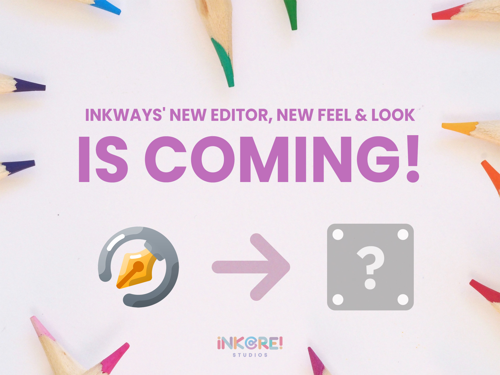
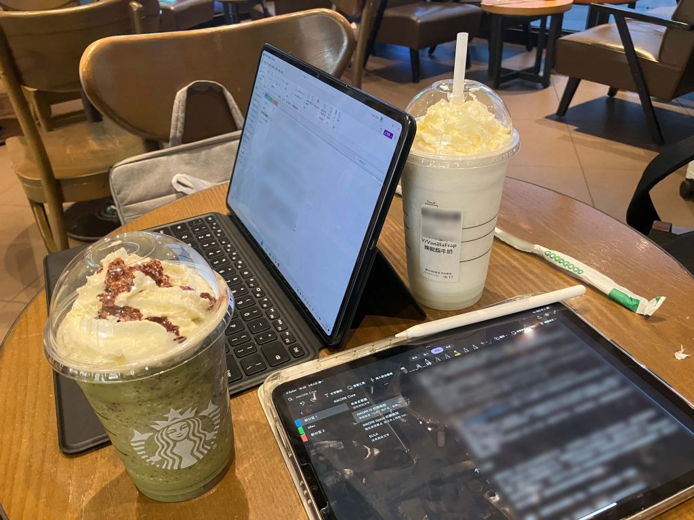

随着新外观和更多功能的加入，Inkways 正在重新构想，以帮助人们在混合世界中高效工作和学习。

您无需采取任何行动，新的体验即将到来 (也许不会很快)。

{/* truncate */}

## 发生了什么？

Inkways 的 WPF 编辑器 (现在可供所有人下载) 将停止更新 (我本来打算稍后告诉你)。换句话说，我们未来的计划是将 Inkways 产品分为两个部分：

- **经典编辑器**：当前版本的 WPF 编辑器将继续保留，未来的错误提交应更改，但不会在此版本中添加新功能。

- **Vanilla 编辑器**：新的 Inkways 体验！(基于 Web) 也是我们未来的主要版本，除了基本的墨水输入外，此版本还将添加更多功能 (Mermaid 思维导图、框架工具、无限画布、不同材质的笔、视频、网页插入、云同步笔记、共享、多用户协作、AI 工具等)。

对于 Windows 用户，我们强烈建议通过 iNKORE Hub 下载 Inkways 应用程序。Inkways for Windows 包括经典编辑器和 Vanilla 编辑器，您可以在笔记本、黑板、摄像机等之间切换(文件格式可能略有不同，您可以使用 Vanilla 编辑器打开 Vanilla 文档，但使用经典编辑器打开 Vanilla 文档可能会有问题)。然而，PowerPoint 助手和桌面注释器将始终使用经典编辑器 (因为 Web 应用程序无法实现透明窗口)，并且 Vanilla 编辑器默认需要互联网。如果您需要离线使用 Vanilla 编辑器，我们会找到其他方法。

至于为什么我们将主要位置转移到 Web，说实话，我真的讨厌 Web 外壳，如 Electron、WebView 2 等。但经过多年的 WPF 应用程序开发，我发现 WPF 的限制太大。墨水会经常卡顿，无法进行灵活编辑，内存使用极高，这些问题困扰了我很长时间。最重要的是，WPF 只能在 Windows 上运行，所以编写一个其他系统无法使用的大项目有点不舒服。所以我们从头开始学习 Web，也许我们可以实现其他平台 (有很多人说只有 Android 平板，他们也想使用 Inkways)，我觉得现在国内系统正在崛起 (说白了，就是 Linux 换了皮)，整个生态开放了，你必须依赖 Web，否则每个平台一套代码太难维护 (开发成本也很高，我们几个人的头发有限)。

别担心，旧的 WPF 经典编辑器将继续维护并可使用。如果您使用 Inkways 进行日记、整理笔记和白板会议，我们强烈建议使用 Vanilla 编辑器。如果您在学校的白板上使用 Inkways，请继续使用经典编辑器，这也是一个不错的选择。

## 介绍 Vanilla 编辑器

新的 Vanilla 编辑器提供了新的外观和感觉，更多功能以及使用 Web 技术的惊人体验。

长话短说，这里有一个功能比较，让我们看看：

| 功能                                                                           | 经典编辑器	 | Vanilla 编辑器 |
|-----------------------------------------------------------------------------------|-----------------|----------------|
| 多指绘图(同时使用多个手指书写)                  | ✅               | ✅              |
| 多指操作(例如双指缩放)                                 | ✅               | ✅              |
| 使用手指移动画布，同时使用触控笔书写                        | ✅               | ✅              |
| 使用手掌擦除，同时使用触控笔书写                   | ❌               | ⭕              |
| 墨水到形状识别                                                          | ✅               | ⭕              |
| 无限画布                                                                   | ❌               | ✅              |
| 基于流文档的画布(导入 docx、pdf 或直接输入并注释) | ❌               | ⭕              |
| PowerPoint 助手和屏幕注释器                                           | ✅               | ❌              |
| 协作和文档共享	                                                 | ❌               | ⭕              |
| 自动保存和跨设备同步                                                   | ❌               | ⭕              |
| 更多高级元素                                                            | ❌               | ⭕              |
| 图表和 AI 生成内容                                                     | ❌               | ✅              |
| 个人可定制的素材库	                                           | ❌               | ✅              |
| 跨平台客户端                                                             | ❌               | ✅              |
| 离线访问                                                                    | ✅               | ⭕              |

:::note

圆圈表示我们计划添加此功能，但可能遇到了技术问题或难以实现。

:::

## 开源还是商业？

对不起，Inkways 目前没有计划开源。我们的想法是等到 Inkways 有一定的收入和知名度后，再开源经典编辑器的核心部分 (墨水、元素、页面等)。(所以，如果你帮我做一些广告来增加我们的知名度，开源可能会更早/doge)

由于我们需要建立服务器、编写代码，有时还需要外包等，从长远来看，靠爱发电是相当困难的。因此，Inkways Vanilla 编辑器预计将采用 Freemium 模型，简单来说就是免费使用基本版本，付费使用高级版本。当然，我们会让免费用户拥有尽可能多的功能和最佳体验。大多数核心功能也将免费提供。当然，如果您愿意每月用一杯奶茶支持我们的开发，您将有资格使用我们的高级功能。

价格和功能列表将很快公布，我们仍在努力。

## 新外观

我们也在更改我们的徽标(图标)和 UI 设计以跟随潮流。然而，这些设计目前尚未确定，所以在正式发布之前，它们都是秘密。

不过，这里有一些由我们的开发团队泄露的图片，您可以先睹为快：

## 总结

差不多了，把剩下的交给我们和时间，等待花开！

如果您有建议、意见或只是想与我们聊天，请加入我们的社区 [点击这里](https://inkore.net/about#social)！