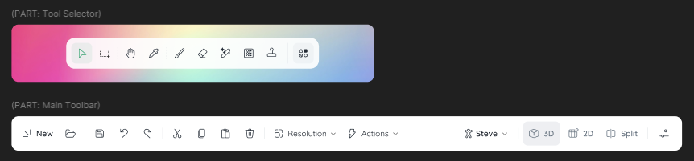

去年我们创建了 MCSkinn 这个项目。基于 MCSkin3D 提供的强大功能，我们在其上进行了大规模的翻新和更改，并在发布之后获得了众多用户的喜爱。

然而，在进行开发的时候，我们遇到了诸多问题，例如 MCSkin3D 的老旧代码导致的渲染效率低下，并且我们难以在其上增加更多功能和想法。而且，许多用户也在呼吁手机版以及其他平台的客户端，这些都是 WPF 架构所做不到的。

在 1.2.8 发布后，我们便基本终止了 WPF 版本的开发，转而使用 Web 技术进行开发。今天，我很荣幸地代表 iNKORE Studios，透露新版 MCSkinn 的一些信息。

## 关于对版本的规划

与 Inkways 相同，我们会同时保留 2 个版本。已有的 MCSkinn 版本将在后面更名为 MCSkinn Legacy，而 Web 版本则会继续使用 MCSkinn 名称。

然而，出于 MCSkinn Legacy 基本没有什么刚需需求，我们在新版发布后就会彻底停止 MCSkinn Legacy 的开发，并将在后面开放其全部源代码。

:::note

出于近日所发生的事件，我们决定新版 MCSkinn 将为闭源项目，请理解并尊重我们的选择。

:::

## 新版 MCSkinn 有什么新东西？

既然已经是新版了，那么就需要有一些新东西，不是吗？

然而，由于 deadline 较紧，我们仅能保证在第一个正式版实现 Legacy 1.2.8 的全部功能。正在制作/规划的功能包括：

- UI 翻新：使用 iNKO UI 全面翻新，带来更为简洁和完善的操作体验。

- 悬浮工具栏：同 Figma, Inkways 等工具相同，我们将工具栏移至底部并悬浮，已便利操作。

- 图层功能：将一张皮肤分为不同部分分别绘制，最后合为一体。

- 沉浸式预览：在不同的场景下预览皮肤。

我们还有很多想法正在付诸实践，敬请期待！

## 公益？收费？

在之前制作 Legacy 版本时，我们曾使用全免费 + 无偿捐赠的模式。然而，我们的开发压力越来越紧迫。因此，我们可能会对新版本中的部分功能进行收费，但 Legacy 版本延续的功能不受影响。

## 新版本预览

我们现在在忙于新版本的制作。然而，这里有一些新版本的预览图像，你可以期待一波：

## 总结

差不多了，把剩下的交给我们和时间，等待花开！

如果您有建议、意见或只是想与我们聊天，请加入我们的社区 [点击这里](https://inkore.net/about#social)！