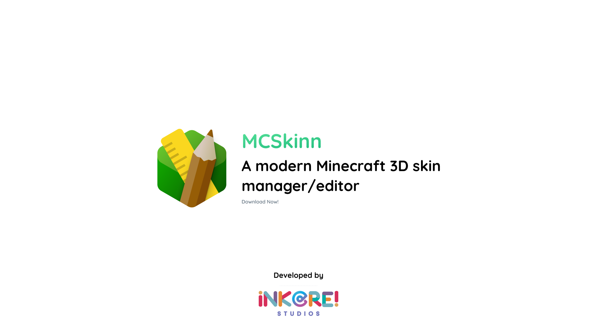
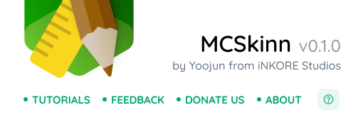

Last year, we introduced MCSkinn. Built upon the robust foundation of MCSkin3D, MCSkinn underwent extensive renovations and updates, quickly gaining popularity among users.

However, during development, we encountered several challenges. The aging codebase of MCSkin3D resulted in slow rendering performance, and expanding its capabilities proved difficult. Additionally, many users requested mobile and cross-platform versions, which were beyond the limitations of the WPF framework.

Following the release of version 1.2.8, we largely discontinued development on the WPF version and shifted our focus to web technologies. Today, I'm excited to share some details about the new version of MCSkinn on behalf of iNKORE Studios.

## Versioning and Future Plans

Similar to Inkways, we will maintain two versions concurrently. The existing MCSkinn version will be renamed MCSkinn Legacy, while the web version will retain the MCSkinn name.

Given the limited demand for MCSkinn Legacy, we will cease development upon the release of the new version and subsequently open-source its entire codebase.

:::note

Due to recent events, we have decided to make the new version of MCSkinn a closed-source project. We appreciate your understanding and respect for this decision.

:::

## What's New in MCSkinn?

With a new version comes new features.

While our development timeline is tight, we can confirm that the first released version will encompass all features available in Legacy 1.2.8. Additionally, we are working on or planning the following:

* UI Overhaul: A complete UI redesign using iNKO UI for a cleaner, more streamlined user experience.
* Floating Toolbar: Similar to tools like Figma and Inkways, we've moved the toolbar to the bottom and made it floating for easier access.
* Layers: Divide skins into different parts for individual editing and then combine them into a whole.
* Immersive Preview: Preview skins in various scenarios.

We have many more ideas in the pipeline, so stay tuned!

## Pricing

For the Legacy version, we offered a completely free model with optional donations. However, due to increasing development pressures, we may introduce paid features in the new version. Rest assured, features available in the Legacy version will remain free.

## Preview

We're currently hard at work on the new version. In the meantime, here are some preview images to give you a glimpse:

## Conclusion

We're excited to share our progress with you. Please join our community at [https://inkore.net/about#social](https://inkore.net/about#social) for feedback, suggestions, or just to chat!