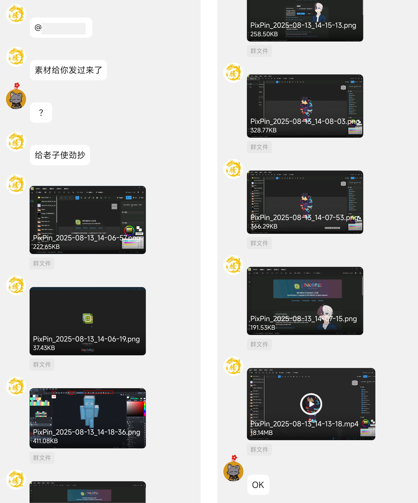
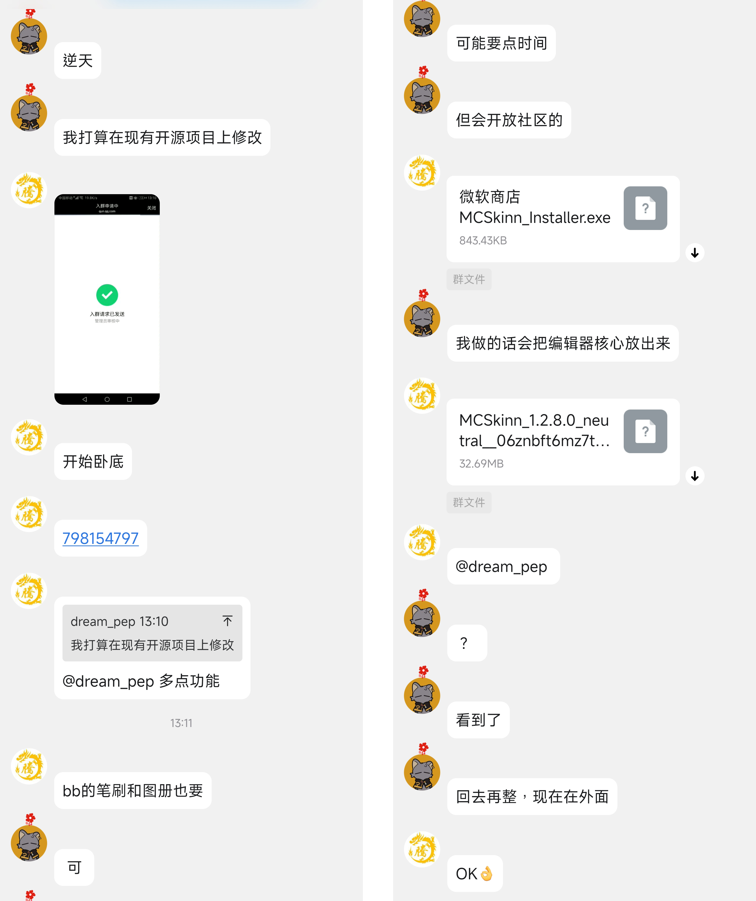
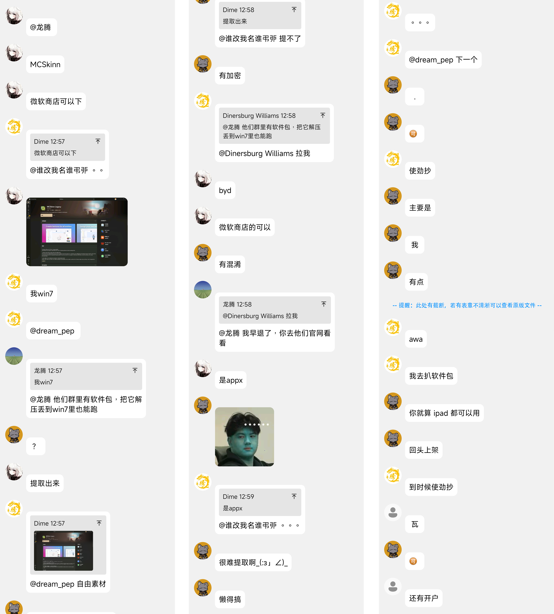
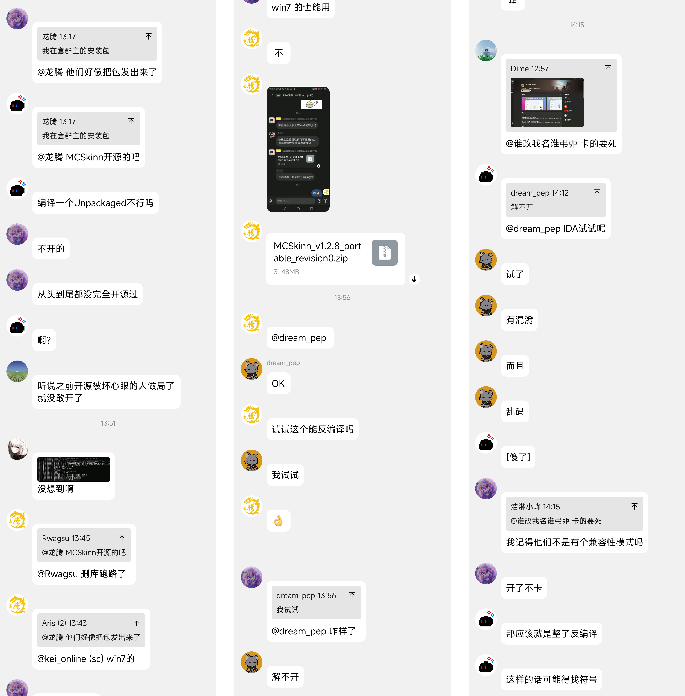
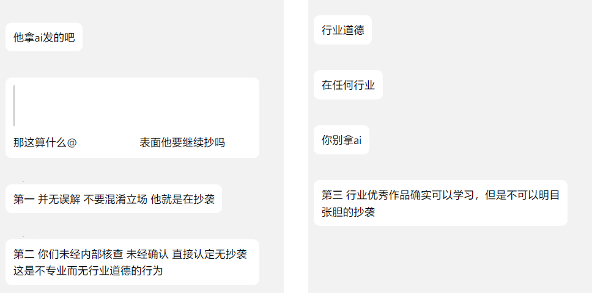
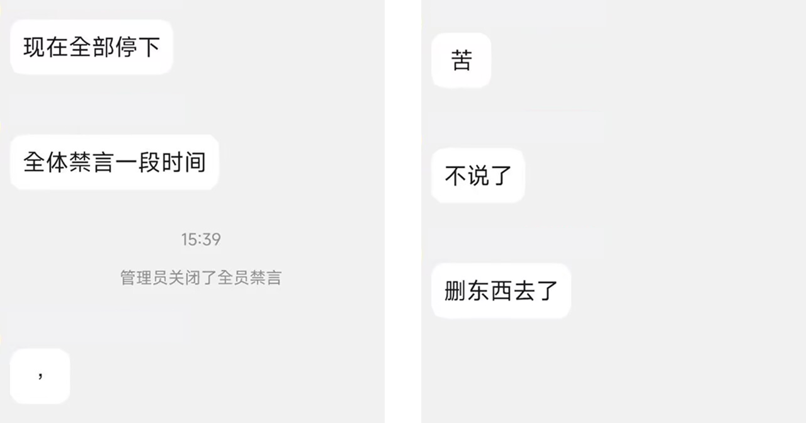
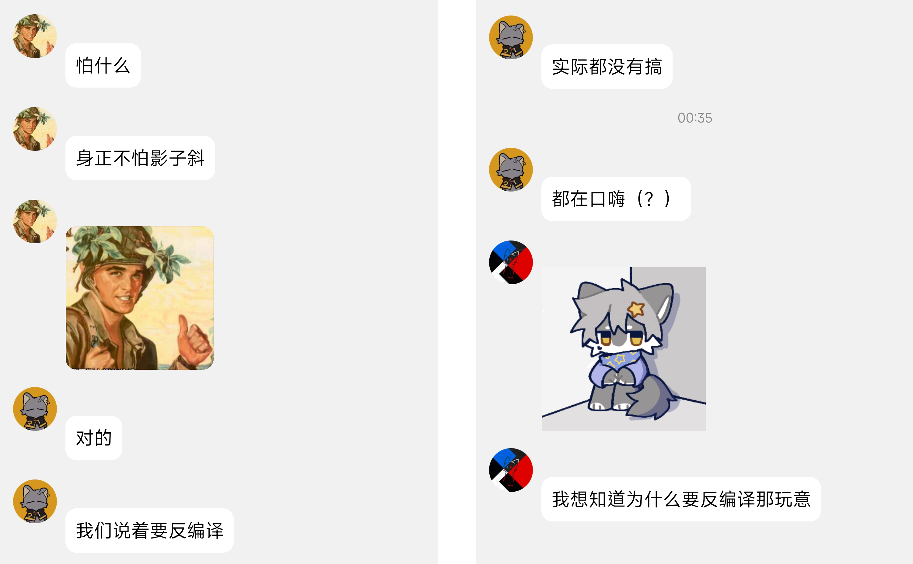
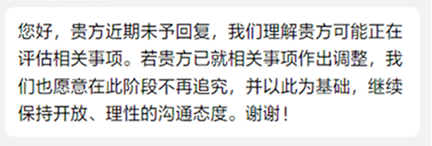
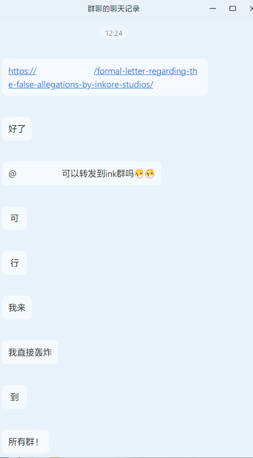

This post is only available in Simplified Chinese, as this incident happened in China.

# 有图有真相：MCSkinn 抄袭 & 反编译事件经过 & 证据全公开

在开始今天的博客之前，先祝大家假期快乐！

:::note

某人指使群员提取并试图反编译 MCSkinn Legacy 的源代码，以此 "借鉴" MCSkinn 的核心功能和 UI。在我们迅速向此人说明情况后，此人矢口否认其试图反编译且侵犯著作权的事实，反而诋毁我们是 "抹黑" 对方。此人还在多个群组中散布谣言，试图将我们描绘成 "恶意攻击者"。我们在此澄清事实，并希望大家能理性看待此事。

:::

{/*truncate*/}

:::info

由于事情发生在中国大陆，聊天截图将以中文展示；此文章中引用的聊天记录图片都为了优化阅读体验而进行了处理，同时也隐去了一些不应当披露的个人信息。虽然本文中直接引用的聊天记录并非可以直接作为证据，我们已将仅经过必要修改的聊天记录 (按照法律与道德对人员的隐私保护要求) 统一存储到了 Github 仓库中，供有需要的读者查阅，你也可以通过查阅它们来更客观，更全面地了解事情经过——理性吃瓜。

https://github.com/iNKORE-NET/Hallofshame/tree/main/archives/2025-08/QGroup682528253

另外原始未经修改的聊天记录已经通过法律途径进行了司法鉴定与保全，但由于可能会涉及到无关人员的隐私，故此处不做公开。

如果你担心我们的描写可能会包含主观色彩——没问题，你也可以直接去上面的链接，查看无 "偏见" 的聊天记录。

:::

## 前情提要

在开始之前，我们想先行解释我们为何将 MCSkinn Legacy 进行闭源。

首先需要明确一点：**MCSkinn Legacy 在逐步替换一些强开源许可证的依赖后逐步转向闭源**，我们之前在 GitHub 仓库内提供了部分参考用的资源，但随着项目的发展和依赖关系的调整，我们需要重新评估开源策略。我们之所以这样做，是为了让社区成员能够了解我们的设计思路和技术实现，但并不意味着我们放弃了对这些资源的版权和知识产权的保护。

新版 MCSkinn 的开发开始前，经过内部评估，我们认为将 MCSkinn Legacy 进行开源不再符合我们目前的需要，因此决定隐藏其 GitHub 仓库。

MCSkinn Legacy 的源代码包含了大量的核心功能和 UI 设计，这些都是我们多年来的心血结晶。我们希望通过闭源来保护这些知识产权，避免被不当使用或剽窃。

MCSkinn Legacy 已经取得了完整的软件著作权登记证书，证明了我们对其拥有合法的知识产权。因此，任何对 MCSkinn Legacy 进行的未经授权的破解操作，不仅侵犯了我们的知识产权，也违反了相关法律法规。

## 事件经过

某日，我们注意到一个群组内发生了关于 MCSkinn 及其他 Minecraft 皮肤编辑器的讨论。某人在群内发布了一条消息，声称他希望开发一款新的 Minecraft 皮肤编辑器以抗衡 MCSkinn。

数天之后，此人在群内发布了一条消息，说明其开发的 Minecraft 皮肤编辑器的新动向。此时他向某群员询问能否提取 MCSkinn Legacy 的包体，并试图反编译以获取源代码，并对其进行 "借鉴" (虽然对方在聊天中直截了当使用 **"抄"** 的字眼)。

接下来，他们明目张胆地尝试对 MCSkinn Legacy 进行提取和反编译：

:::note

依据中华人民共和国的相关法律法规，未经著作权人许可，提取、反编译或以其他方式获取软件源代码的行为均属于侵犯著作权的行为。我们的追踪从这里开始。

:::

另外，此群聊中的人也数次对我们进行人身攻击和恶意中伤，如 "崇洋媚外"，"抹黑同行"，"傻*开发组" 等等。

## 导火线

我们在得知此事后，立即与该主理人进行了沟通，明确表示其行为已经侵犯了我们的知识产权，并要求其停止相关操作。

> (我方:)
> 
> 你好，我是 iNKORE Studios。最近我们注意到你在计划开发一款类似的软件，部分创意和功能与我们已有产品高度重合。
> 
> 我们非常尊重同行之间的技术交流和创新，也理解大家在探索产品方向时可能会参考已有作品。但我们已经申请了相关的知识产权，并对相关创意和表达方式进行了法律保护。
> 
> 目前我们掌握了证据，你方的行为有意借鉴，复刻甚至抄袭我们的软件逻辑和设计。虽然你们可能会使用不同的语言或代码实现，但如果最终产品在表达方式上构成实质性相似，仍会涉及侵权。
> 
> 我们希望能友好沟通，避免后续产生不必要的法律纠纷。也欢迎你们在合法合规的前提下进行创新开发。

在我们的消息发出去不久，对方即在他的群组中开启了 "紧急警报"，并给出下列回复：

> (对方:)
> 
> 您好，我是****** Network 负责人。对于您上述的问题与情况，我们已仔细阅读并充分了解。首先非常感谢贵司的及时沟通，我们始终认为同行间的坦诚交流是维护行业健康发展的重要基础，也完全理解并尊重贵司对自身知识产权的重视与保护——毕竟每一款产品的诞生都凝聚着团队的大量心血，对创意和成果的保护本就是推动行业创新的重要前提，这一点我们深表认同。
> 
> 关于您提到的“开发类似软件、创意和功能高度重合”等情况，在此需要明确说明：截至目前，****** Network从未开展过与贵司现有产品在核心创意、功能逻辑或设计表达上相似的软件开发工作，也不存在任何有意借鉴、复刻甚至抄袭贵司软件逻辑和设计的行为。相关信息可能存在一定的误解，我们对此高度重视，并已内部核查确认，暂无任何与贵司产品构成实质性相似的开发计划或成果。
> 
> 事实上，对于贵司开发的皮肤编辑器及相关产品，我们一直抱有学习和敬佩的态度。行业内优秀的作品本就是大家共同学习的范例，****** Network始终坚持在合法合规的框架下，通过研究优秀产品的设计思路和技术亮点，来启发自身的创新方向，但这一过程始终以“独立研发、差异化创新”为原则，坚决杜绝任何可能涉及侵权的行为。
> 
> 我们深知知识产权保护对行业发展的重要性，****** Network也始终将合规创新作为自身发展的底线。未来，我们也会继续严格规范自身的开发行为，避免任何可能引起误解的情况。
> 
> 再次感谢贵司的提醒与沟通，我们非常愿意在尊重彼此知识产权、遵守相关法律法规的前提下，与贵司保持良性互动，共同为行业的创新与发展贡献力量。若贵司有进一步的信息或疑虑，也欢迎随时沟通，以便我们更清晰地澄清情况。

:::note

我们对此回应不做评价。然而，这是某外部人士的看法：

:::

在进行声明后，此人表面停止了其行为，并声称其已经停止了相关项目。

然而稍后此人发来了一条消息，**声称其并未进行**反编译操作，但当我们对齐展示我们已经收集的证据时，对方却**突然改口**：

> (对方:) 若此前消息中的表述让贵司产生了 "已进行反编译" 的误解，我们深表歉意，特此明确更正——那并非事实。

也许你不知道他这句话想表达什么，但是，后来的聊天记录：

诶，请问一下各位语言大师们，"口嗨" 是什么意思呢？那这样一来，是不是我先说我想说的，然后在事后将其称之为 "口嗨" 呢？如果是口嗨 - 那你们又是如何得出 "解不开"，"有混淆" 这样的结论的呢？

---

鉴于其 "已经" "删除" 了相关项目，我们在再次提醒后，决定不再追究此事。

## 结束了？

然而，不久之后此人又发来一份所谓的 "正式文件"，表示他们的所谓 "立场"，其大意为：

- 在继续提出指控前，提供以下资料：

  - 《计算机软件著作权登记证书》或能证明 iNKORE Studios 享有 MCSkinn 系列产品权利的合法文件；

  - 若涉及界面、美术、交互设计，请同时提供确权材料。
  
  - 能明确证明行为主体为对方 ***克网络科技有限公司 的技术取证材料。

- 对方自始至终 未曾实施反编译、破解、抄袭 等行为。

- 我方所称 "聊天记录"，若未经过司法鉴定，其真实性、完整性、关联性均无法确认。单方留存的文字记录，不足以构成认定侵权的依据。

很好，看来他们正在 "试探" 我们的底细，

- 我们确切具有 MCSkinn Legacy 的计算机软件著作权登记证书。为了保护我们团队及成员的隐私，处理后公开的证书如下：

  ![] (ccopyright-mcskinn.jpg)

  至于为什么这张登记证书要涂掉一些地方？很简单，你觉得我们会**把我们的肚子露出来，让你拿去开盒吗**？Nice try！如果你对该文档的真实性有质疑，可以通过法律途径进行核实；我们会将此文档的原件提交给法官和庭审组，在开庭之前，其余情况下我们有权将**关键信息保持私密**。(有些人天天擒着这个要，不就是为了拿到之后去开盒嘛。I'm not gonna fall for that again)

- 我们具有 MCSkinn 的完整设计稿及源代码。

- 我们已经将相关聊天记录进行**即时通讯聊天记录留存**并取得证书，这意味着它们已经具有法律效力，同时也能作为对方行为的证据。

- 至于 "明确证明行为主体为我方 ***克网络科技有限公司"，在我方与其的沟通中，从未提及对方所说的公司，我们一概使用 "贵方"——指该账号使用者本人，而他却非常聪明地对号入座到了该公司。

非常有趣的是，对方首先提供了一版**无任何盖章**，无任何证据的文件，此后才提供了一版扫描得来的带公章文件。

在所有我们主动与对方沟通的过程中，我们始终使用私聊——并不想卷入太多的无关人员，也尽可能保障对方的声誉；然而，对方的选择却耐人寻味——将文件上传至他们的官网并进行公告，并将其转发至了多个无关群聊内。这不仅将事态牵扯到了无关人群，也**无故诽谤并抹黑我方名誉**，同时也与**对方一开始的言论相悖**...不是说要尊重双方的名誉权吗...？

Ooooops...

如果有任何疑问，请拿事实和**完整的**证据说话，不要断章取义，添油加醋。

---

不想多说了...You are harshing our mellow, dude.

自己看原始聊天记录吧 (上面有链接)

到这里，马上会有人红温，有人抬杠，有人会破口大骂，有人平静地看着，就当这一切都是个笑话一样。

看你不爽的人，会觉得你的呼吸都是错的；讨厌你的人，会拿显微镜看你和你的奖杯。

~~不说了，我要蹲好，准备继续接受 "正义" 的审判啦 😅~~
