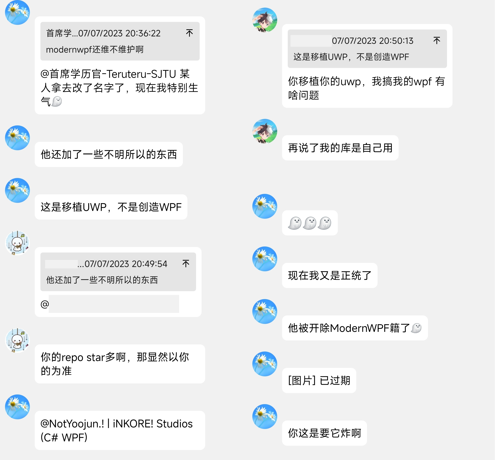
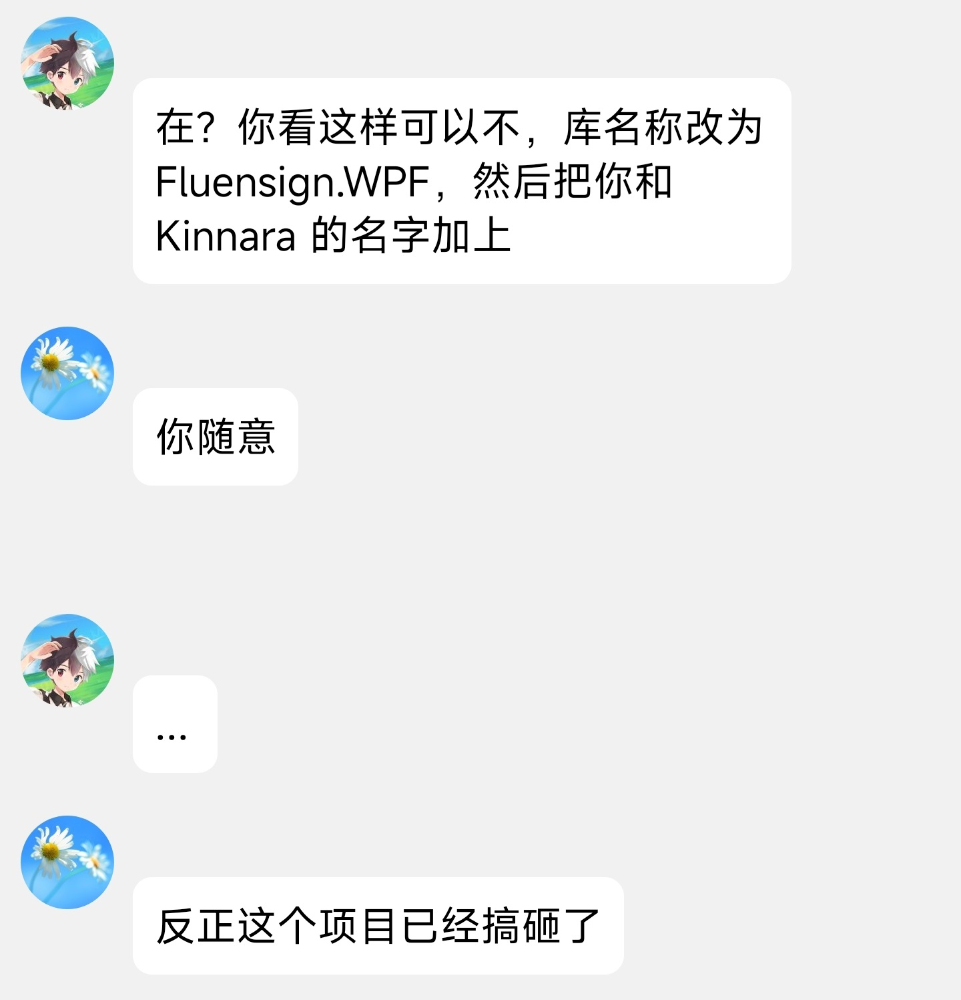
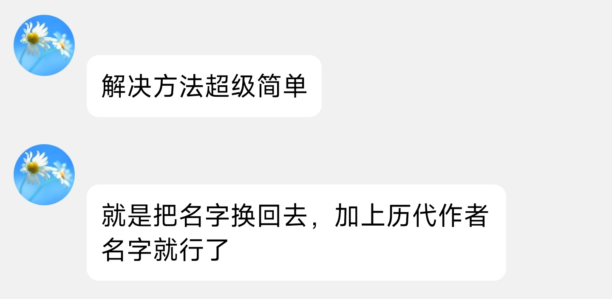
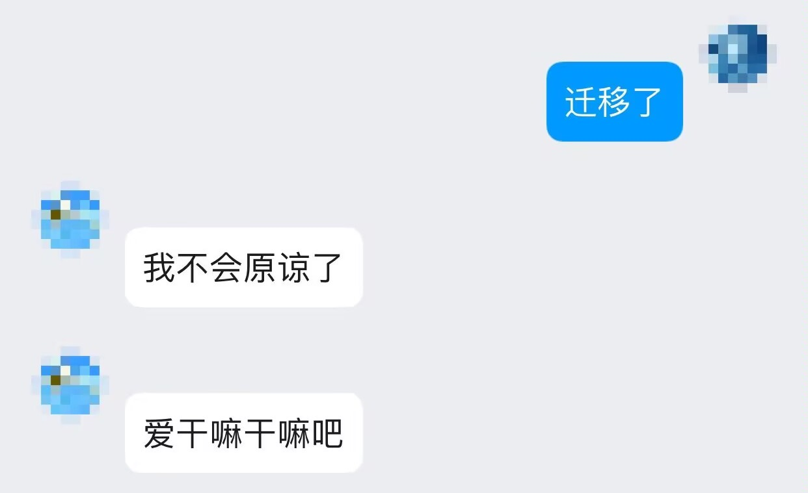
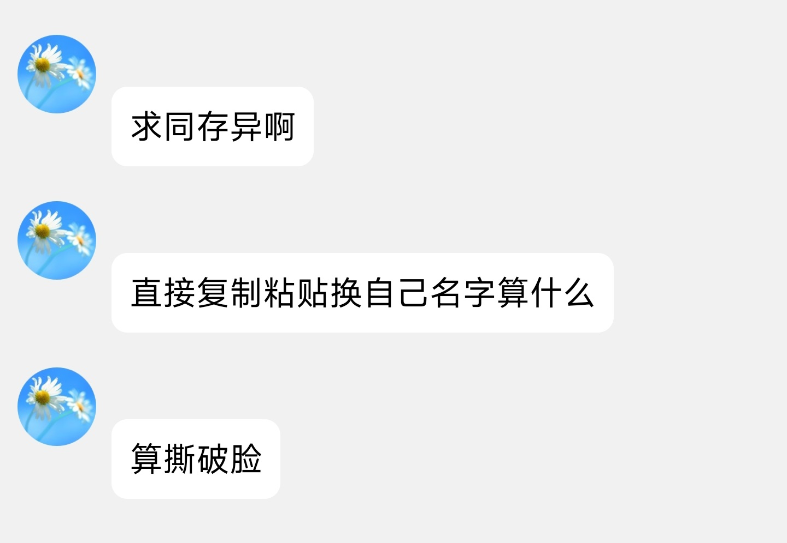
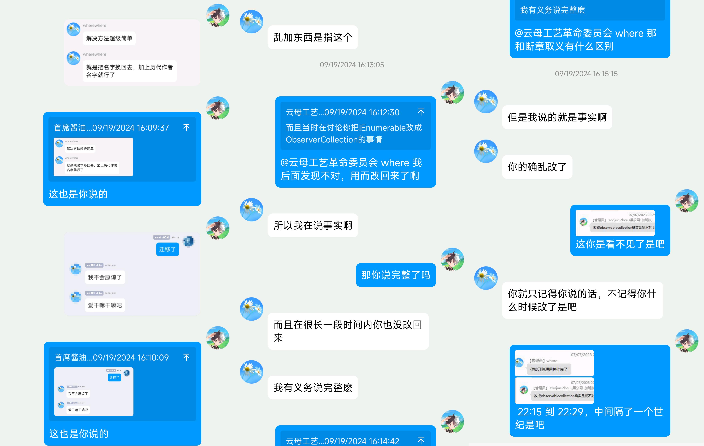

# 事件回顾与反思：开源社区的利益冲突

在开始今天的博客之前，先祝大家中秋快乐，阖家团圆！

我写这篇文章的目的并不是像一些人一样讨伐，"谴责" 和阴阳别人，我只是想简单地陈述下事情的经过，谈谈我的感受。也希望我和更多的人能够明辨是非，并吸取教训，在生活和工作中能够更明了地看清楚这样的问题。也许你还没有看到或经历过这样的事情，但是说不定哪天被爆的就是你自己。(无恶意，只是提醒)

:::note

**极限省流版 (表达并不准确也不够中立，有时间和心情的话最好看下文)：** 开放源代码社区里，我们借鉴了别人的代码 (根据 MIT 许可证完全合法合理吗，除了我们疏忽未将原作者名字进行标注) 做了个衍生作品，我们做得比原作者好（用的人比原作多，收藏数量是原作的十多倍），原作者急眼了，到处去群里爆我们阴阳我们。虽然我们没有按照许可证要求标明原作者，但是我们在事情发生之后第一时间找到了原作者，可是他变本加厉，继续阴阳...

:::

{/* truncate */}

:::info

由于事情发生在中国大陆，聊天截图将以中文展示。
部分人名和项目名字已经做了修改，以保护个人隐私。猪可以不尊重人，但是人得尊重猪。

:::

*(看了下时钟：20:30，抿了一小口咖啡)*

我感觉当双方的利发生冲突时，没有什么绝对正确和错误的一方，也没有什么正义和非正义，有的只是你的利益和我的利益之间的不平衡。也许阅读此文的你是一个彻彻底底的局外人，或者是有着比我更高的思维维度，请见谅。因为每个人的处境和境界都不一样，我想这应该是值得尊重和理解的。

:::danger

有人说这篇文章是在带节奏，以表面弱势伪装受害者的强势态度：

> 看了文章，整体表达出了，不认为消除原项目 Owner 或者说违反协议是多么大不了的一件事情，态度是我都已经加上了你还想怎样，核心是希望把舆论或者看法往自己这里拢拢。全文集中在态度恶劣啥的，如果我的repo被这样抹掉署名的话，估计态度好不到哪里去。并且这种主动行为不能以疏忽来解释。
> 
> 能发这样的文章，一边说着不希望带节奏/被带节奏，一边其实本身就在带节奏，表面上是客观论述事实，内心其实还是希望以这样的做法来扭转不利局面。文底提醒部分明面上是提醒，实则强化原Owner在带节奏的印象，如果是我写的话，这种提醒大概率是提醒读者注意 License 和保持原 Owner 的署名吧而不是这种什么什么节奏问题，因为节奏问题根本不是主要矛盾，你这样写更进一步说明了不觉得主动消除原 Owner/破坏协议是什么大问题，全文我只看到试图以表面弱势伪装受害者的强势态度。

- 说这话的人，你也不看看是谁先带的节奏，是谁先在多个群里爆料的，是谁先在群里阴阳别人的。当你面对这样的人，除了像他一样，以毒攻毒，还能有什么办法？难道去礼貌交涉吗？我们不是没试过，但是你不能和不讲理的人讲道理啊，这种人根本就不会听的。你只能比他更不讲理，这样才能让他知道你不是好欺负的。"希望以这样的做法来扭转不利局面"？请问你想怎样才能扭转局面？

- 请问哪里表达了 "消除原项目 Owner 或者说违反协议是多么大不了的一件事情"？我们多次用红色文字标注的道歉你是选择性眼瞎是吧？至于 "我都已经加上了你还想怎样"，那我请问你：我们没加，你就可以为所欲为，想怎么样就怎么样吗？加上了之后我们也马上和对方进行联系了，你是又没看到吗？

- 你说 "这种提醒大概率是提醒读者注意 License 和保持原 Owner 的署名吧而不是这种什么什么节奏问题"，那只能说明你没读完这篇文章，哪里没提醒读者注意 License 和保持原 Owner 的署名？你是不是又选择性眼瞎了？

- "试图以表面弱势伪装受害者的强势态度"？请问哪里表现出了强势态度？我们只是在这里表达我们的观点，我们的感受，我们的反思。"表面弱势" 请问是什么意思？我们有像 Whatwhat 一样阴阳别人吗？出现问题之后难道没有积极寻求解决办法吗？什么叫 "伪装成受害者"？难道我们不是受害者吗？你可以说 Whatwhat 也是受害者，但是如果你说我们不是受害者，那我只能说你是不是有点脑子有问题？"强势态度"？你不表现出强势态度，对方就会对你好一点吗？你是不是有点天真了？

:::

## 没想到有一天吃瓜能吃到自己头上

如题，我是万万没想到，但是又好像早有预料。我以工作室的名义做了个控件库：iNKORE.UI.WPF.Modern (下文简称 iUWM)，关于这个控件库的更多信息可以在这里找到：

https://github.com/iNKORE-NET/UI.WPF.Modern

### 前情提要

我记得当时我才开始我们工作室的第一个桌面应用，决定使用 WPF 来开发，但是微软给 WPF 做的界面啊...真是一言难尽。几番摸索，在 Github 上找到了一个名为 ModernWpf 的项目。它里面的控件都是 Windows 10 风格的，正好此时 Windows 11 已经发布了，我就在想，有没有一个控件库是 Windows 11 风格的呢？于是我就找到了 ModernWpf 的一个分支仓库，这个里面的控件库就是 Windows 11 风格的。

这个控件库的作者就是这次事件的主要人物之一，我就称他为 Whatwhat 吧。我看了下这个库的许可证，是 MIT 许可证，我就 fork 了这个库，然后开始了我的控件库之旅。在做自己的控件库之前也和原作者 Whatwhat 交流过，他首先想让我加入他的 ModernWpf 项目。Whatwhat 的想法是 "移植 UWP"，而我的想法是 "创造 WPF"，于是就谈崩了。

在此之后，我就开始了我的控件库之旅，我将这个库命名为 iUWM，这个库的目的是为了让 WPF 开发者能够更加方便地使用 Windows 11 风格的控件。我在这个库里面加入了很多自己的想法，比如说控件的样式，控件的行为等等，比如，我赋予了用户完全掌控窗口标题栏高度和按钮的能力，这些在 Whatwhat 的眼里是不应该有的。

刚开始我编写此库主要是为了自己和工作室的项目，也就随手把仓库公开在 Github 上，没想到这个仓库很快被人发现，现在已经相当数量的 star 和使用量了。我很开心，也很自豪，但是 Whatwhat 对此并不买账，他认为我这个库是他的分支库，我应该继续使用 ModernWpf 的名字，而不是 iUWM。

:::info 我的评判

按照 MIT 开源协议，衍生作品需要标注原作者，这里我承认是我没有做对，没有将 Whatwhat 的名字写入到项目的 README.md 中，在这里向 Whatwhat 道歉。但是根据 MIT 协议，衍生作品无需按照原作者的意愿来做。

这位 Whatwhat 对我的控件库的名称有很大的意见，他认为我这个库应该继续使用 ModernWpf 的名字，因为我是基于 ModernWpf 的分支库。我认为这个库是我自己的，我有权利给它起一个我认为合适的名字，即使这个名字包含我的工作室的名字.

:::

截至本文，我和其他贡献者 (不算 Whatwhat) 已经为这个库做了很多工作，超过 400 次的提交 (此时 Whatwhat 的提交次数约为 120 次)。

:::info

我并不觉得比较提交次数是一个好的比较标准，我也**不想说** ~~"我的提交次数比 Whatwhat 多，所以我才是这个库的主要贡献者"~~。但是我认为这是一个可以说明问题的一个数据，至少说明了我对这个库的贡献是有目共睹的。

:::

:::note

蓝色花朵头像是 Whatwhat，蓝绿背景加小人头像是我，下同。

:::

### 引爆炸弹的火线

在我发布了 iUWM 之后，我发现了一个很有意思的现象，iUWM 的收藏数量是 Whatwhat ModernWpf 的十多倍，这让我很开心，也让我很自豪。但是 Whatwhat 对此并不买账，他认为我这个库是他的分支库，我应该继续使用 ModernWpf 的名字，而不是 iUWM。

QQ 上的一个某产品交流群 (我们就称为 Fris Lunch 吧) 中，有人发布了由 Aris 制作的 MCSkinn 宣传视频，后又转发了 iUWM 的演示视频。好巧不巧，这位 Whatwhat 也在这个群里，他看到了这个消息，于是就开始了他的**阴阳之旅**。

Whatwhat 直接跳出来说 iNKORE! 抄袭了他的代码，随后又吹捧称原作者和 WPF UI 写的代码质量比 iUWM 好；随后又说 Yoojun 所做的更改是 "乱搞"。

:::info 我的评判

我并不认为 Whatwhat 的言论是正确的，但是我认为他有权利表达自己的观点，我也有权利反驳他的观点。Whatwhat 可以说我的更改是 "乱搞"，但是这并不代表我的版本 "不如" 他的版本。你觉得我是乱改，那你不用就是了。每个人心里都有自己的评判标准，你想让别人都用你的而不是用我的，那你就用行动证明你的方案比我的方案更好，大家自然就会选择更好的一边。

:::

起初，群内的成员觉得我们没有标注 Whatwhat 的名字不道德。我们也意识到了这个问题，于是第一时间找到项目的 README.md 中加入了 Whatwhat 的名字。

https://github.com/iNKORE-NET/UI.WPF.Modern/commit/45a2286e39b2801b52fcf9fb478b8172a8c8c79e

我也第一时间找到了 Whatwhat 本人，并向其征求意见，可是他阴阳地回应道：

:::info 我的评判

我觉得这是不可接受的，于是又移除了 Whatwhat 的名字。

:::

我们本以为这个事情就这样结束了，Whatwhat 又阴阳怪气称 "不管如何都会进行谴责" 并表示 "爱怎样怎样"。接下来，他说我们应该从名称中移除 iNKORE! 的名字，并且加上 Whatwhat 及其他作者的名字。

### 得寸进尺

行吧，你有理，我们于是按照他的要求，将 iUWM 的名字改为了 Fluensign.WPF，并加上了 Whatwhat 及其他作者的名字。 可是 Whatwhat 得寸进尺，继续阴阳怪气：

此后，Whatwhat 进一步表示，他的目标是 "做出 WPF 界的 WAS"，并且毫不掩饰地嘲笑 iUWM 项目，声称我们只是 "直接复制粘贴，然后换上自己的名字"。

:::info 我的评判

他这种言论不仅贬低了我们的努力和贡献，还试图通过这种方式来抹黑我们的项目，给我们带来了极大的困扰和不满。也许他自动忽略了我所作出的更改，除了复制粘贴和换名字。😅

他想要 "做出 WPF 界的 WAS"，这是他的目标，我觉得这是非常好的，我也希望他能够实现这个目标。但我并不觉得他有权利来左右我们的项目。

:::

### 我们做错了什么

我们没有按照 MIT 许可证的要求标注 Whatwhat 的名字，这是我们的失误，我们已经在第一时间进行了更正。同时我们也标明了另一作者 Kinnara 的名字。

除此之外，我还真想不出来我们到底哪里没做对？难道说，我们不按照原作者的意愿来做就是错的吗？那如果这样的话，往下看之前想想你自己哪里错了吧。

### 引发的思考

整件事情让我想到了很多，我觉得在开源社区中，我们应该更加尊重他人的劳动成果，不管是原作者还是衍生作者。我们应该尊重他人的劳动成果，不应该因为自己的利益而去阴阳别人。另外我也发现开源许可证的重要性，我们应该遵守开源许可证的规定。既然选好了开源许可证，那么不管是原作者还是衍生作者，都应该遵守这个许可证的规定。开源世界赋予我们自由，但这种自由也需要建立在规则和尊重的基础上。

另外，不管是作为一个开发者还是一个普通人，总总会遇到这样子蛮不讲理又爱阴阳怪气的人，我们应该保持冷静，不要被他们的言论所影响。

其实他一个人想什么做什么也许没那么重要，重要的是当他用他那套奇怪的逻辑来阴阳别人的时候，会直接影响到我们个人和组织的声誉，让不明白所以的人被带节奏。因此，面对这种情况，我们应当坚定自己的立场，保持客观冷静。我们可以通过公开透明的沟通来澄清事实，并呼吁大家更多关注项目本身的价值，而不是被少数人的情绪化言论牵着走。

### 如果我是对方呢

我们自己作为开源项目的作者，如果我们自己的项目被别人改了名字之后重新被发布，我们的心里也会非常的不舒服。我很能理解 Whatwhat 的感受，我很久以前写过一个不算简单也不算复杂的笔记软件，后来有人 fork 了我的项目，然后改了名字，我当时也是非常的不舒服。

我觉得如果只是单纯地改个名字，没有自己的东西，那是非常不厚道的；但是，如果你对这个项目付出了足够的努力，那么我觉得你有权利给这个项目起一个你认为合适的名字。另外，无论如何，必须得遵守开源许可证的规定。作为原作者，此时为自己的项目选一个合适的许可证也是非常有必要的；如果你的项目非常隐私，那么你可以选择一个不那么宽松的许可证，比如 GPL，甚至闭源。

但是再怎么样，在我们及时补充了 Whatwhat 的名字之后，他还是继续阴阳怪气，这就让我很难接受了。

看看下面，除了用不讲理来形容他，我再也找不到其他的词了。

### 这还只是被我看到的一次

在这个项目开始的时候，Whatwhat 就已经表现出不满的情绪并在群聊中发表了许多 "言论"，但是我并没有在意。我觉得这只是他的一时情绪，也许过段时间就会好了。后续我又看到他陆陆续续地在多个不同的群内发表了一些言论，我相信，我所能看到的只是冰山一角，他在其他地方一定做过很多次这样的事情。这次爆发所处于的 Fris Lunch 群，我甚至都没有进入，还是从其他人那里得知的。

相信 Whatwhat 能做一次就能做第二次，第三次...我不知道他还会做出什么样的事情，但是我相信，他做的远超我所能触及到的。

> **身边人的意见**
>
> - 所以 what 说不标注他名字不无道理，说下就行了，太小手
> - 嚯嚯，对方心胸气度不够
> - 求同存异是他自己说出口的，搞大统一专制是他自己要求的

## 隔壁也爆炸了

在这个事件发生的同时，隔壁的另一个开源项目也爆炸了。不过由于不是我们的事情，我们也不好过多评判。但是我觉得这个事件也给我们提了个醒，一定要小心身边的人，不要让自己和自己的用户被带节奏。

如果你的身边恰好有这样的例子，那就更要小心了。

## 所以，发生之后呢

通过这几次事件，我深刻感受到开源社区中的复杂性和挑战。其实真正的难题并不是什么技术，而是人心。你永远不知道身边的人，或者身外的人，会在什么样的地方给你使下绊子。

尽管在这次事件中，我们犯了一些错误，但我们在发现问题后也及时做出了修正。虽然 MIT 看上去是一个非常宽松，甚至形同虚设的许可证，但是我们也应该尊重原作者的劳动成果，遵守许可证的规定：在显眼的地方标注原作者的名字，不仅尊重了原作者，而且避免了很多麻烦和被找茬的机会。

与此同时，我们也希望所有的开源参与者能够更加理性、宽容地看待问题，避免将个人情感带入技术讨论。只有这样，开源社区才能健康发展，更多的优秀项目才能涌现，为开发者们提供持续的支持和动力。

*(将杯中的咖啡一饮而尽，看了下时间，正好 22:00)*

多一事不如少一事，能好好说话为什么非要狗叫。我一般会尊重任何人，除非对方先不尊重我。

今日事件，望各位明鉴。

再次感谢每一位为开源社区做出贡献的人，也希望未来我们能够共同维护这个珍贵的开放世界。

最后说句题外话，刚才晚上在亲戚家里吃饭。饭前几人发现屋主家里的小孩不见了，等小孩的母亲从门外回来，她告诉我们小孩在房里补作业呢。这是另一个亲戚马上就说 “表扬表扬“，也许这里面可以继续深挖，只是我现在没时间也没心情罢了。

愿世界上每一个人都能被温柔对待！

