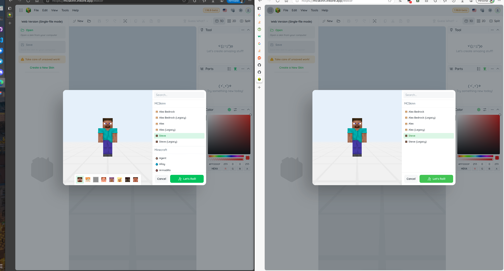

# 浏览器环境对程序正常运行有多大影响？

左图显示的是一个没有安装任何扩展程序的环境，一切运行正常；右图则是安装了一堆扩展程序和 Tampermonkey 脚本的环境，此时部分模型无法加载，已加载的模型也无法选择模板。

你安装的扩展程序有权限干预和修改整个页面的所有内容（包括界面、程序执行、网络访问等），这可能会导致难以预料的问题。

另一个已经确认的问题是：你浏览器内置的 Google 翻译器会干扰程序的正常运行，可能导致界面错乱甚至程序崩溃。目前业界尚无理想的解决方案。如果我们的程序暂时不支持你所需的语言翻译，请告诉我们，或在 Github 上贡献翻译内容。

