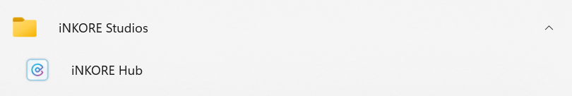
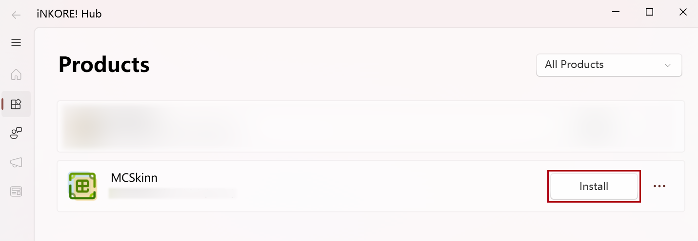
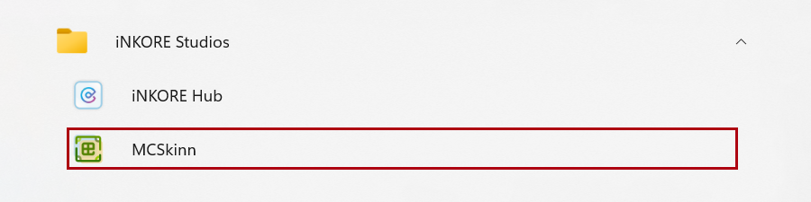
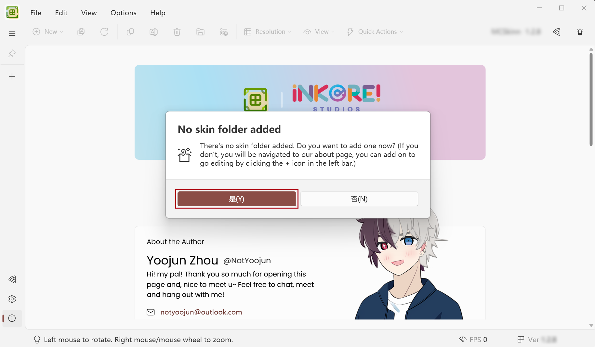

---

sidebar_label: Getting Started

---

# Getting Started

Before using MCSkinn, we suggest you to look up our [Documentation](docs.inkore.net) first. If you want to know more features or advantages of MCSkinn, please look up our website:

https://inkore.net/zh-cn/products/mcskinn/

This page will guide you to install and config MCSkinn.

## Step 1: Download and Install

:::warning

iNKORE Hub is corrently not available. Please ignore the instructions below, and install MCSkinn through Microsoft Store:

For more infomation, please check [this announcement](https://docs.inkore.net/en-us/announcements/2024/09/30/legacy-hub-service-suspended).

### Install iNKORE Hub

You can install our products quickly and conveniently using **iNKORE Hub**. If you don't have **iNKORE Hub** on your computer yet, please click the button below to get **iNKORE Hub** download link and instructions. If you have already installed, skip this step.

[Download iNKORE Hub](https://inkore.net/hub-windows)

After installing **iNKORE Hub**, there should be a shortcut in your start menu like this.

### Open iNKORE Hub and Download MCSkinn

Click **iNKORE Hub** in the start menu programs. After initializing, click the **products** tab in the left panel. You should see MCSkinn in the list. Click the **Install** button and wait a minute while MCSkinn is being installed. After installation, the **Install** button should be changed to **Open**. Now MCSkinn is successfully installed into your computer.

:::info Troubleshooting

If there is any error message popping up, you should check your network connection, antivirus software and system environment. If that doesn't work, please [contact support](studios@inkore.net), we're more than happy to help.

:::

## Step 2: Start MCSkinn

### Preparations

Before using MCSkinn, you need a directory (a.k.a. a given folder) representing your skin library. It can be empty or filled with your personal skins. All your skins designs will be in this directory. If you want to create a skin from zero, just create an empty one. If you'd like to edit skins downloaded from the Internet, you need to move (or copy) the skins to that directory. MCSkinn cannot view or edit skins that are outside this directory.

### Open app and first initialization

After everything is ready, you should be able to see MCSkinn shortcut in the start menu and desktop. Click it to start the app.

If you're the first time using MCSkinn on this computer, you will see this message:

It's time to add your skin directory! Click **Yes**, and select the directory you've prepared.

Now everything is set. You can start working immediately or continue reading more about how to use MCSkinn!