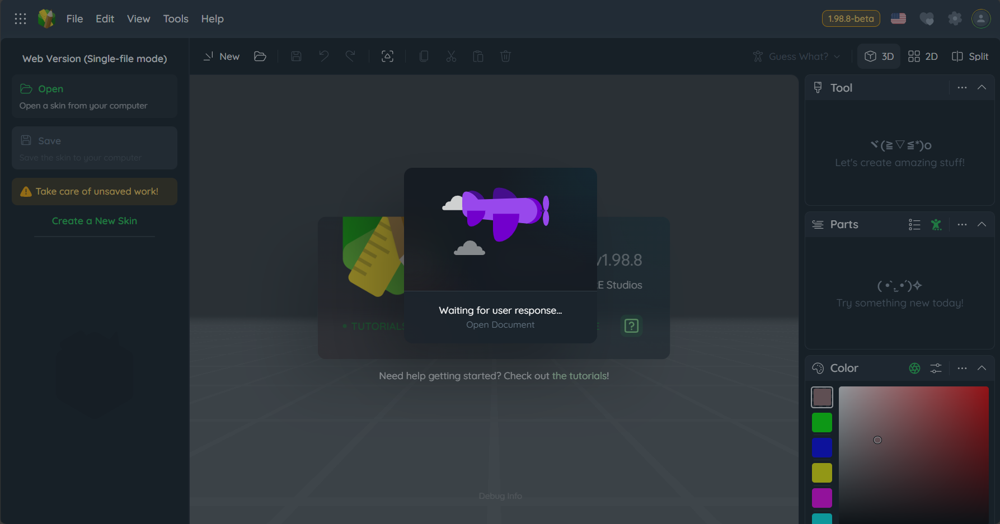

# Getting Started

Before using MCSkinn, we suggest you to look up our [Documentation](docs.inkore.net) first. If you want to know more features or advantages of MCSkinn, please look up our website:

https://inkore.net/zh-cn/products/mcskinn/

This page will guide you to install and config MCSkinn.

## Step 1: Download and Install

MCSkinn is currently in an early preview stage. You can try it out directly by visiting [https://mcskinn.inkore.app](https://mcskinn.inkore.app). Please note that since MCSkinn is still in its early preview phase, you may encounter some issues during use — this is completely normal. You can report any problems [here](https://github.com/iNKORE-NET/MCSkinn/issues/new), and we’ll work on fixing them as soon as possible.

Also, please be aware that MCSkinn does **not** have a desktop version yet. If you come across anything claiming to be "MCSkinn for Windows" or similar, please verify its authenticity. A desktop version is planned for the future — stay tuned!

## Step 2: Start MCSkinn

After launching MCSkinn, you’ll need a directory (also known as a folder) to serve as your skin library. This folder can be empty or filled with your personal skins. All your skins will be stored in this directory. If you want to create a skin from scratch, simply create an empty skin. If you wish to edit skins downloaded from the internet, you’ll need to move (or copy) those skins into this directory. MCSkinn cannot view or edit skins located outside of this directory.

:::warning

**Do not** create your skin directory inside the MCSkinn program folder. We are **not** responsible for any loss of skins due to software updates or other issues!

:::

For the web version and desktop version, due to architectural limitations, there are two different handling methods:

### Web Version

Due to web architecture limitations, MCSkinn cannot fully access directories and therefore does not support multi-skin editing. To import your skin, follow these steps:

After loading the MCSkinn webpage, click the **"Open"** button in the left sidebar. After clicking, your webpage should display something like this:

At the same time, a file picker dialog provided by your browser will pop up. Select the skin you want to edit and click **"Confirm"** to proceed.