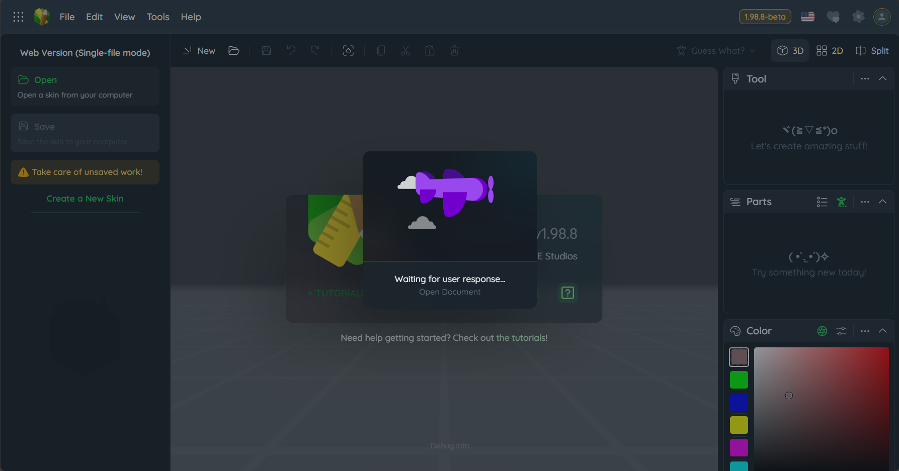

# 开始使用

在使用 MCSkinn 之前，我们建议您查阅我们的[文档](docs.inkore.net)。如果您想了解 MCSkinn 的更多功能和优势，请访问我们的网站：   

https://www.inkore.net/mcskinn

此页面将告诉您如何安装和配置 MCSkinn。

## 步骤 1: 下载并安装

MCSkinn 当前处于早期预览阶段。你可以通过访问 https://mcskinn.inkore.app 来直接使用。请注意，出于 MCSkinn 仍在早期预览阶段，因此在使用时可能会遇到一些问题，这是十分正常的，你可以通过[这里](https://github.com/iNKORE-NET/MCSkinn/issues/new)进行反馈，我们会尽快修复。

另外，MCSkinn 还并未推出桌面版本。如遇到诸如 "MCSkinn for Windows" 之类的内容，请注意甄别。我们会在未来推出桌面版本，敬请期待！

## 步骤 2: 开始使用 MCSkinn

打开 MCSkinn 之后，您需要一个目录（也称为文件夹）来表示您的皮肤库。它可以是空的，也可以填充您个人的皮肤。所有的皮肤都将存储在这个目录中。如果您想从零开始创建皮肤，只需创建一个空的皮肤即可。如果您想编辑从互联网上下载的皮肤，则需要将这些皮肤移动（或复制）到该目录中。MCSkinn 无法查看或编辑位于该目录之外的皮肤。

:::warning

请**不要**将皮肤目录建立在 MCSkinn 程序目录下。对于软件更新或其他原因导致的皮肤遭删除等问题，我们概不负责！

:::

对于网页版和桌面版，出于架构限制，有 2 种不同的处理方法：

### 网页版

出于架构限制，MCSkinn 无法完整访问完整目录，因此也无法进行多皮肤编辑。想要导入你的皮肤，你需要进行以下操作：

在加载 MCSkinn 网页后，点击左侧侧栏的 "打开" 按钮。点击之后，你的网页应当这样显示：

同时一个由浏览器提供的文件选择窗口将会弹出。选择你想编辑的皮肤后，点击 "确认" 即可。