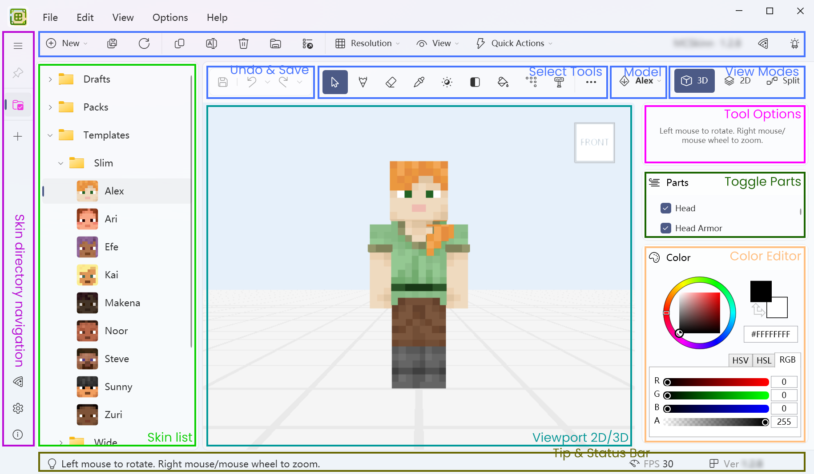

# Main Layout

This post will tell you some basic usages of MCSkinn. If you haven't installed MCSkinn yet, please go to the previous page to get started.

After starting MCSkinn, the main layout should be like this. The figure below shows how the controls are used.

## Skin libraries

**Skin directory navigation**: Select which skin directory you want to go to if you have multiple skin directories. You can also go to Sponsor, Settings and About page.

**Skin list**: Select and manage your skin in a tree structure and head thumbnails. You can drag and drop the selected skin internally, and right click a skin to open its context menu.

## Editor

**Viewport**: The main area for viewing, moving and editing your skins. Different mouse buttons work differently in different tools.

**Select Tools**: Many tools you can choose from. You can also take a screenshot, reset camera here. The tools will be introduced later.

**Models Selector**: Click to select the right model that fits to your skin, then a categorized menu will be open for you to select.

**View Modes**: Switch to 3D/2D/Split view freely for your viewport. This helps a lot editing your skin.

## Toolbar & Menus

**Undo & Save**: Undo, redo, or save your skin in one click. You can click the small arrow after the button to undo/redo multiple steps. You can also right click the save button to save the skin as.

**Tip & Status Bar**: Displays some hint information and current status of the program. When you're confused, the tip may help.

## Sidebars

**Tool Options**: Change brush shape, density and other options for the selected tool. Using the tools wisely helps you design your skin faster.

**Toggle Parts**: Set the skin part should be visible or not. Use the checkbox to toggle its visibility. This helps when you want to see some faces that are hidden normally.

**Color Editor**: Change the color of the current tool using the palette, HEX box and RGB/HSL/HSV sliders.

**Scene**: Change the background environment in viewport in order to view your skin with different game-like effects directly.