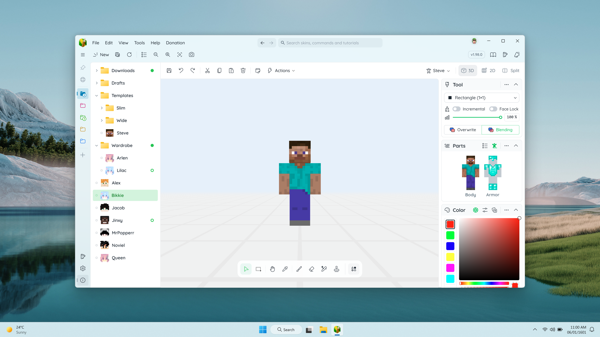

# 布局导航

在从桌面或开始菜单启动 MCSkinn 后，主界面应该是这样的。下图显示了如何使用这些控件。

## 皮肤库管理

**皮肤目录导航**: 选择您想要访问的皮肤目录，如果您有多个皮肤目录的话。您还可以切换到赞助、设置和关于页面。

**皮肤列表**: 在树形结构和头像缩略图中选择和管理您的皮肤。您可以在内部拖放所选的皮肤，右键单击一个皮肤以打开其上下文菜单。

## 编辑器

视口: 用于查看、移动和编辑您的皮肤的主要区域。在不同的工具中，不同的鼠标按钮具有不同的功能。

选择工具: 有许多工具可供选择。您还可以在此处进行截图和重置相机。工具将在后面介绍。

模型选择器: 点击选择适合您皮肤的正确模型，然后将打开一个分类菜单供您选择。

显示模式: 自由切换到 3D/2D/拆分模式 以适应您的视口。这对于编辑皮肤非常有帮助。

## 工具栏

撤销 & 保存: 一键撤销、重做或保存您的皮肤。您可以在按钮后点击小箭头以撤销/重做多个步骤。您还可以右键单击保存按钮将皮肤保存为其他名称。

提示 & 状态栏: 显示一些提示信息和程序的当前状态。当您感到困惑时，提示可能会有所帮助。

## 侧边栏

工具选项: 更改所选工具的画笔形状、密度和其他选项。明智地使用工具有助于更快地设计您的皮肤。

切换部位: 设置皮肤部件是否可见。使用复选框切换其可见性。这对于想要查看通常隐藏的一些面很有帮助。

颜色编辑器: 使用调色板、HEX 框和 RGB/HSL/HSV 滑块更改当前工具的颜色。

场景：更换视口中的背景环境，以帮助您更直接地预览皮肤在游戏中的不同效果。