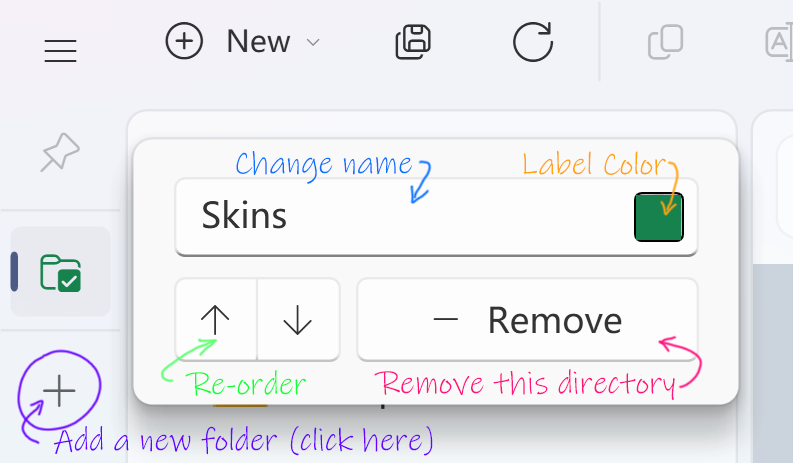
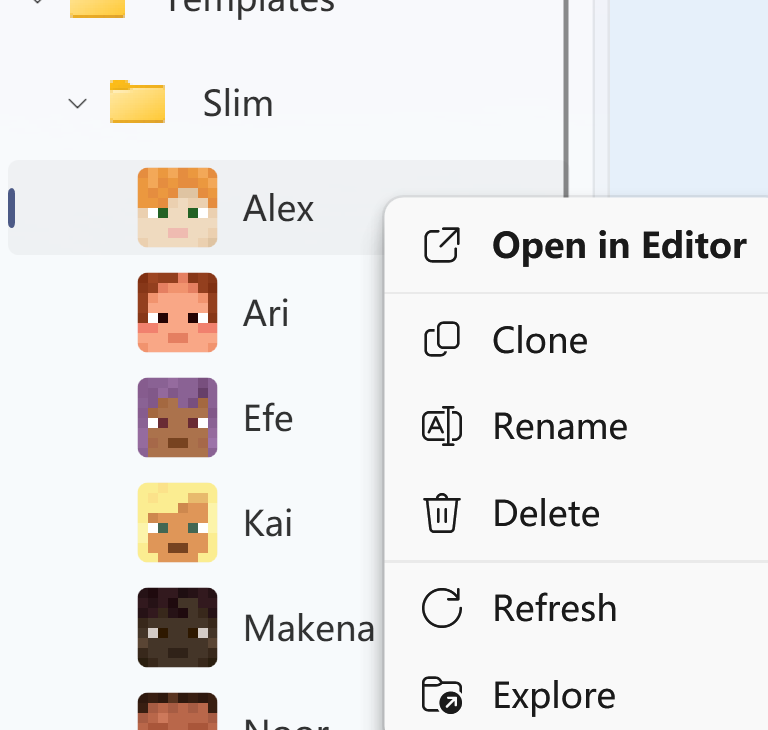

# 皮肤库管理

## 皮肤目录

在 MCSkinn 中，您需要至少一个文件夹作为您的皮肤目录。这是您皮肤库的根目录，这意味着 MCSkinn 可以查看和编辑其中的任何皮肤，而此文件夹之外的任何内容都不能被编辑。

要添加一个皮肤目录，请在左侧的 “皮肤目录导航” 区域点击 “+” 按钮，然后会弹出浏览对话框，选择您的文件夹并按 Enter 键，现在您可以在列表的末尾看到这个文件夹。

:::tip 关于皮肤库目录

您可以随时重命名或移动此目录。但您需要稍后在 MCSkinn 中删除旧目录并添加新目录。

您可以创建多个目录，如果需要的话。但您需要逐个将它们添加到 MCSkinn 中。

您可以将任何文件放入此目录，但 MCSkinn 将仅加载 PNG 文件，这意味着最好不要放入任何不是 Minecraft 皮肤的 PNG 文件 (如果这样做，MCSkinn 在加载时可能会出现卡顿和其他未知问题) 。

:::

您可以右键单击皮肤目录的图标以修改或删除它。更改其名称或将其从皮肤目录导航中删除不会影响实际的文件夹本身。

通常我们建议您只有一个皮肤目录，这样您就可以轻松地在一个列表中管理所有皮肤。但是，您可以添加任意多个。最后，您至少需要一个皮肤目录才能开始使用。

:::danger

小心，不要将任何皮肤目录放在程序安装文件夹中。一旦应用程序更新，所有内容都将被清除！(真实经历 + 血泪教训)

:::

## 皮肤列表

在所选的皮肤目录中，所有皮肤和文件夹都将以类似树状的结构显示在皮肤列表中。您可以点击一个皮肤开始编辑。当选择一个文件夹时，程序将显示其欢迎屏幕。不用担心，只需选择一个皮肤即可。

您可以右键单击一个节点（任何皮肤或文件夹）以打开其上下文菜单，进行重命名、复制或删除操作。您还可以点击“重新加载（在某些版本中为“刷新”）”来完全重新加载皮肤或文件夹，或点击“浏览”以在 Windows 文件资源管理器中定位此节点。

内部拖放也是受支持的。在拖动之前，您需要确保要拖动的节点已被选中（为了防止触摸问题，只有选定的节点才能开始拖动），并且已经保存。提示：拖放操作后，被拖动的皮肤将失去其更改（当您的皮肤未保存时，应该会有一条警告消息）。

## 工具栏命令

窗口顶部是菜单栏和主工具栏。它们几乎具有相同的功能，但我们建议您使用工具栏，它具有更多功能且更易于使用。以下是工具栏中的命令（从左到右）：

- **新建皮肤/文件夹**: 在当前选定项下添加新的皮肤或文件夹。

- **保存所有**: 一次性保存所有皮肤上的所有更改。

- **重新加载 (刷新)**: 重新加载您的选择、当前目录或所有内容。*(当您在外部编辑器中编辑了皮肤，希望放弃对此皮肤的所有更改，或者 MCSkinn 没有正确加载此节点时，这非常有用)*

- **复制**: 立即复制您的选择。

- **重命名**: 打开一个重命名表单以重命名您的选择。

- **删除**: 删除您的选择（总会有一个消息框）。

- **浏览**: 在 Windows 资源管理器中定位您的选择。

- **打开**: 使用您喜欢的外部图像编辑器编辑您的皮肤。

- **分辨率**: 查看或更改您的皮肤分辨率。

- **视口选项**: 更改视口的一些选项。

- **快速操作**: 一些有用的操作和工具。