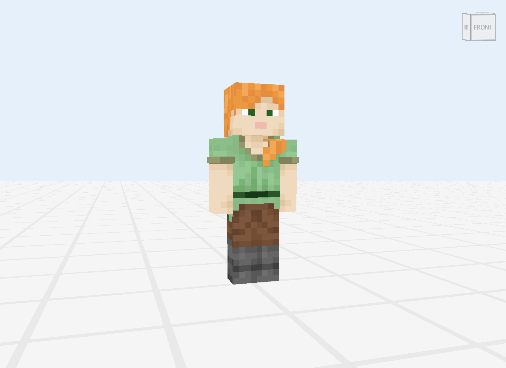
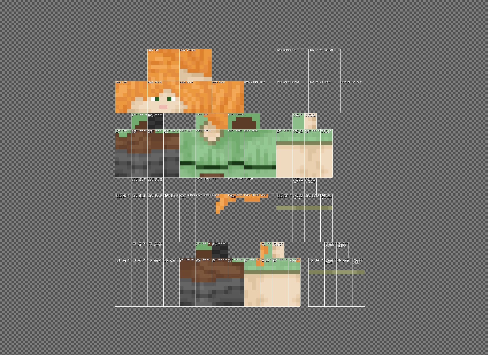
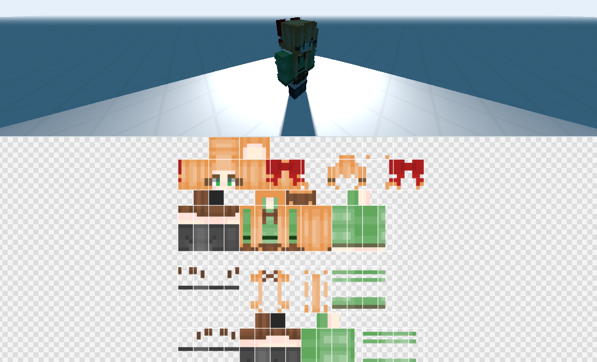
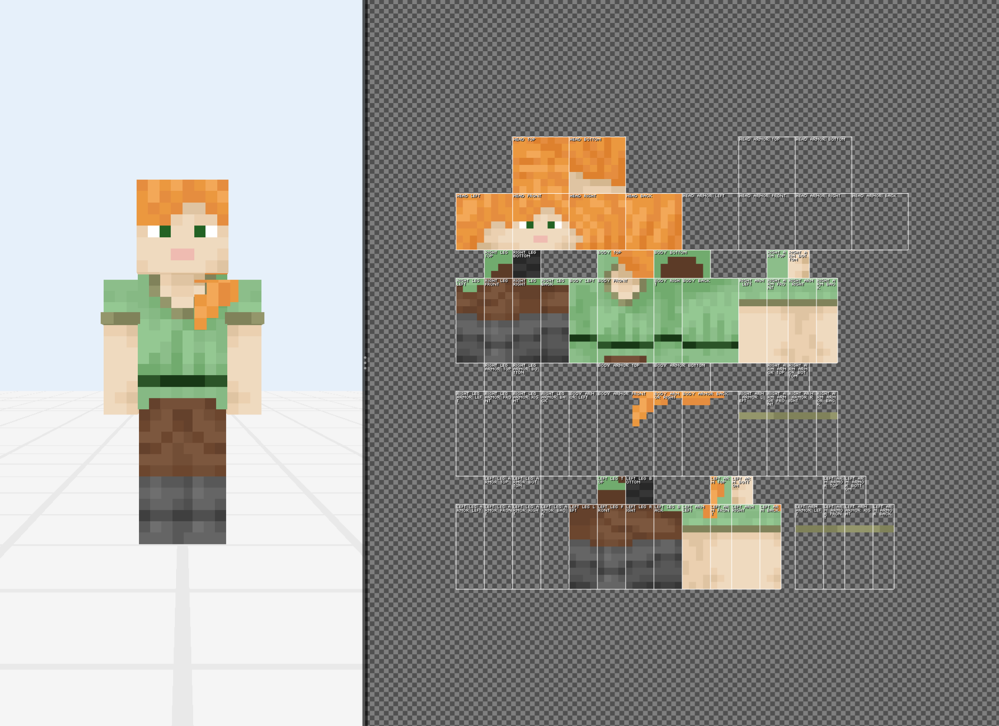

# Viewport

## View modes

In the top-right area you should see a 3D/2D/Split button case. This is how you can switch the view mode of the main viewport. There’re currently 3 view modes.

### The 3D View

The 3D view gives you a perspective way to preview and edit your skin. This is also how in-game skins look like. You can use any tool lively on the 3D model. 

:::info

Many models have their overlays called "armor layer", don’t get confused!

:::

Use different mouse buttons to move the view flexibly. Memorize the table below, it might be very useful!

| Mouse button  | Camera Tool in 3D | Other Tool in 3D |
| ------------- | ----------------- | ---------------- |
| Left          | Rotate view       | Draw             |
| Right         | Translate view    | Rotate view      |
| Middle        | Scale view        | Translate view   |
| Wheel         | Scale view        | Scale view       |

*(How the mouse button works in 3D view)*

### The 2D View

The 2D view unfolds all your skin parts and gives you a view of the original image. In this mode, it’s very easy to edit every face of any part. Also some unused area can also be edited.

Mouse buttons in 2D view are much more simpler, here’s how they work. It’s super easy to know, right?

| Mouse button  | Camera Tool in 2D | Other Tool in 2D |
| ------------- | ----------------- | ---------------- |
| Left          | Translate view    | Draw             |
| Right         | Translate view    | Translate view   |
| Middle        | Translate view    | Translate view   |
| Wheel         | Translate view    | Translate view   |

### Split View

It’s kind of tiring to switch 3D/2D from time to time. Why not try the split view? The split view splits the whole viewport in to two parts — 3D and 2D. The two parts will sync together, and you can switch from one to another just by moving away your cursor!

Did you see that black (or white in dark mode) bar in the middle? Yes, you can hold and drag it freely to adjust the percentage of every view. Right click that bar, then you can change the orientation (horizontal or vertical) and swap their places.

It’s very easy to understand that the mouse button works in the way above in different areas. If you don’t get it, then try it.

## Painting Tools

### Basic Tools

**Move Tool (aka Camera Tool, View Tool, and Pan Tool)**: With this tool you can move your view easily by holding and moving your mouse. Different mouse buttons in different view modes move in different ways (we talked about that above).

**Draw Tool**: Draw a pixel block drawing on the skin, which is often used to draw the structure and details of the skin. You can also adjust the size of the brush according to your needs.

- **Incremental**: Affect any given pixel more than once in one click if checked.

- **Brush**: The brush shape you want to draw in.

**Eraser Tool**: Erase and modify everything you drew wrong. Like a pencil, you can adjust the size of the brush to suit your needs.

**Dropper Tool**: Pick a color on the cursor position. If Shift is pressed, the picked color will be the new background color, otherwise foreground color.

### Adjustment Tools

**Dodge/Burn Tool**: Dodge or burn the base color, which changes the brightness of the colors in the area. This can be used to control the intensity of lightening and darkening according to different intensities and brush sizes, so as to increase and change the contrast of the character’s time.

- **Threshold**: The degree how much the tool affects the pixels.

**Lighten/Darken Tool**: Lighten/darken the base color. which changes the saturation of the colors in the area.

### Additional Tools

**Fill Bucket**: Make the connected area filled with a new color. It can be directly paved in large quantities, which is very useful for background color laying.

- **Threshold**: the tolerance level. It can range between 0 and 255. A lower number means the tool will only fill areas very similar to the pixel you click on. A higher number lets the tool fill a wider range of colors. Try starting with a tolerance of around 30. If the tool isn’t filling enough, increase the number. If it’s filling too much, decrease the number.

**Noise Tool**: Lighten/darken the base color. which changes the saturation of the colors in the area.

- **Holdness**: The opacity of noise.

**Stamp Tool**: Pick a sample area and paste the pixels from the sample area to another position. If Shift is pressed, the tool will be in sample mode, otherwise paint mode. You need to pick the sample before using this tool for the first time.