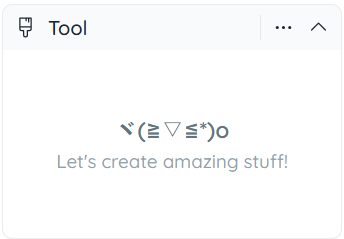

# Side panels

## Tool Options Panel

This is where you set the options and arguments for the selected tool. With different tool selected, the content in this panel will be also different.

 

If the selected tool has no options. The help text will be displayed instead.

## Toggle Parts Panel

With this panel you can easily choose which part to show and which to hide. The parts will be listed in a tree structure (or list if there's no hierarchy). Click the check box on the left of a part name to toggle its visibility. This helps a lot when you want to draw the inner face covered by another part (like the armpits).

This only works in 3D mode. In 2D mode, all parts are always visible. If you want to make the unchecked parts semi-transparent instead of completely invisible (aka. Toggle Ghost Parts), go to *View* (from the menu or the main toolbar) and check the *Toggle Ghost Parts*.

## Color Panel

The color harmony and selection panel, where you can select and bring up your favorite color, and then use the drawing tool to color it.