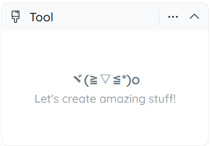
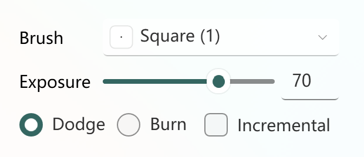

# 侧边栏

## 工具选项面板

这是您设置所选工具的选项和参数的位置。选择不同的工具时，此面板中的内容也会不同。

 

如果所选工具没有选项，帮助文本将显示。

## 切换部位面板

通过此面板，您可以轻松选择要显示和隐藏的部件。部件将以树形结构（如果没有层次结构，则为列表）列出。单击部件名称左侧的复选框以切换其可见性。这在您想绘制被其他部件遮盖的内部面（如腋下）时非常有帮助。

这仅适用于 3D 模式。在 2D 模式下，所有部件始终可见。如果您希望使未选中的部件半透明而不是完全透明（又称 半透明隐藏部位），转到 "视图" 并勾选 "半透明隐藏部位"。

## 颜色编辑器面板
颜色和选择面板，您可以在其中选择并调出您喜爱的颜色，然后使用绘图工具进行着色。

即将推出：色卡