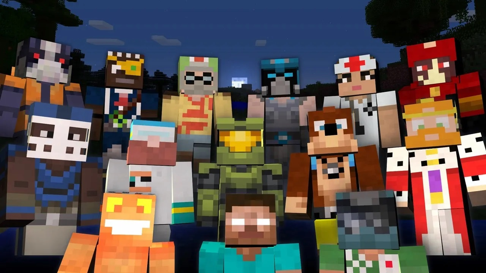
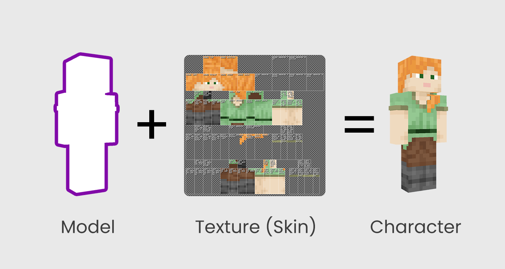
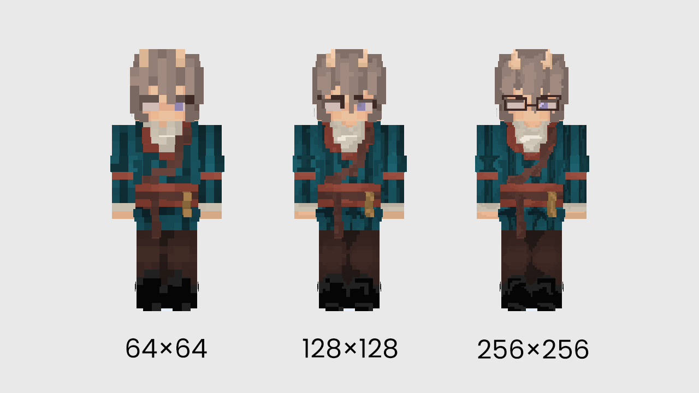
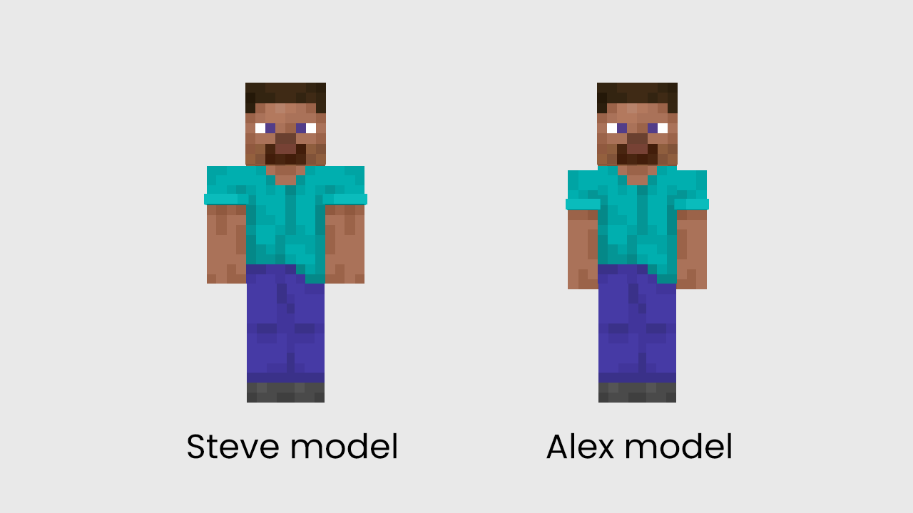

# About Minecraft skins

Skins are an essential element of Minecraft, and they are the presence that expresses the personality of adventurers.

And how to create and own a unique skin, how to make your own personalized skin not ordinary?

*Image from the Internet: Best Minecraft Skins (attackofthefanboy.com/guides/best-minecraft-skins/)*

## What is a Minecraft skin

First of all, let's understand what the essence of skin is.

The skin's is actually a PNG texture. Texture, on the other hand, can be understood as the clothes we usually wear, and we ourselves are the subject of the characters. When we wear different styles of clothes, we are also decorated with different styles and appearances. The skin's textures define our style and appearance in the game.

## The visual magic — Resolution

The skin's textures give it style, and resolution plays a key role in determining the fineness of the skin!

Nowadays, 64x is considered the most basic and widely used official texture specification, while 128x and 256x are considered high pixel resolution texture specifications. The different pixel resolution sizes of the skin will improve the accuracy of the "high definition" of the visual effect, so the pixel resolution is one of the important factors in determining whether the texture is clear and detailed.

In Bedrock Edition, skins can have double the resolution of a normal skin. This means the skin template can be up to **128×128** instead of just 64×64. The normal templates still apply, but players get 4× the number of pixels to work with, since both dimensions have been doubled. However, in the current stage, in Java Edition, 128px skins are NOT supported.

## Different skin models

In Minecraft, we have two model type to choose from: the Steve models, and the Alex models.

The main difference between the two characters is the thickness of their arms, which players can choose according to the style of the character they set. Steve model has a thicker arm while Alex model's arms are slimer.

When designing character skins, we also need to decide to use one-layer model or two-layer-model.

**One-layer model (usually 64×32 or higher)**: It means that there is only one layer of character skin, and only one style can be designed for the hands and feet, and then the program will automatically mirror one side and copy it to another side. This might make your ideas limited, but this is perfect if you're the first time designing a skin.

**Two-layer model (usually 64×64 or higher)**: On the basis of a single layer of skin, add a layer of pattern, just like putting on a coat and a hat for the character. Moreover, the hands and feet of the double skin can be designed separately, and one side will not be mirrored to the other side. This undoubtedly provides the fun and selectivity of the creation. Usually this is the way in which skin design is more commonly used by beginners after they become proficient.

## Conclusion

In conclusion, Minecraft skins are low dimension PNG images that get wrapped around your character inside the game. The most common resolution for skins is 64 x 64 pixels. The Java edition of the game has easy-to-make skins, while Bedrock adds some depth and custom bumps over the protagonist's body.

Do make sure your game is not a demo version to get most of these Minecraft skins and let's get started!