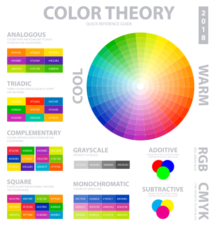
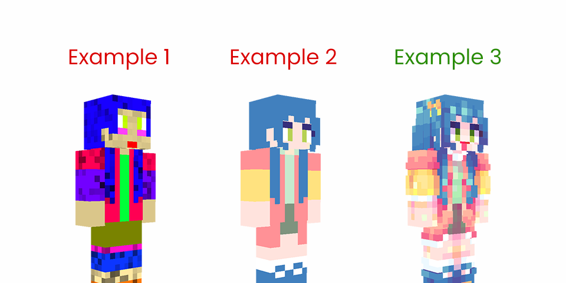

# 颜色与调和

皮肤是通过颜色的组合而成的，几乎没有线稿，所以颜色是否恰当就成为皮肤的关键。如果你想做好调色，首先需要更多地了解颜色。

## 颜色元素

**颜色的三个要素**： 色彩的三要素：色相，明度，纯度 (在软件里叫 HSV)。色调确定了颜色的基本特性，例如一个物体总体上偏向蓝色 / 红色 / 黄色。亮度设定了颜色的光暗程度，如在水彩画中，淡黄色就是通过将柠檬黄与白色混合得到的。饱和度决定了颜色的活力程度，很多时候人们说的 "颜色不够透明" 实际上是由于饱和度过低所造成的。当这些元素结合并形成一个环状结构时，它们会呈现出下面的样子：

*图片来自网络: https://www.freepik.com/free-vector/color-theory-poster_6203155.htm*

采用恰当的色彩搭配，能产生既令人愉悦又美观的色调。

## 什么是舒服的颜色？

独立的色彩并无美丑之分，令人舒心的色调更多来自于颜色的组合。各种组合会带来各种效果。

美观的组合层出不穷，但不妥的组合也有其规律例如，大面积的过于亮丽或暗淡的色彩，混乱的色彩布局等。下面是一个不太好的例子，以及如何纠正这些错误：

*一些错误和正确的例子*

让我们看看上图中的三个例子。不要模仿第一个和第二个。

示例 1:
 乱用噪点，头发和衣服颜色相近，没看到的地方没画，什么颜色都往上加，根本没动双层，以及烈焰红唇。

示例 2: 没有明面和暗面对比，细节不足，缺少层次感。

示例 3: 正确的明暗面，足够的细节和正确的配色方案。然而，过于明亮的嘴唇仍然不值得模仿。

此外，颜色不宜太亮或太重 (过于饱和)，如鲜红色或深黑色。