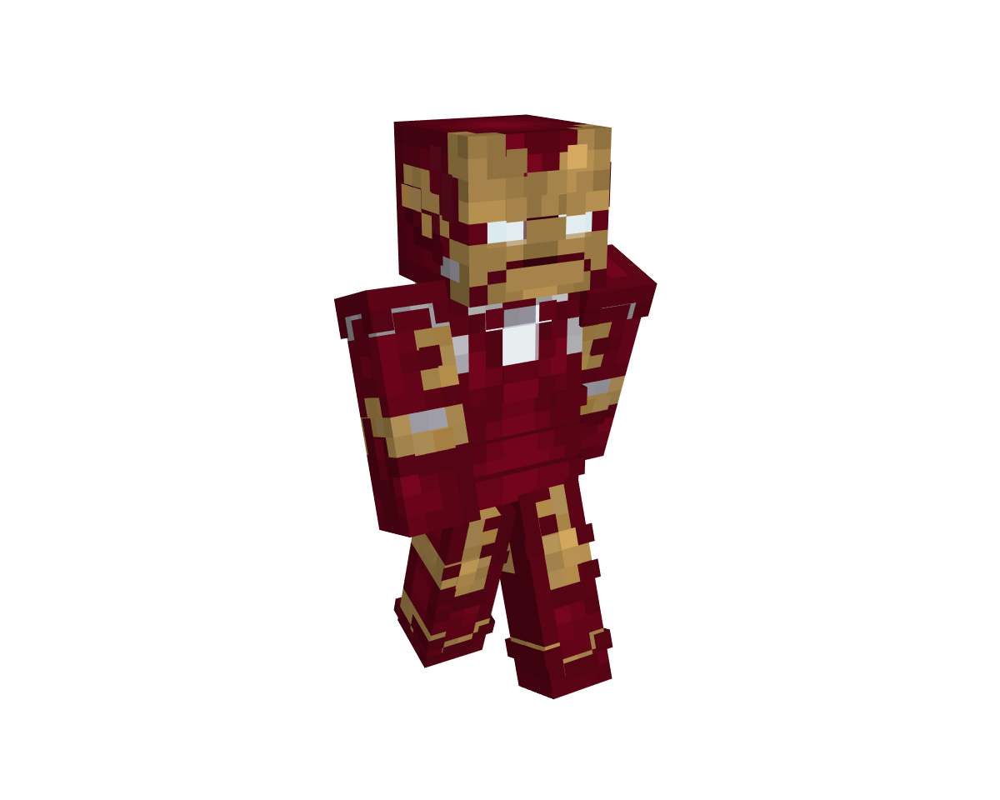

# 表达你的想法

许多游戏爱好者最初的愿望只是想获得自己喜欢的角色的皮肤，但在网络上并未找到合适的，因此开始了创作旅程，所以角色的准确复原至关重要。

## 如何把自己想表达的东西表达出来？

皮肤的重要之处在于需要能识别出描绘的人物，在受限网格展示内容的环境下尤为关键。由于皮肤的像素通常较低，并且可以呈现有限的信息，因此它们需要在有限的空间内巧妙地传达他们想要的东西。

如何在有限的空间内展示您需要的东西？答案是去掉不必要的细节，增强角色的身份。换句话说，在创作过程中，我们所需要的只是去除不必要的细节，突出角色的显着特征。

*通过面部、衣着等明显特征，可以看出这就是钢铁侠。*

在为像素艺术创作同人艺术时，我们不能尝试包含所有细节，因为像素的信息有限。因此，我们需要从原始图像中提取主要特征，这样即使风格不同，也可以看出它是同一个角色。

人们首先要看作者在画什么，然后看画的好不好看。

如果添加过多的元素，甚至只是降低高清图像的分辨率并粘贴它，您将无法看到绘制的内容，这需要特别注意。

## 如何练习

### 让别人知道你画的是什么

正如艺术的根基在于握住正确的笔法，识别你绘制的图像也是基础知识。我们需要强调特征，同时忽视在皮肤上不必要的细节。

### 正确地选择颜色

在学习初期，不应依赖于吸色管，而是应通过色相环自己调配颜色。务必保证你调配的颜色与你绘制的对象的颜色相符。

### 一些其他的建议

画你所爱，如果你无法确定要画什么，可以尝试将你喜欢的角色绘制成皮肤。多观察优秀的作品，进行反复比对，你也可以寻求技术高超的专家的建议。

在绘制皮肤的过程中，提高审美观，培养对色彩的感知能力，同时学习一些美工后期软件，如 Photoshop 和 Illustrator。

在绘画过程中，你需要持续学习，找出前一幅作品的问题，并在下一幅作品中进行改进，这样才能持续进步。

不要过于功利，没有精华并不意味着作品不好。