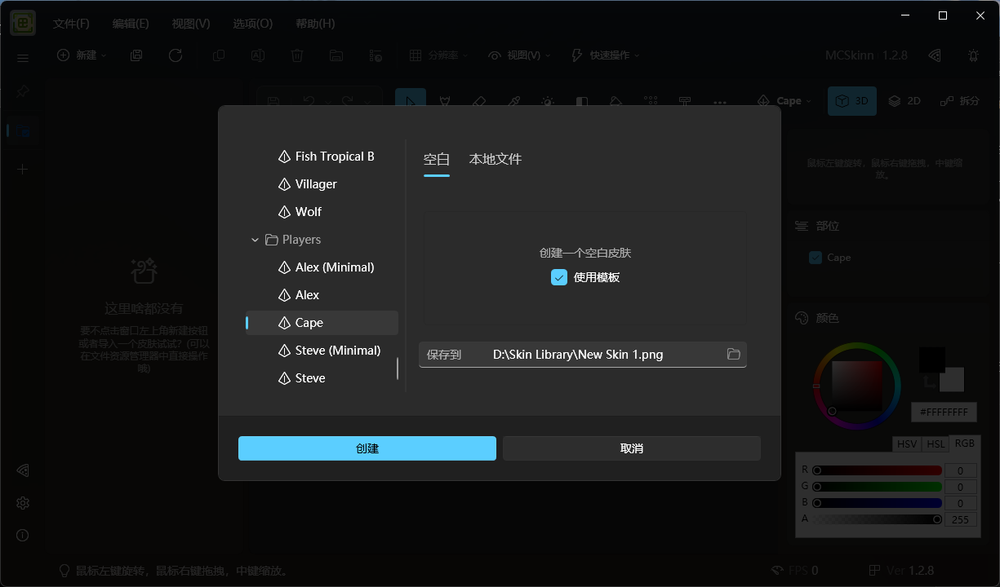
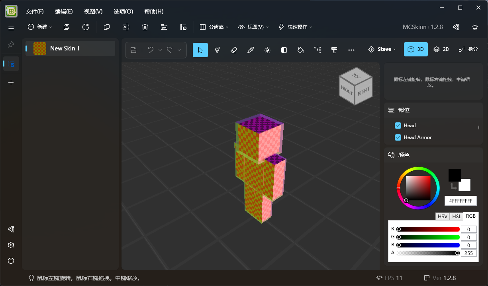

# 准备工作

## 开始之前

本系列文档将带您从零构建属于您的 Minecraft 皮肤。首先，您需要确保您的 MCSkinn 已正确配置并设置了皮肤库文件夹。若没有，请查阅[这里](../../overview)。如果您准备好了，请向下翻阅。在这些工作结束后，您会 (我们肯定) 欣喜地看到您的创意在 MCSkinn 里呈现!

:::tip

您不需要总是按文档的步骤照做。加入自己的创意和理解会更有益于创建独一无二的皮肤！

:::

## 创建新皮肤

在"新建"菜单栏中，您会看到一个"皮肤"按钮。点击它，您会看到一个浮出窗口。

*一个配置好的皮肤选择器。*

选择器的左栏是 Minecraft 中的各种皮肤模型。一般情况下，您只需要转到 "Player" 文件夹下，并在其中进行选择。

在 "Player" 文件夹下有 5 种皮肤类型。 Cape 类型是披风，而 Steve 和 Alex 类型则会控制您皮肤的手臂粗细。(Minimal) 后缀会控制您皮肤的层数 (单层或双层)。除非您的皮肤需要在 Minecraft 的旧版本 (1.8 以下)，否则我们不建议您使用单层皮肤。

选择器的右边是一些相关选项，其中 "空白" 和 "本地文件" 选项卡将控制您是直接新建皮肤还是打开一个皮肤文件。在 "空白" 选项卡下有一个 "启用模板" 的复选框，禁用该选项会使您的皮肤各部分被不同颜色的半透明颜色填充，就像这样：

*禁用模板时的 Steve 皮肤样式。*

如果启用该选项，您的皮肤将会显示为该皮肤类型的默认皮肤。

底部是您创建皮肤的路径，建议不要更改。

在选择好一切选项后，点击 "创建"，然后您就会看到一个待编辑皮肤。