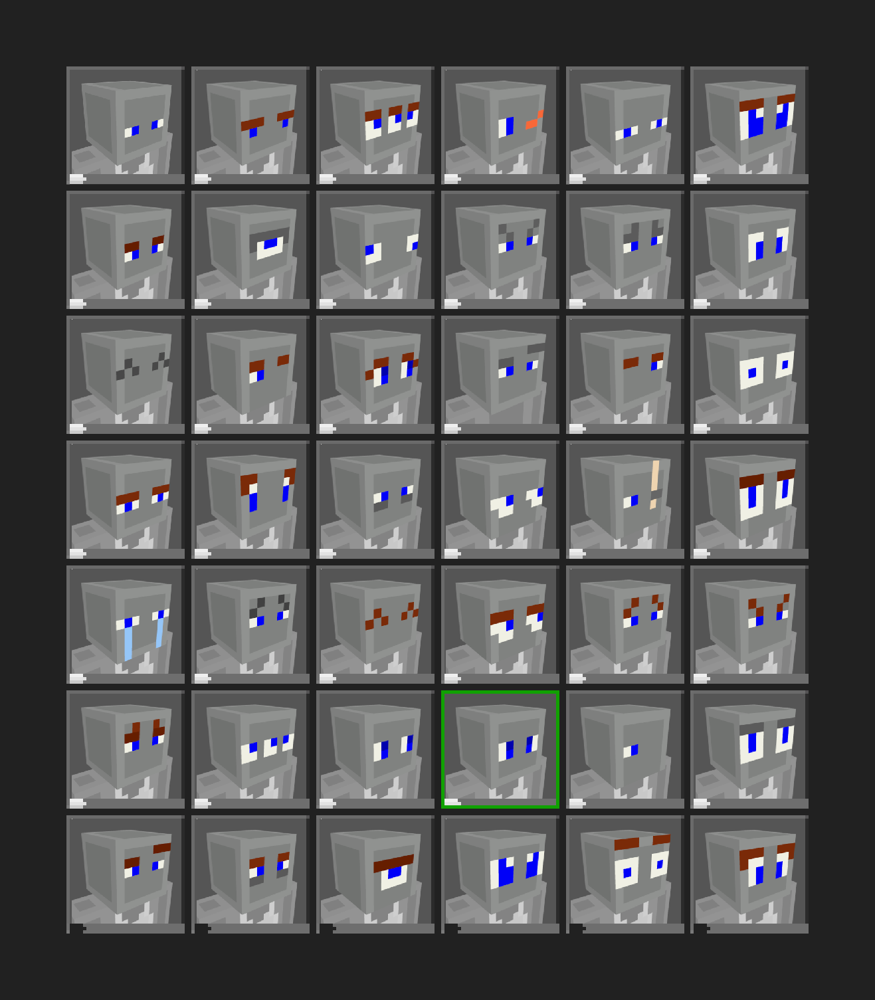

# Drawing the Head

Drawing the head is the first step in creating your skin, and it plays a significant role in defining its appearance. Below, we'll detail how to draw a head.

## Inner Hair

For a typical 64x64 skin, the head area is only 8×8. With such limited space, it's crucial to make the most of it.

Before drawing the head, it's best to hide other parts to focus on it. In the "Parts" panel, deselect all parts except for "Head". This will help you observe the head in the 3D view.

The key to drawing the head is choosing the colors for the skin and hair. Once you've set up your palette, start by filling the entire head with the skin color.

After filling, use the hair color to outline and fill in the inner hair.

:::tip

There are limitations to hairstyles. If you're lacking inspiration, you can reference hairstyles from others. Bangs can also add texture to your skin.

:::

The inner bangs only need rough outlines, as we'll add outer bangs later. So don't worry too much if they look stiff for now.

## Adding Details

To add more detail to the hair, you'll need to use the "Lighten/Darken" tool. Select it from the toolbar.

Start by adding shadows to the hair. Choose "Darken" from the sidebar and draw 3 pixels on each side of the hair to define the shadows, then add more details according to the direction of the hair.

:::tip

Avoid making too regular patterns; it's better to have some randomness. And don't overuse the noise tool.

:::

Next, add highlights. This is similar to adding shadows, but don't overdo it.

For the other sides, follow a similar approach.

At the top of the head, draw the hairline and add highlights and shadows around it. Again, it's best to have some randomness.

Finally, connect adjacent pixels to ensure there are no gaps between faces.

## Outer Hair

You can draw the outer hair using similar methods as above. For a more three-dimensional effect, you can skip drawing the top of the second layer to create a more fluffy appearance.

First, make the outer layer visible. In the "Parts" panel, select "Outer Head" (often called "Head Armor").

Then, draw the outline of the outer layer. To distinguish layers quickly, use a brighter color, and replace it with the fill bucket after completing the final look.

Next, add shadows and highlights to the outer layer using the same methods as above.

Feel free to experiment with different hairstyles. Don't just copy and paste; add some uniqueness to your skin.

## Eyes

There are several ways to draw eyes, but only a few look good in practice. Here are some styles:

*Some eye styles in Minecraft: Bedrock Edition*

We suggest not drawing a mouth (because of limited space and potential awkwardness), but you can try it in special cases, which might enhance your skin.

First, choose suitable colors for your pupils and eyelashes. Then draw the pupils and choose a color for the whites of the eyes. Avoid pure white; the pupils should have a slight color tint (S: about 1~2, V: about 99~98), as shown in the image.

Next, use the "Dodge/Burn" tool to add more detail. In this example, I used "Burn" with an exposure of 100 and drew twice on the upper part of the eyes.