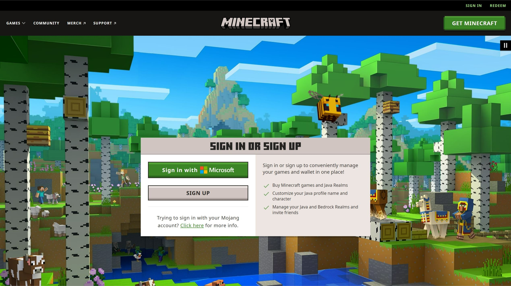
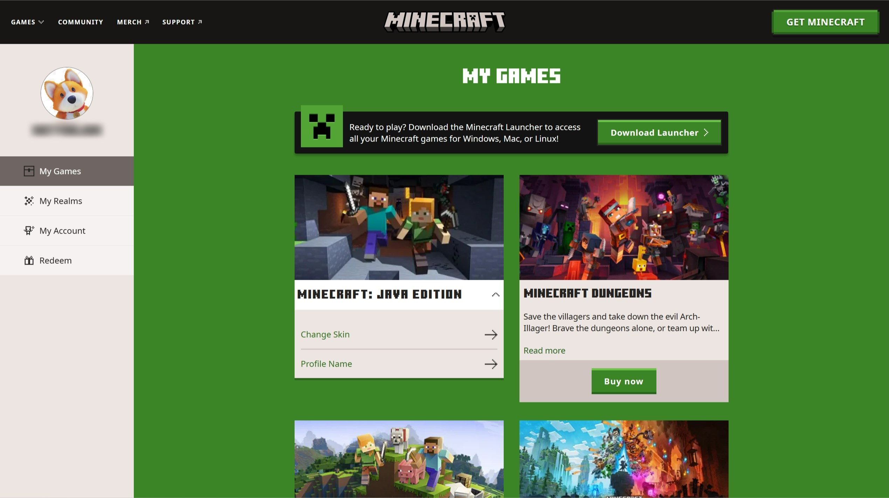
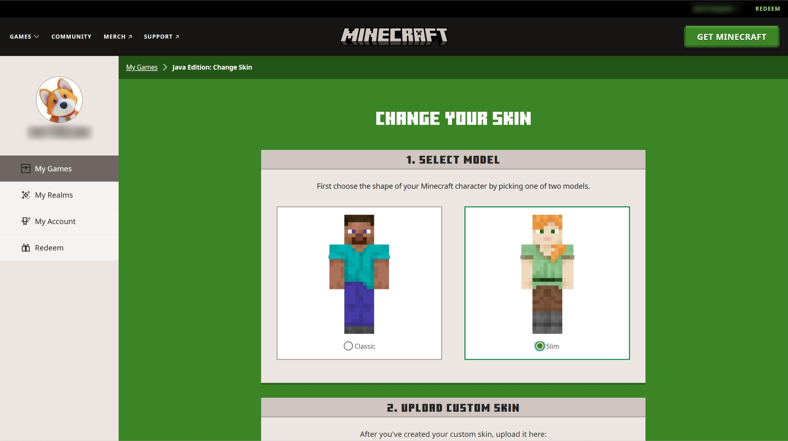
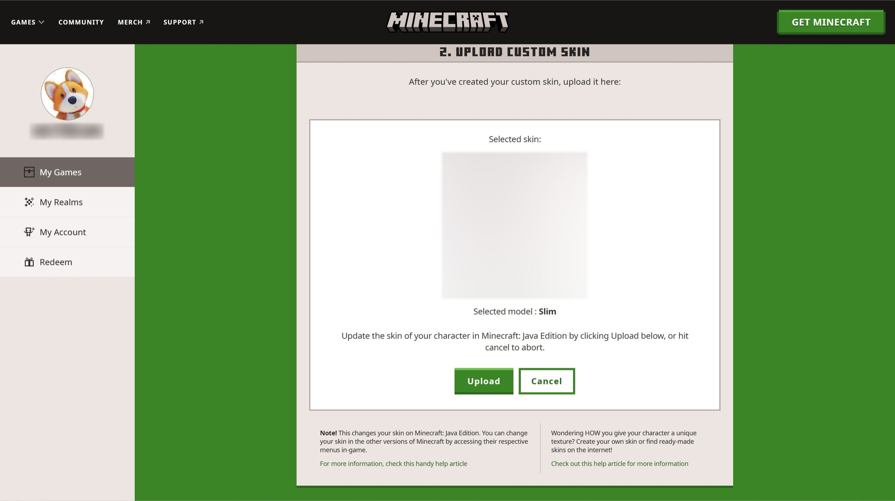
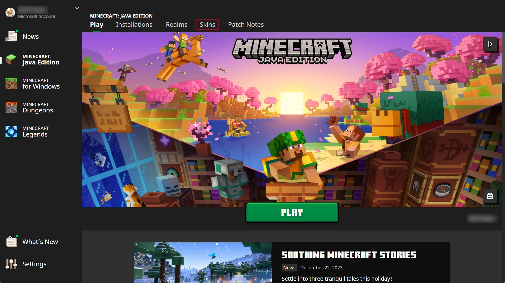
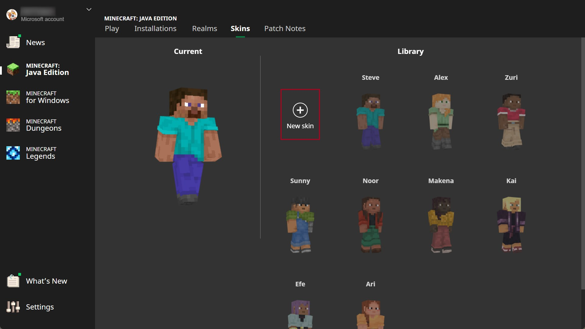
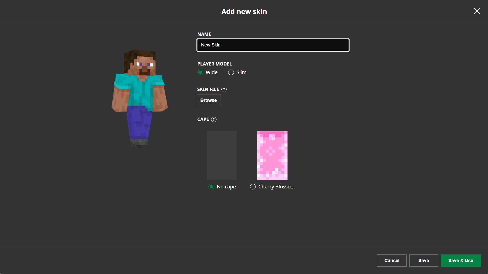

# Upload my skin to Minecraft: Java Edition

Before modifying the skin, make sure you have already paid Minecraft Java Edition (demo versions won't work) and the game is not running while changing your skin. There're two ways you can change your skin:

## Method 1: Upload in Minecraft.net

Go to https://www.minecraft.net/en-us/login and log in your Microsoft account.

Then you will be redirected to the following page, click **Change Skin** under the "MINECREAFT: JAVA EDITION".

Choose the model of your skin, and scroll down the page.

Click **Select File**, and select your new skin file on your computer.

Finally, click the "Upload" button, your new skin is now ready!

## Method 2: Upload via launcher

Open the Minecraft Launcher, once the launcher opens, don't click the play button as usual, instead, click **Skins** tab.

Click the **New Skin** button.

Write down the name, select the model type and upload your skin file. click on the **Browse** button to select your PNG skin file.

Finally, click **Save & Use** to save the changes.

Now launch the game, and you shuold be able to see your new skin.