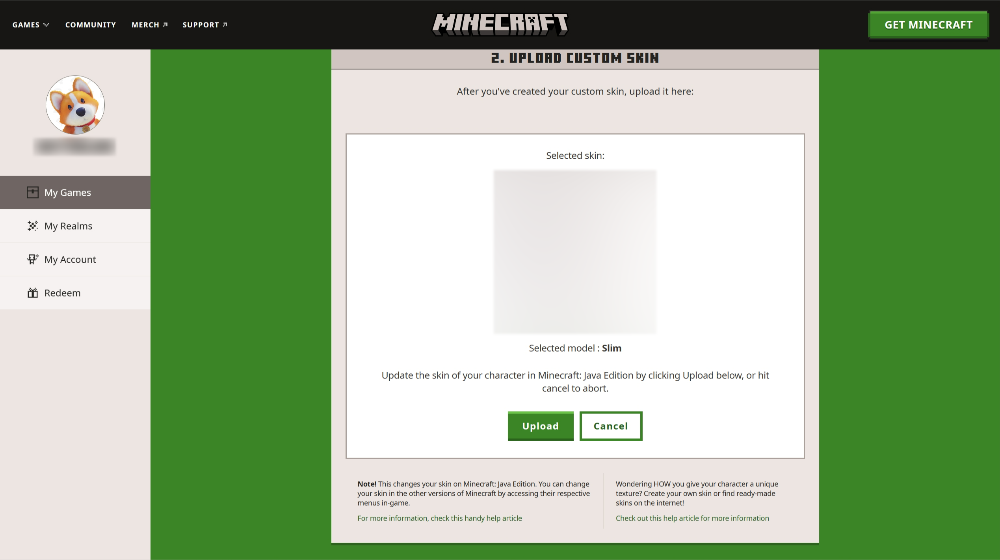
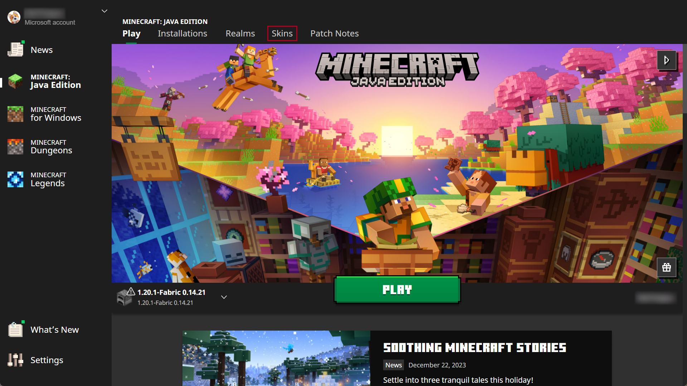
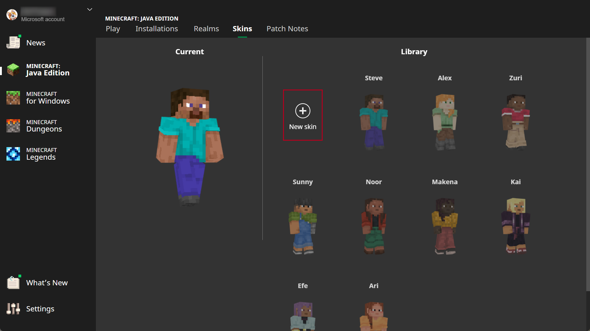

# 上传我的皮肤到 Minecraft: Java 版

在修改皮肤之前，请确保您已购买正版游戏（非正式版无法使用这种方法），并且在更改皮肤时游戏没有运行。有两种方法可以改变你的皮肤：

## 方法 1: 在 Minecraft.net 上传

进入 https://www.minecraft.net/zh-hans/login 然后登录你的微软账号。

然后您将进入以下页面，单击 **更改皮肤**，这个选项在 "MINECREAFT: JAVA EDITION" 的下面。

选择您的皮肤模型，然后向下滚动页面。

点击 **选择文件**，选择你要更换的皮肤文件。

最后，点击 **上传** 按钮，你的皮肤就更换好了！

## Method 2: 在启动器中上传

打开 Minecraft Launcher, 当启动器打开时，不要点开始游戏按钮，而是点击 **皮肤** 选项。

单击 **新皮肤** 按钮

输入皮肤名，选择模型并上传你的皮肤文件。单击 **浏览** 按钮来选取你的 PNG 皮肤文件。

最后，点击 **保存并使用** 按钮来保存更改。
现在重新启动游戏，你应该可以看到你的新皮肤了 (有可能会有延迟)。