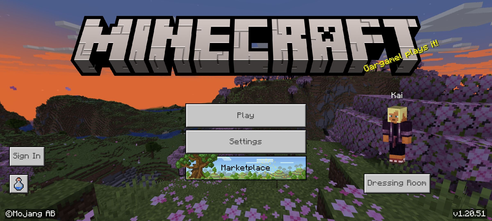
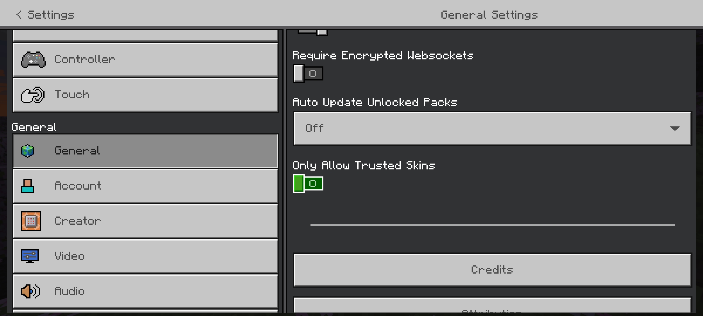
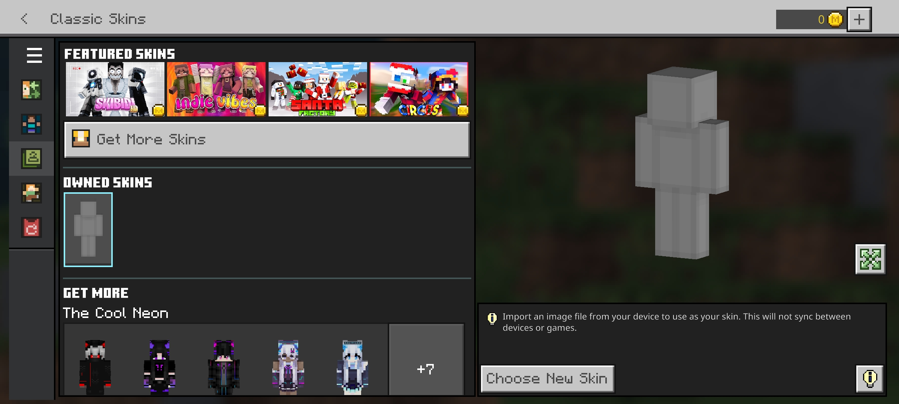

# 上传我的皮肤到 Minecraft: Bedrock Edition

## 更改设置

在基岩版中更改皮肤之前，更改一些设置是非常重要的。在主菜单上，单击 **设置** 按钮。

接下来进入"通用" 界面，确保 **仅允许受信任的皮肤** 是 **关闭** 的。(如果你打算和朋友一起进行多人游戏，那么也请确保其他人设备上的此设置也已关闭。)

:::danger

非常重要！如果此选项是启用的，其他人可能看不到你的皮肤，你也可能看不到他们的皮肤。

:::

## 上传我的皮肤

然后回到主菜单，点击 **更衣室** 按钮。

单击 **编辑角色**，然后单击左侧面板中的第三个（绿色）选项。

选择空白皮肤（灰色的那个），然后点击 **选择新皮肤**，然后在文件管理器中选择您的 PNG 文件。加载后选择正确的模型。完成！

现在，无论何时启动 Minecraft，你都可以看到你的新皮肤。当然，新皮肤也许会被盔甲遮盖，你可能需要脱下盔甲才能看见。