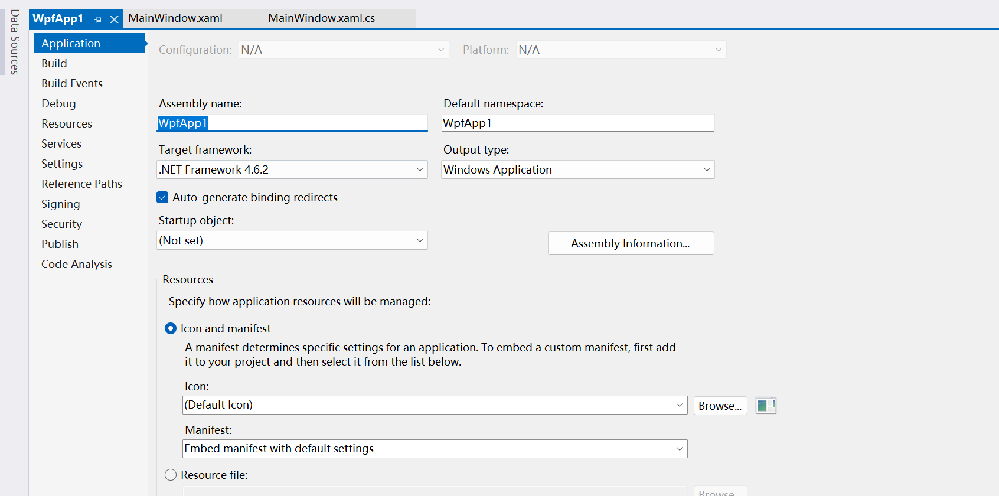
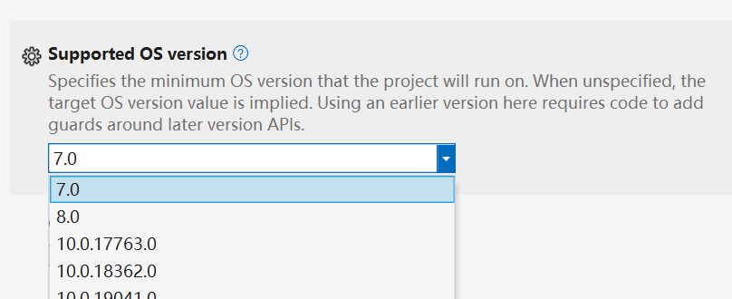

# 开始

在本指南中，我们将引导您将 iNKORE.UI.WPF.Modern 库集成到您的应用程序中，使您的 WPF 项目拥有现代且视觉上吸引人的用户界面。通过支持 Fluent Design 元素和灵活的自定义选项，iNKORE.UI.WPF.Modern 可以将您的应用程序转变为视觉上令人惊叹的体验。

## 第一步：调整配置

在安装包之前，我们建议您对项目设置进行一些调整。在解决方案视图中右键单击项目，然后单击 **属性**。


### 针对 .NET Framework 项目

如果您的 csproj 样式是传统的，您应该会看到以下界面：



:::info 提醒

我们强烈建议您将 csproj 文件转换为 [SDK 样式](https://learn.microsoft.com/en-us/dotnet/core/project-sdk/overview)，它提供了更多功能和更好的体验。有关更多信息，请查看 Microsoft 的文档。

:::

如果您的项目已经升级到 SDK 样式，您应该会看到以下界面：


无论您的 csproj 文件是什么样式，请确保目标框架是 .NET Framework 4.6.2 或更高版本。

如果您使用的是旧版本框架，库可能无法正确加载。

### 针对 .NET Core（包括 6.0 及更高版本）项目

首先，请确保框架是 .NET 6.0 或更高版本。


:::danger 注意！

我们刚刚移除了对 .NET Core 3.1 和 .NET 5.0 的支持，这意味着这些框架与此库的最新版本不兼容。

如果您必须坚持使用这些旧版本，您仍然可以下载完整的源代码并自行编译支持旧版本的二进制文件。但是，由于引用了较新的 API，此编译可能会失败。

:::

然后让我们关注 **目标操作系统版本** 选项。我们建议您将其设置为 `10.0.18362.0` 或更高版本，以启用主题同步功能。


:::warning

如果目标版本设置为 10.0，您可能会在输出目录中看到这些文件：


这是由 .NET SDK 引起的，与我们的库无关。

如果您介意这些文件，请将其设置为 7.0，尽管这会使这两个文件消失，但您的应用程序将无法跟随系统主题。

:::

:::tip

尽管 **目标操作系统版本** 设置为 10.0，您可以将 **支持的操作系统版本** 设置为您想要的任何版本。为了在 .NET 支持的任何 Windows 版本上运行您的应用程序，最佳选择是将其设置为 `7.0`。



:::

## 第二步：安装包

再次右键单击您的项目，然后单击 **管理 NuGet 包** 菜单。


然后单击 **浏览**，在搜索框中输入 `inkore`。我们所有的公共库都会出现在这里。然后选择 `iNKORE.UI.WPF.Modern` 并单击 **安装**，选择 `iNKORE.UI.WPF` 并再次单击安装。


然后您应该会看到此包已添加到您的依赖项列表中：


:::info

搜索时会出现一些其他库。您可以在我们的 [Github 资料](https://github.com/iNKORE-NET) 和它们的存储库中了解更多关于它们的信息。

:::

:::warning 为什么需要 **iNKORE.UI.WPF**？

通常，我们使用 `iNKORE.UI.WPF` 作为所有 WPF 库的基础库。它包含一些在所有 WPF 库中共享的常用工具和控件。

如果您在运行时看到此异常，请手动安装 `iNKORE.UI.WPF`：

> **System.Windows.Markup.XamlParseException**：'初始化 'iNKORE.UI.WPF.Modern.ThemeResources' 时引发异常。'

> [InnerException]
> FileNotFoundException：无法加载文件或程序集 'iNKORE.UI.WPF, Version=######, Culture=neutral, PublicKeyToken=######'。系统找不到指定的文件。

安装 iNKORE.UI.WPF.Modern 时，iNKORE.UI.WPF 应该会自动安装。但是，由于某些原因（可能是 NuGet 内部错误或错误配置），它可能不会被安装。

如果您找到确保 `iNKORE.UI.WPF` 自动安装的方法，请告诉我们。

:::

## 第三步：添加主题资源

打开根目录中的 `App.xaml` 文件，并添加命名空间声明：

```ini
xmlns:ui="http://schemas.inkore.net/lib/ui/wpf/modern"
```

然后，在 `Application.Resources` 中，创建一个新的 `ResourceDictionary` 并添加属性 `ResourceDictionary.MergedDictionaries`。

在 `MergedDictionaries` 中，添加一个新的 `ui:ThemeResources` 和 `ui:XamlControlsResources` 实例。

最终您的 `App.xaml` 文件应如下所示：

```xml title="App.xaml"
<Application x:Class="StarterKit.App"
             xmlns="http://schemas.microsoft.com/winfx/2006/xaml/presentation"
             xmlns:x="http://schemas.microsoft.com/winfx/2006/xaml"
             xmlns:local="clr-namespace:StarterKit" 
# highlight-next-line
             xmlns:ui="http://schemas.inkore.net/lib/ui/wpf/modern"
             StartupUri="MainWindow.xaml">
    <Application.Resources>
        <ResourceDictionary>
            <ResourceDictionary.MergedDictionaries>
# highlight-start
                <ui:ThemeResources/>
                <ui:XamlControlsResources/>
# highlight-end
            </ResourceDictionary.MergedDictionaries>
            
            <!--如果存在，您的其他资源在这里-->
            
        </ResourceDictionary>
    </Application.Resources>
</Application>
```

此时，现代主题已成功添加到项目中。您所有的控件现在都应该具有现代风格。

## 第四步：应用样式到 MainWindow

接下来，让我们将现代样式应用到主窗口。转到 `MainWindow.xaml`，首先添加命名空间声明：

```ini
xmlns:ui="http://schemas.inkore.net/lib/ui/wpf/modern"
```

然后通过应用此附加属性使窗口使用现代样式：

```ini
ui:WindowHelper.UseModernWindowStyle="True"
```

:::info

与其他控件不同，窗口不能全局设置样式，必须手动设置其样式（出于安全性和兼容性原因）。

:::

现在，如果您运行应用程序，您可以看到窗口具有现代风格的框架。您还可以使用 `ui:WindowHelper.SystemBackdropType` 属性为窗口添加背景：

```ini
ui:WindowHelper.SystemBackdropType="Mica"
```

现在您的 `MainWindow.xaml` 应如下所示：

```xml title="MainWindow.xaml"
<Window x:Class="StarterKit.MainWindow"
        xmlns="http://schemas.microsoft.com/winfx/2006/xaml/presentation"
        xmlns:x="http://schemas.microsoft.com/winfx/2006/xaml"
        xmlns:d="http://schemas.microsoft.com/expression/blend/2008"
        xmlns:mc="http://schemas.openxmlformats.org/markup-compatibility/2006"
        xmlns:local="clr-namespace:StarterKit" 
        xmlns:ikw="http://schemas.inkore.net/lib/ui/wpf"
# highlight-next-line
        xmlns:ui="http://schemas.inkore.net/lib/ui/wpf/modern"
# highlight-start
        ui:WindowHelper.UseModernWindowStyle="True"
        ui:WindowHelper.SystemBackdropType="Mica"
        ui:TitleBar.Height="36"
# highlight-end
        mc:Ignorable="d"
        Title="欢迎！" Height="450" Width="800">
    
    <!--我在这里添加了一些内容，您可以添加任何您想要的内容-->
    <ikw:SimpleStackPanel VerticalAlignment="Center" Spacing="5">
        <TextBlock Text="Fluent Design 很美。" FontSize="24" FontWeight="Bold" TextAlignment="Center"/>
        <TextBlock Text="但是嘿，我们值得拥有 :-)" FontSize="20" TextAlignment="Center"/>

        <Button Content="Hello world!" HorizontalAlignment="Center" Margin="0,20,0,0"/>
    </ikw:SimpleStackPanel>
</Window>
```

现在点击运行按钮，您可以看到一个带有现代按钮的现代窗口。


## 结论

干得好！您已成功将 Fluent Design 应用于您的项目。现在是时候探索更多了！

:::tip

本文的完整源代码可以在这里找到：https://github.com/iNKORE-NET/UI.WPF.Modern/tree/main/samples/StarterKit

:::