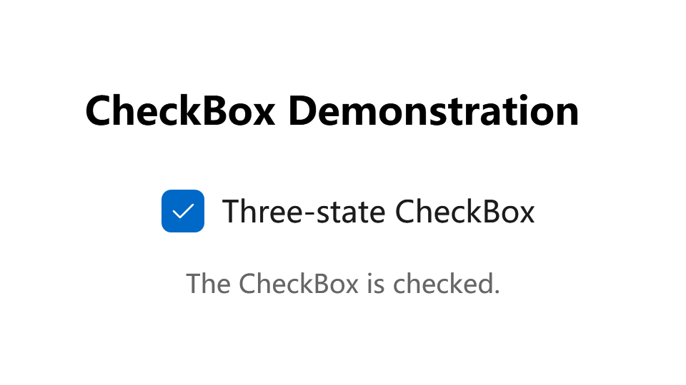
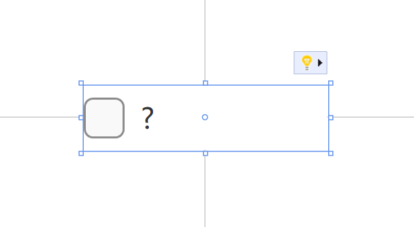

# CheckBox

You can use a CheckBox in the user interface (UI) of your application to represent options that a user can select or clear. You can use a single check box or you can group two or more check boxes.

- **Class**: [System.Windows.Controls](https://learn.microsoft.com/en-us/dotnet/api/system.windows.controls)[.CheckBox](https://learn.microsoft.com/en-us/dotnet/api/system.windows.controls.button)

## Examples

The following example creates a CheckBox and handles the Checked, Unchecked, and Indeterminate events.

```xml
<Grid VerticalAlignment="Center">
    <Grid.RowDefinitions>
        <RowDefinition Height="Auto"/>
        <RowDefinition Height="Auto"/>
        <RowDefinition Height="Auto"/>
    </Grid.RowDefinitions>

    <TextBlock Text="CheckBox Demonstration" Margin="0,0,10,20"
            FontSize="18" FontWeight="Bold"
            Grid.Row="0" HorizontalAlignment="Center"/>

    <CheckBox x:Name="cb1" Grid.Row="1" Margin="5,0,0,0" 
        Content="Three-state CheckBox" IsThreeState="True"
        Checked="HandleCheck" Unchecked="HandleUnchecked" 
        Indeterminate="HandleThirdState" HorizontalAlignment="Center" />
                            
    <TextBlock x:Name="text1" Grid.Row="2" Margin="0,10,0,0" TextAlignment="Center" Opacity="0.6" />
</Grid>
```

```csharp
private void HandleCheck(object sender, RoutedEventArgs e)
{
    text1.Text = "The CheckBox is checked.";
}

private void HandleUnchecked(object sender, RoutedEventArgs e)
{
    text1.Text = "The CheckBox is unchecked.";
}

private void HandleThirdState(object sender, RoutedEventArgs e)
{
    text1.Text = "The CheckBox is in the indeterminate state.";
}
```

Unchecked:


Checked:



Indeterminate:


## Remarks

CheckBox controls inherit from [ToggleButton](./toggle-button) and can have three states: checked (selected), unchecked (cleared), and indeterminate.

A CheckBox is a ContentControl, which means that it can contain a single object of any type (such as a string, an image, or a panel). For more information, see the [ContentControl](https://learn.microsoft.com/en-us/dotnet/api/system.windows.controls.contentcontrol) class.

### Is this the right control?

Use a single check box for a binary yes/no choice, such as with a "Remember me?" login scenario or with a terms of service agreement.


For a binary choice, the main difference between a check box and a [**toggle switch**](./toggle-switch) is that the check box is for status and the toggle switch is for action. You can delay committing a check box interaction (as part of a form submit, for example), while you should immediately commit a toggle switch interaction. Also, only check boxes allow for multi-selection.

Use **multiple check boxes** for multi-select scenarios in which a user chooses one or more items from a group of choices that are not mutually exclusive.

Create a group of check boxes when users can select any combination of options.


When options can be grouped, you can use an indeterminate check box to represent the whole group. Use the check box's indeterminate state when a user selects some, but not all, sub-items in the group.


Both check box and radio button controls let the user select from a list of options. Check boxes let the user select a combination of options. In contrast, radio buttons let the user make a single choice from mutually exclusive options. When there is more than one option but only one can be selected, use a [radio button](./radio-button) instead.

:::tip

If you have multiple options appearing in a list, you can preserve space by using checkboxes instead of on/off switches. If you have a single option, avoid using a checkbox and use an on/off switch instead.

:::

### Styles

There is one built-in style for Button control:

- **DefaultCheckBoxStyle**: The default style for CheckBox, you can access it with `ui:ThemeKeys.DefaultCheckBoxStyleKey`.

### Compact Sizing

If you are using CheckBox in a compact layout, you might find out that even if the check box has no content, it takes an amount of space. This is because the **MinWidth** property is set in the default style. 



To fix this, you can simply set **MinWidth** property to `0` like this:

```xml
<CheckBox Content="?" MinWidth="0"/>
```


## See also

### Related articles

- [Components / ToggleButton](./toggle-button)

- [Components / ToggleSwitch](./toggle-switch)

- [Components / RadioButton](./radio-button)

### Microsoft Learn

- [CheckBox Class (WPF)](https://learn.microsoft.com/en-us/dotnet/api/system.windows.controls.checkbox)

- [CheckBox Class (WinRT)](https://learn.microsoft.com/en-us/windows/windows-app-sdk/api/winrt/microsoft.ui.xaml.controls.checkbox)

- [CheckBox - WPF](https://learn.microsoft.com/en-us/dotnet/desktop/wpf/controls/checkbox)

- [CheckBox - Windows apps](https://learn.microsoft.com/en-us/windows/apps/design/controls/checkbox)

