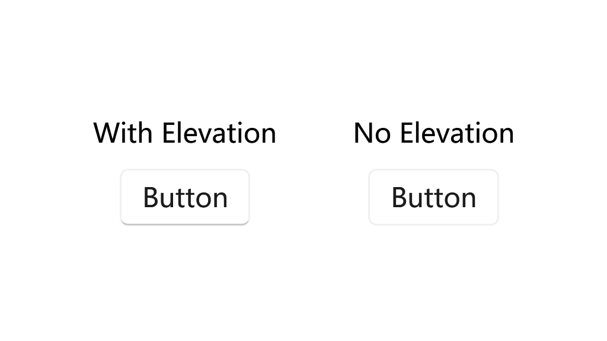
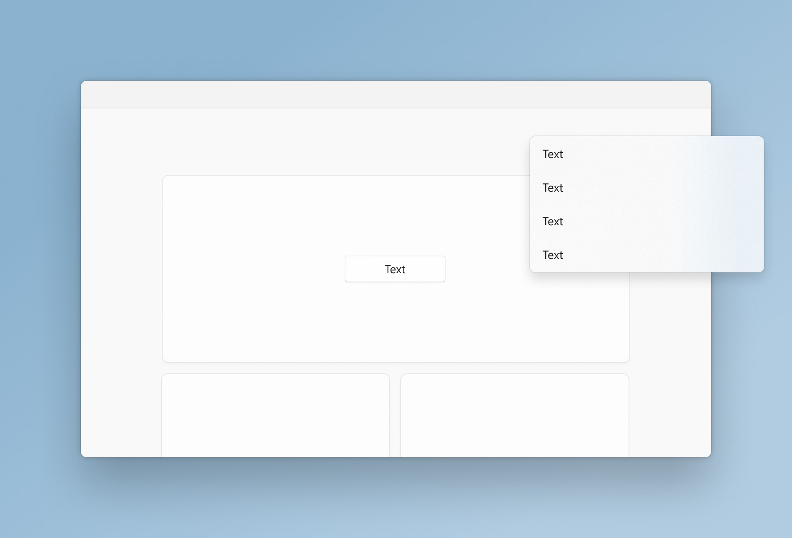

# Elevations

Elevation is the depth component of the spatial relationship one surface has to another with respect to their position on the desktop. When two or more objects occupy the same location on the screen, only the object with the highest elevation will be rendered at that location.

Shadows and contour (outlines) are used on controls and surfaces to subtly communicate an object's elevation, and to help draw focus where needed within an experience. Windows 11 uses the following values to express elevation with shadow and contour.

## Contour elevation

Let's take a loot at the Button control, which has a border with a highlight at the bottom to create a sense of depth. Here's a comparison between a Button with and without elevation:



### Controls

- [Button](%BASE_NAME%/components/basic-input/button), [ToggleButton](%BASE_NAME%/components/basic-input/toggle-button), [RepeatButton](%BASE_NAME%/components/basic-input/repeat-button), [DropDownButton](%BASE_NAME%/components/basic-input/dropdown-button), [SplitButton](%BASE_NAME%/components/basic-input/split-button), [ToggleButton](%BASE_NAME%/components/basic-input/toggle-button), [ToggleSplitButton](%BASE_NAME%/components/basic-input/toggle-split-button)

- [TextBox](%BASE_NAME%/components/text/text-box), [RichTextBox](%BASE_NAME%/components/text/richtext-box), [PasswordBox](%BASE_NAME%/components/text/password-box), [NumberBox](%BASE_NAME%/components/text/number-box), [AutoSuggestBox](%BASE_NAME%/components/text/autosuggest-box)

### Applying

You can use the ElevationBorder control to add elevation to anywhere you want. 

For more information, see the [ElevationBorder Control](%BASE_NAME%/components/media/elevation-border).

### Customizations

You can use the attached properties of `ui:ElevationBorder` to customize the elevation of a control. For example, the following code removes the elevation from a Button:

```xml
<Button Content="No Elevation" ui:ElevationBorder.IsElevationEnabled="False"/>
```

You can also specify the color, opacity, direction and much more. For more information, see the [ElevationBorder Class](%BASE_NAME%/definitions/controls/elevation-border).

## Shadow elevation

Shadow elevation is achieved by adding a subtle shadow effect to an element, creating the illusion of it being raised or floating above the surface. This technique is commonly used to provide visual depth and separation between different elements in a user interface.



In Windows 11, shadow elevation is an important aspect of the Fluent Design System, which aims to create a more immersive and engaging user experience. The shadow elevation values used in Windows 11 are carefully designed to provide a consistent and visually pleasing appearance across different UI components.

By applying shadow elevation to elements cards, panels and dialogs, you can enhance their visual hierarchy and make them stand out from the background. This helps users quickly identify interactive elements and understand the structure of the interface.

### Controls

All controls that represents a dialog, popup (menu included) or card have shadow elevation. 

### Applying

You can use the DropShadowPanel control to add shadow elevation to the controls in a window. For more information, see the [DropShadowPanel Control](%BASE_NAME%/components/media/dropshadow-panel).

All the dialog, popups and menus (which are all treated as a window) should have shadow elevation that is automatically applied by the system.

## See also

### Microsoft Learn

- [Layering and elevation in Windows 11](https://learn.microsoft.com/en-us/windows/apps/design/signature-experiences/layering)