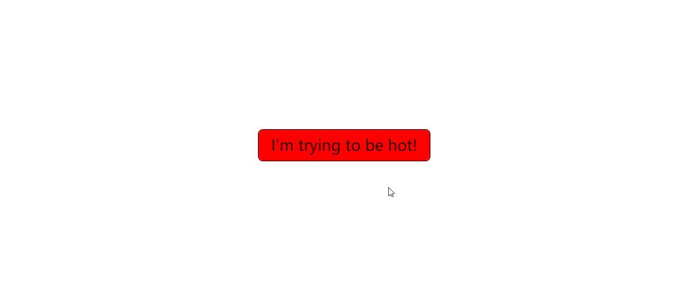
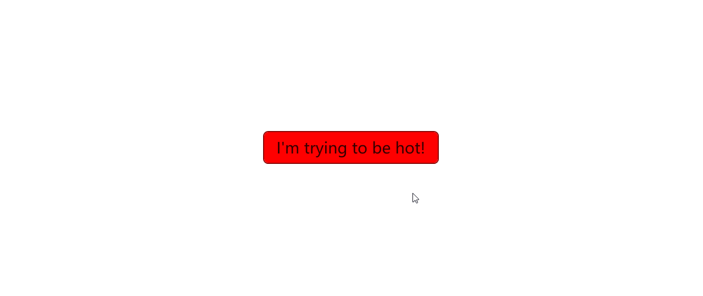
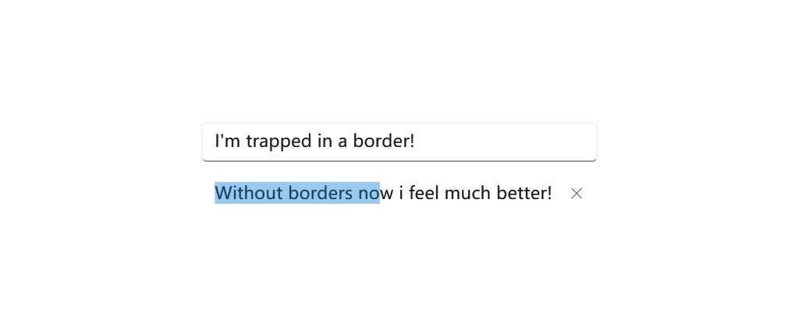

# Override Resources

The methods we're talking about is onew way to customize your application.

## Why do so

For example, now you want to change the background color of the Button to red. Generally, you can do this by setting the `Background` property of the Button to `Red` like this:

```xml
<Button Content="I'm trying to be hot!"
    Background="Red" BorderBrush="DarkRed"/>
```

This may look okay at first glance, but the problem appears when you move your cursor over the Button. All your own settings will be overridden by the default style. To fix this, you might come up with a solution: specify the hover color and the pressed color as well.



Think about it. It seems that there's no way to directly pass the values to the style. But in fact, there is. Now scroll up and check the **ControlTemplate.Triggers** section of the [Button.xaml](https://github.com/iNKORE-NET/UI.WPF.Modern/blob/main/source/iNKORE.UI.WPF.Modern/Themes/Controls/Button.xaml) file:

```xml title="Button.xaml"
<Style x:Key="DefaultButtonStyle" TargetType="Button">
    <Setter Property="OverridesDefaultStyle" Value="True" />
    <Setter Property="Background" Value="{DynamicResource ButtonBackground}" />
    <Setter Property="Foreground" Value="{DynamicResource ButtonForeground}" />
    <Setter Property="BorderBrush" Value="{DynamicResource ButtonBorderBrush}" />
    <Setter Property="BorderThickness" Value="{DynamicResource ButtonBorderThemeThickness}" />
    <Setter Property="Padding" Value="{DynamicResource ButtonPadding}" />
    <Setter Property="HorizontalAlignment" Value="Left" />
    <Setter Property="VerticalAlignment" Value="Center" />
    <Setter Property="HorizontalContentAlignment" Value="Center" />
    <Setter Property="VerticalContentAlignment" Value="Center" />
    <Setter Property="FontFamily" Value="{DynamicResource ContentControlThemeFontFamily}" />
    <Setter Property="FontWeight" Value="Normal" />
    <Setter Property="FontSize" Value="{DynamicResource ControlContentThemeFontSize}" />
    <Setter Property="FocusVisualStyle" Value="{DynamicResource {x:Static SystemParameters.FocusVisualStyleKey}}" />
    <Setter Property="chelper:FocusVisualHelper.UseSystemFocusVisuals" Value="{DynamicResource UseSystemFocusVisuals}" />
    <Setter Property="chelper:FocusVisualHelper.FocusVisualMargin" Value="-3" />
    <Setter Property="chelper:ControlHelper.CornerRadius" Value="{DynamicResource ControlCornerRadius}" />
    <Setter Property="Stylus.IsPressAndHoldEnabled" Value="False" />
    <Setter Property="Template">
        <Setter.Value>
            <ControlTemplate TargetType="Button">
                ...
                <ControlTemplate.Triggers>
                    <Trigger Property="IsMouseOver" Value="True">
                        <Setter TargetName="Background" Property="Background" Value="{DynamicResource ButtonBackgroundPointerOver}" />
                        <Setter TargetName="Background" Property="BorderBrush" Value="{DynamicResource ButtonBorderBrushPointerOver}" />
                        <Setter Property="Foreground" Value="{DynamicResource ButtonForegroundPointerOver}" />
                    </Trigger>
                    <Trigger Property="IsPressed" Value="True">
                        <Setter TargetName="Background" Property="Background" Value="{DynamicResource ButtonBackgroundPressed}" />
                        <Setter TargetName="Background" Property="BorderBrush" Value="{DynamicResource ButtonBorderBrushPressed}" />
                        <Setter Property="Foreground" Value="{DynamicResource ButtonForegroundPressed}" />
                    </Trigger>
                    <Trigger Property="IsEnabled" Value="False">
                        <Setter TargetName="Background" Property="Background" Value="{DynamicResource ButtonBackgroundDisabled}" />
                        <Setter TargetName="Background" Property="BorderBrush" Value="{DynamicResource ButtonBorderBrushDisabled}" />
                        <Setter Property="Foreground" Value="{DynamicResource ButtonForegroundDisabled}" />
                    </Trigger>
                </ControlTemplate.Triggers>
            </ControlTemplate>
        </Setter.Value>
    </Setter>
</Style>
```

The colors are not hard-coded, but are set by the `DynamicResource` markup extension. Now you got it? The `DynamicResource` markup extension is a way to make the style customizable by allowing you to override the default values. Now you may understand why we use the `DynamicResource` markup extension instead of hard-coding the values.

## How to do so

### Override a single resource

In the FrameworkElement class, you may find a property called **Resources**. This property is a dictionary that contains the resources of the element which will be applied to the element itself and its children. To override a resource, you can add a new resource to the dictionary with the same key. How can I get the keys? Using the `ui:ThemeKeys` class and `x:Static` extension is thew best idea.

You can override the resources by adding a new resource to the dictionary with the same key. For example, making the button green when the mouse is over it will be like this:

```xml
<Button Content="I'm trying to be hot!"
        Background="Red" BorderBrush="DarkRed">
# highlight-start
    <FrameworkElement.Resources>
        <SolidColorBrush x:Key="{x:Static ui:ThemeKeys.ButtonBackgroundPointerOverKey}" Color="Green"/>
    </FrameworkElement.Resources>
# highlight-end
</Button>
```

Now when you move your cursor over the Button, the background color will be green. In this way you can override all the resources (Colors, Brush, Thickness, Double, Animation, etc.) that is not hard-coded for any controls you want.



:::info It's a pity that...

When in Visual Studio, you may find that the IntelliSense doesn't work well with the `x:Static` extension in the `x:Key` attribute. But don't worry, it's just a bug of Visual Studio. The code will work well when you run the app, though this bug may make you feel uncomfortable.

If Visual Studio staff are reading this, please fix this bug. Thanks in advance.

:::

### Override multiple resources

In this way, you can override multiple resources for multiple elements. When the resources are overridden, the new values will be applied to the elements and their children. For example, you can make all the buttons green when the mouse is over, and blue when they are pressed.

```xml
<ikw:SimpleStackPanel HorizontalAlignment="Center" VerticalAlignment="Center"
    Spacing="10" Orientation="Horizontal">
# highlight-start    
    <FrameworkElement.Resources>

        <SolidColorBrush x:Key="{x:Static ui:ThemeKeys.ButtonBackgroundPointerOverKey}" Color="Green"/>
        <SolidColorBrush x:Key="{x:Static ui:ThemeKeys.ButtonBackgroundPressedKey}" Color="Blue"/>
    </FrameworkElement.Resources>
# highlight-end

    <Button Content="Once"/>
    <Button Content="Upon"/>
    <Button Content="A"/>
    <Button Content="Time"/>
</ikw:SimpleStackPanel>
```


### Override resources globally

You can also override the resources globally. To do this, you can add the resources to the `Application.Resources` property. This will make the resources available to all the elements in the application.

```xml title="App.xaml"
<Application x:Class="MyWpfTest.App"
             xmlns="http://schemas.microsoft.com/winfx/2006/xaml/presentation"
             xmlns:x="http://schemas.microsoft.com/winfx/2006/xaml"
             xmlns:ui="http://schemas.inkore.net/lib/ui/wpf/modern"
             StartupUri="MainWindow.xaml">
    <Application.Resources>
        <ResourceDictionary>
            <ResourceDictionary.MergedDictionaries>
                <ui:ThemeResources/>
                <ui:XamlControlsResources/>
            </ResourceDictionary.MergedDictionaries>

# highlight-start
            <SolidColorBrush x:Key="{x:Static ui:ThemeKeys.ButtonBackgroundPointerOverKey}" Color="Green"/>
            <SolidColorBrush x:Key="{x:Static ui:ThemeKeys.ButtonBackgroundPressedKey}" Color="Blue"/>
# highlight-end
        </ResourceDictionary>
    </Application.Resources>
</Application>
```

The code above does the same thing as the previous example, but it makes the resources available to all the elements in the application.

### Forwarding resource override

In some cases, you may want to make one resource the same as another resource. The obvious way is to copy the value of the resource to the other resource. But this is not a good idea because it will make the code hard to maintain. Instead, we've prepared a surprise for you -- the `ui:StaticResource` markup extension.

```xml
<ui:StaticResource x:Key="{x:Static ui:ThemeKeys.ButtonBackgroundPointerOverKey}" ResourceKey="{x:Static ui:ThemeKeys.SubtleFillColorSecondaryBrushKey}" />
<ui:StaticResource x:Key="{x:Static ui:ThemeKeys.ButtonBackgroundPressedKey}" ResourceKey="{x:Static ui:ThemeKeys.SubtleFillColorTertiaryBrushKey}" />
```

The code above makes the `ButtonBackgroundPointerOver` resource the same as the `SubtleFillColorSecondaryBrush` resource, and the `ButtonBackgroundPressed` resource the same as the `SubtleFillColorTertiaryBrush` resource. This way you can make the resources the same without copying the values, improving the readability and maintainability of the code as well.

You can use `ui:StaticResource` in anywhere you want to forward the resource override, like what we've talked about in the previous sections.

## Examples

### Remove background andf border of a TextBox

By default, the TextBox control comes with a border and background. However, in some cases, you may want to remove them. You can do this by overriding the `TextBoxBackground` and `TextBoxBorderBrush` resources like this:

```xml
<TextBox Text="I'm trapped in a border!"/>

<TextBox Text="Without borders now i feel much better!">
    <FrameworkElement.Resources>
# highlight-start
        <SolidColorBrush x:Key="{x:Static ui:ThemeKeys.TextControlBackgroundKey}" Color="Transparent"/>
        <SolidColorBrush x:Key="{x:Static ui:ThemeKeys.TextControlBackgroundPointerOverKey}" Color="Transparent"/>
        <SolidColorBrush x:Key="{x:Static ui:ThemeKeys.TextControlBackgroundFocusedKey}" Color="Transparent"/>

        <SolidColorBrush x:Key="{x:Static ui:ThemeKeys.TextControlBorderBrushKey}" Color="Transparent"/>
        <SolidColorBrush x:Key="{x:Static ui:ThemeKeys.TextControlBorderBrushPointerOverKey}" Color="Transparent"/>
        <SolidColorBrush x:Key="{x:Static ui:ThemeKeys.TextControlBorderBrushFocusedKey}" Color="Transparent"/>
# highlight-end
    </FrameworkElement.Resources>
</TextBox>
```



Alternatively, you can also control the border with the **BorderThickness** property like this:

```xml
<Thickness x:Key="{x:Static ui:ThemeKeys.TextControlBorderThemeThicknessKey}">0</Thickness>
<Thickness x:Key="{x:Static ui:ThemeKeys.TextControlBorderThemeThicknessFocusedKey}">0</Thickness>
```

The two above does almost the same thing, but they are different in nature. The first one removes the border by setting the color to transparent, while the second one removes the border by setting the thickness to 0. You may pick the one that fits your needs.

::tip

This is also applicable to RichTextBox, PasswordBox, and other controls that inherit from TextBox.

:::

### Remove all the tint colors of NavigationView

NavigationView control comes with a tint color by default. You can remove it by overriding resources. 

The details are talked about in the [NavigationView](%BASE_NAME%/components/navigation/navigation-view#clear-background) page.

### Make a button into any color you want

In some scenarios, you may want a Button neither default nor accent color. Like when you're dealing with "Delete file" dialog, the confirm button is usually red, this can be done by overriding the color resource of a Button:

```xml
<Button Content="Confirm Deletion">
    <FrameworkElement.Resources>
        <SolidColorBrush x:Key="{x:Static ui:ThemeKeys.ButtonBackgroundKey}" Color="#FFD80000"/>
        <SolidColorBrush x:Key="{x:Static ui:ThemeKeys.ButtonBorderBrushKey}" Color="#FF960000"/>

        <SolidColorBrush x:Key="{x:Static ui:ThemeKeys.ButtonBackgroundPointerOverKey}" Color="#FFE90000"/>
        <SolidColorBrush x:Key="{x:Static ui:ThemeKeys.ButtonBorderBrushPointerOverKey}" Color="#FFC00000"/>

        <SolidColorBrush x:Key="{x:Static ui:ThemeKeys.ButtonBackgroundPressedKey}" Color="#FF860000"/>
        <ui:StaticResource x:Key="{x:Static ui:ThemeKeys.ButtonBorderBrushPressedKey}" ResourceKey="{x:Static ui:ThemeKeys.ButtonBackgroundPressedKey}"/>

        <ui:StaticResource x:Key="{x:Static ui:ThemeKeys.ButtonForegroundKey}" ResourceKey="{x:Static ui:ThemeKeys.AccentButtonForegroundKey}"/>
        <ui:StaticResource x:Key="{x:Static ui:ThemeKeys.ButtonForegroundPointerOverKey}" ResourceKey="{x:Static ui:ThemeKeys.ButtonForegroundKey}"/>
        <ui:StaticResource x:Key="{x:Static ui:ThemeKeys.ButtonForegroundPressedKey}" ResourceKey="{x:Static ui:ThemeKeys.ButtonForegroundKey}"/>

    </FrameworkElement.Resources>
</Button>
```


## See also

### Related articles

- [Theming / Theme Resources](%BASE_NAME%/features/theming/theme-resources)

- [Definitions / StaticResourceExtension Class](%BASE_NAME%/definitions/markup/static-resource-extension)

### Microsoft Learn

- [ResourceDictionary Class (WPF)](https://learn.microsoft.com/en-us/dotnet/api/system.windows.resourcedictionary)

- [Application Resource, Content, and Data Files - WPF](https://learn.microsoft.com/en-us/dotnet/desktop/wpf/app-development/wpf-application-resource-content-and-data-files)

- [Merged resource dictionaries (WPF .NET)](https://learn.microsoft.com/en-us/dotnet/desktop/wpf/systems/xaml-resources-merged-dictionaries)