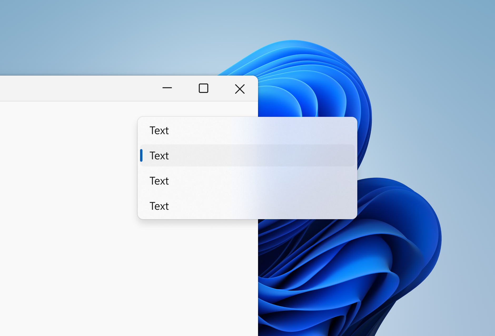

# BackdropType Enum

Specifies the system backdrop of window. Used by the WindowHelper.SystemBackdropType property.

## Definition

- Namespace: [iNKORE.UI.WPF.Modern.Helpers.Styles](.)
- Assembly: iNKORE.UI.WPF.Modern.dll

```csharp
public enum BackdropType {...}
```

Inheritance: [Object](https://learn.microsoft.com/en-us/dotnet/api/system.object) → [ValueType](https://learn.microsoft.com/en-us/dotnet/api/system.valuetype?view=windowsdesktop-8.0) → [Enum](https://learn.microsoft.com/en-us/dotnet/api/system.enum?view=windowsdesktop-8.0) → BackdropType

## Fields

### None

None of the system backdrops will be applied. The window will remain solid.

**Value**: 1

### Mica

The window will have a mica effect, which is a translucent background that blurs the desktop background it.

**Value**: 2

Mica is a new opaque material introduced in Windows 11. Mica surfaces are subtly tinted with the user's desktop background color.

Mica is mode aware; it supports both light and dark modes. Mica also indicates window focus with active and inactive states as a built in feature.


### Acrylic

The window will have an acrylic effect and determine which API will be used depending on the system version, which is a translucent background that blurs the content behind it.

**Value**: 3

Acrylic is a semi-transparent material that replicates the effect of frosted glass. In Windows 11, acrylic has been updated to be brighter and more translucent, allowing for a stronger contextual relationship with the visuals behind it. Acrylic is used only for transient, light-dismiss surfaces such as flyouts and context menus.

Acrylic is mode aware; it supports both light and dark mode.



### Tabbed

The window will have a tabbed effect, which looks like mica but have deeper colors. This is often used when there's a root TabControl on the window (e.g. the Windows Explorer).

**Value**: 4

Mica Alt (aka. Tabbed) is a variant of Mica, with stronger tinting of the user's desktop background color. You can apply Mica Alt to your app's backdrop to provide a deeper visual hierarchy than Mica, especially when creating an app with a tabbed title bar. Mica Alt is available for apps that use Windows App SDK 1.1 or later, while running on Windows 11 version 22000 or later.


### Acrylic10

The window will have an acrylic effect using an older API.

**Value**: 5

### Acrylic11

The window will have an acrylic effect using a newer API.

**Value**: 6

## Remarks

### Acrylic10 and Acrylic11

Though bothe Acrylic10 and Acrylic11 give you the similar look and feel, they are using different APIs. Acrylic10 is using the older API and Acrylic11 is using the newer API and the have some differences.

|                   | Acrylic10                                                            | Acrylic11                                                                           |
|-------------------|----------------------------------------------------------------------|-------------------------------------------------------------------------------------|
| Availability      | <font color="seagreen">Windows 10 and 11 (Windows 10.0.17063+)</font>                              | Windows 11 (Windows 10.0.22523+)                                                    |
| Performance       | Laggy when resizing the window                                       |  <font color="seagreen">Looks okay resizing the window</font>                                                      |
| Customizations    | <font color="seagreen">Customizabe tint color (use ui:WindowHelper.Acrylic10Color property)</font> | Nothing                                                                             |
| Transitions       | Nothing                                                              | <font color="seagreen">Both switching light/dark and focused/unfocused will display a transition animation</font> |
| When losing focus | <font color="seagreen">Acrylic effect remains</font>                                               | Acrylic effect temporarily disabled                                                 |

As the table shows, both the two Acrylic effects have their own pros and cons. You can choose the one that fits your needs.

### Mica and Tabbed

Mica and Tabbed are similar in terms of appearance, but they have different purposes. Mica is used for general windows, while Tabbed is used for windows with a root TabControl.

These images show the difference between Mica and Mica Alt in a title bar with tabs. The first image uses Mica and the second image uses Mica Alt.


## See also

### Related articles

- [Components / Window](%BASE_NAME%/components/dialogs/window#WindowHelper.SystemBackdropType)

- [Definitions / WindowHelper Class](%BASE_NAME%/definitions/controls/helpers/window-helper)

- [Definitions / Acrylic10Helper Class](%BASE_NAME%/definitions/controls/helpers/acrylic10-helper)

- [Definitions / BackdropHelper Class](%BASE_NAME%/definitions/controls/helpers/backdrop-helper)

### Microsoft Learn

- [Mica material - Windows Apps](https://learn.microsoft.com/en-us/windows/apps/design/style/mica)

- [Acrylic material - Windows Apps](https://learn.microsoft.com/en-us/windows/apps/design/style/acrylic)

- [Materials in Windows 11](https://learn.microsoft.com/en-us/windows/apps/design/signature-experiences/materials)

### Source code

- [Github | BackdropHelper.cs](https://github.com/iNKORE-NET/UI.WPF.Modern/blob/main/source/iNKORE.UI.WPF.Modern/Helpers/Styles/BackdropHelper.cs#L18)
