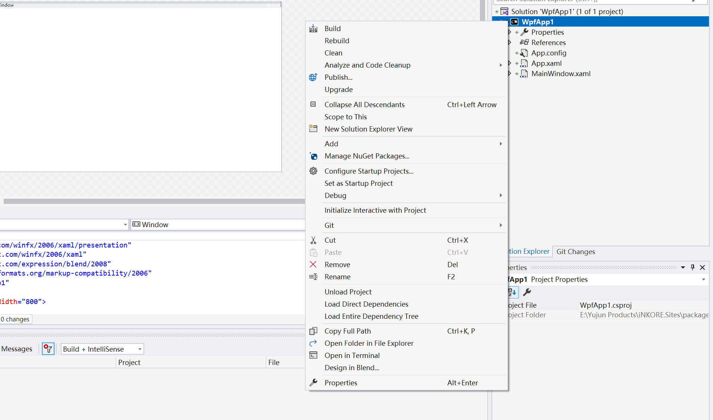
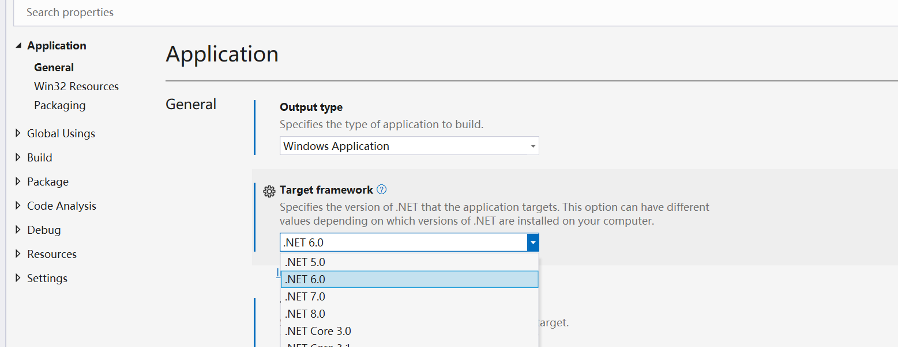
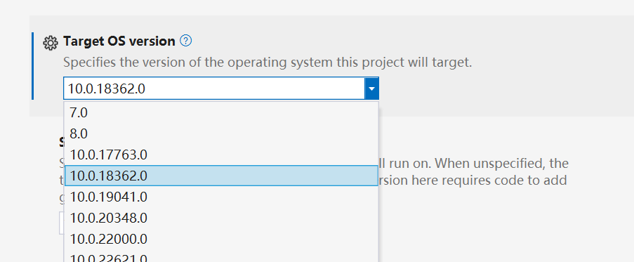
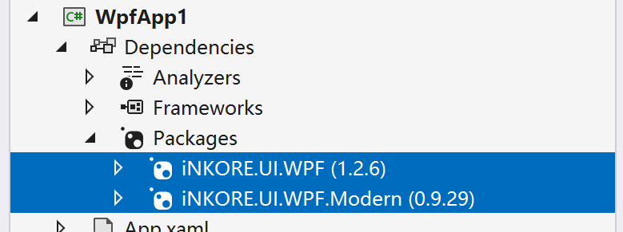

# Getting Started

In this guide, we will walk you through the process of integrating the iNKORE.UI.WPF.Modern library into your application, allowing you to bring a modern and visually appealing user interface to your WPF project. With its support for Fluent Design elements and flexible customization options, iNKORE.UI.WPF.Modern can transform your application into a visually stunning experience.


## Step 1: Adjust configuration

Before installing package, we recommend you do some adjust to the project settings. Right click the project in your solution view, and click **Properties**.



### For .NET Framework Projects

If your csproj style is legacy, yous should see this interface:


:::info Reminder

We strongly recommend you to convert your csproj file into [SDK style](https://learn.microsoft.com/en-us/dotnet/core/project-sdk/overview), which provide a lot more features and better experiences. For more information, please check out the documentations of Microsoft.

:::

If your project have already upgraded to SDK style, you shuold be able to see this instead:


No matter what style your csproj file are, please make sure the target framework is .NET framework 4.6.2 or any higher versions.

If you are using an old framework version, the library might be unable to be loaded properly.

### For .NET Core (also 6.0 later) project

To begin with, please make sure the framework is .NET 6.0 or higher.




:::danger Attention!

We have just removed support for .NET Core 3.1 and .NET 5.0, which means these frameworks aren't compatible with the latest version of this library.

If you have to stick to these old versions, you can still download the full source code and compile a binary with old-version support yourself. However, due to some reference to newer APIs, this compile might fail.

:::

Then let's focus on the **Target OS Version** option. We recommend you set this `10.0.18362.0` or higher to enable the theme syncing feature.



:::warning

If the target version is set to 10.0, you might see these file in your output directory:


This is caused by .NET SDKs, and they're not related to any of our libraries.

If you mind that, then set it to 7.0, though this will make the two files disappear, your app won't be able to follow the system themes.

:::


:::tip

Though the **Target OS Version** is set to 10.0, you can set **Supported OS Version** to whatever you want. In order to run your app on any Windows version that .NET supports, the best choice is set it to `7.0`.


:::

## Step 2: Install package

Right click your project again, and click the **Manage NuGet packages** menu.


Then click **Browse**, and type `inkore` in the search box. All our public libraries will appear here. Then elect `iNKORE.UI.WPF.Modern` and click **Install**, select `iNKORE.UI.WPF` and click install again.


Then you're expected to see this package has been added to your dependencies list:



:::info

There are a few other libraries appearing when searching. You can learn more about them in our [Github profile](https://github.com/iNKORE-NET) and their repositories.

:::

:::warning Why **iNKORE.UI.WPF**?

Generally, we use `iNKORE.UI.WPF` as a base library for all our WPF libraries. It contains some common utilities and controls that are shared among all our WPF libraries.

If you see this exception when running, please install `iNKORE.UI.WPF` manually:

> **System.Windows.Markup.XamlParseException**: 'Initialization of 'iNKORE.UI.WPF.Modern.ThemeResources' threw an exception.'

> [InnerException]
> FileNotFoundException: Could not load file or assembly 'iNKORE.UI.WPF, Version=######, Culture=neutral, PublicKeyToken=######'. The system cannot find the file specified.


The iNKORE.UI.WPF should be automatically installed when you install iNKORE.UI.WPF.Modern. However, for some reason (probably NuGet internal bug or wrong configuration), it might not be installed.

If you found a way to ensure `iNKORE.UI.WPF` is installed automatically, please let us know.

:::

## Step 3: Add theme resources

Open your `App.xaml` file in the root directory, and add the namespace declaration:

```ini
xmlns:ui="http://schemas.inkore.net/lib/ui/wpf/modern"
```

Then, in `Application.Resources`, create a new `ResourceDictionary` and add property `ResourceDictionary.MergedDictionaries`.

In the `MergedDictionaries`, add a new `ui:ThemeResources` and `ui:XamlControlsResources` instance.

Finally your `App.xaml` file should look like this:

```xml title="App.xaml"
<Application x:Class="StarterKit.App"
             xmlns="http://schemas.microsoft.com/winfx/2006/xaml/presentation"
             xmlns:x="http://schemas.microsoft.com/winfx/2006/xaml"
             xmlns:local="clr-namespace:StarterKit" 
# highlight-next-line
             xmlns:ui="http://schemas.inkore.net/lib/ui/wpf/modern"
             StartupUri="MainWindow.xaml">
    <Application.Resources>
        <ResourceDictionary>
            <ResourceDictionary.MergedDictionaries>
# highlight-start
                <ui:ThemeResources/>
                <ui:XamlControlsResources/>
# highlight-end
            </ResourceDictionary.MergedDictionaries>
            
            <!--Your other resources here (if exists)-->
            
        </ResourceDictionary>
    </Application.Resources>
</Application>
```

At this moment, modern themes have been sucessfully added to the project. All your controls should have a modern style now.


## Step 4: Apply style to MainWindow

Let's apply modern styles to the main window, then. Go to `MainWindow.xaml`, and add the namespace declaration first:

```ini
xmlns:ui="http://schemas.inkore.net/lib/ui/wpf/modern"
```

Then let the window use modern style by apply this attached property:

```ini
ui:WindowHelper.UseModernWindowStyle="True"
```

:::info

Unlike other controls, windows cannot be styled globally without manually set its style (for security and compatibility reasons).

:::

Now if you run the app, you can see the window has a modern-style frame. Also you can add backdrop to your window using `ui:WindowHelper.SystemBackdropType` property:

```ini
ui:WindowHelper.SystemBackdropType="Mica"
```

Now your `MainWindow.xaml` should look like this:

```xml title="MainWindow.xaml"
<Window x:Class="StarterKit.MainWindow"
        xmlns="http://schemas.microsoft.com/winfx/2006/xaml/presentation"
        xmlns:x="http://schemas.microsoft.com/winfx/2006/xaml"
        xmlns:d="http://schemas.microsoft.com/expression/blend/2008"
        xmlns:mc="http://schemas.openxmlformats.org/markup-compatibility/2006"
        xmlns:local="clr-namespace:StarterKit" 
# highlight-next-line
        xmlns:ui="http://schemas.inkore.net/lib/ui/wpf/modern"
// highlight-start
        ui:WindowHelper.UseModernWindowStyle="True"
        ui:WindowHelper.SystemBackdropType="Mica"
        ui:TitleBar.Height="36"
// highlight-end
        mc:Ignorable="d"
        Title="Welcome!" Height="450" Width="800">
    
    <!--I added something here, you can add whatever you want-->
    <ui:SimpleStackPanel VerticalAlignment="Center" Spacing="5">
        <TextBlock Text="Fluent Design is beautiful." FontSize="24" FontWeight="Bold" TextAlignment="Center"/>
        <TextBlock Text="But hey, we deserve it :-)" FontSize="20" TextAlignment="Center"/>

        <Button Content="Hello world!" HorizontalAlignment="Center" Margin="0,20,0,0"/>
    </ui:SimpleStackPanel>
</Window>
```

Now hit the run button, you can see a modern window with a modern button.


## Conclusion

Great job! You have sucessfully applied Fluent Design to your project. Now it's time exploring more!

:::tip

The full source code of this article can be found here: https://github.com/iNKORE-NET/UI.WPF.Modern/tree/main/samples/StarterKit

:::
