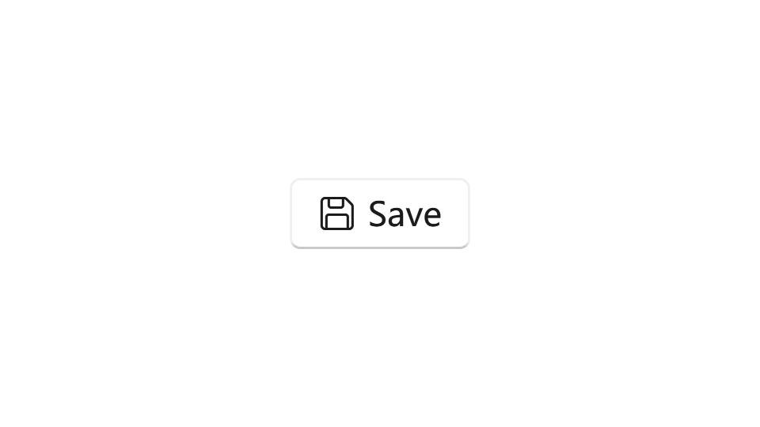

---

description: "响应用户输入并引发 Click 事件的控件。"

---

# 按钮

按钮允许用户通过单击采取操作并做出选择，响应来自鼠标、键盘、触控笔或其他输入设备的用户输入，并引发 Click 事件。

- **类**: [System.Windows.Controls](https://learn.microsoft.com/en-us/dotnet/api/system.windows.controls)[.Button](https://learn.microsoft.com/en-us/dotnet/api/system.windows.controls.button)

- **继承**: [Object](https://learn.microsoft.com/en-us/dotnet/api/system.object) → (...) → [Control](https://learn.microsoft.com/en-us/dotnet/api/system.windows.controls.control) → [ContentControl](https://learn.microsoft.com/en-us/dotnet/api/system.windows.controls.contentcontrol) → [ButtonBase](https://learn.microsoft.com/en-us/dotnet/api/system.windows.controls.primitives.buttonbase) → [Button](https://learn.microsoft.com/en-us/dotnet/api/system.windows.controls.button)

按钮的主要目的是在用户单击时触发某些操作。您可以通过两种方式实现：

- 处理 Click 事件。
- 将 Command 属性绑定到描述命令逻辑的 ICommand 实现。

## 示例

以下示例展示了按钮控件的常见用法。

### 基本按钮

通过使用 Button 类，您可以创建一个按钮。您可以使用 Content 属性添加内容，并使用 Click 事件处理按钮被单击时的操作。

```xml
<Button Content="Click me" Click="Button_Click"/>
```

```csharp
private void Button_Click(object sender, RoutedEventArgs e)
{
    // 当按钮被点击时执行某些操作！
}
```

然后您可以看到一个带有文本的普通按钮，并尝试点击它！


### 带图标的按钮

按钮通常只有简单的字符串内容，但您可以使用任何对象作为内容。通过以下代码，您将获得一个只有图标和工具提示的按钮：

```xml
<Button ToolTip="Save my documents">
    <ui:FontIcon Icon="{x:Static ui:SegoeFluentIcons.Save}"/>
</Button>
```


有关 *ui:FontIcon* 的更多信息，请 [点击这里](../media/icon-elements#FontIcon)

### 带图标和文本的按钮

如果您想要同时显示图标和文本，最好的方法是使用 ui:IconAndText 组件。它将图标和文本捆绑在一起：

```xml
<Button>
    <ui:IconAndText Icon="{x:Static ui:SegoeFluentIcons.Save}" Content="Save"/>
</Button>
```



有关 IconAndText 的更多信息，请 [点击这里](../media/icon-and-text)

如果您不想使用 FontIcon，或者您想完全自定义子组件（不推荐这样做，因为这可能会增加复杂性并且更难维护），请尝试以下代码：

```xml
<Button>
    <ui:SimpleStackPanel Orientation="Horizontal" Spacing="5">
        <ui:FontIcon Icon="{x:Static ui:SegoeFluentIcons.Save}"/>
        <TextBlock Text="Save"/>
    </ui:SimpleStackPanel>
</Button>
```

### 强调按钮

强调按钮是高强调的，通过使用提升和填充来区分。它们包含对您的应用程序至关重要的操作。

要将强调样式应用于按钮，您需要将 Style 属性设置为 `{StaticResource {x:Static ui:ThemeKeys.AccentButtonStyleKey}}`。

```xml
<Button Style="{StaticResource {x:Static ui:ThemeKeys.AccentButtonStyleKey}}"/>
```

由于强调按钮通常是整个窗口的主要操作，最好允许通过按 Enter 键触发其点击事件，这可以通过将 IsDefault 属性设置为 `True` 来实现。

完整代码应如下所示：

```xml
<Button Content="Accent button" Style="{StaticResource {x:Static ui:ThemeKeys.AccentButtonStyleKey}}" IsDefault="True"/>
```


## 备注

### 提升

按钮控件默认带有提升边框效果。您可以使用 `ui:ElevationBorder` 自定义其提升效果。

查看更多信息：____

### 样式

按钮控件有两种内置样式：

- DefaultButtonStyle：按钮的默认样式，您可以通过 `ui:ThemeKeys.DefaultButtonStyleKey` 访问。

- AccentButtonStyle：按钮的强调样式，您可以通过 `ui:ThemeKeys.AccentButtonStyleKey` 访问。

## 另请参阅

### Microsoft Learn

- [Button 类 (WPF)](https://learn.microsoft.com/en-us/dotnet/api/system.windows.controls.button)

- [Button 类 (WinRT)](https://learn.microsoft.com/en-us/windows/windows-app-sdk/api/winrt/microsoft.ui.xaml.controls.button)

- [Button - WPF](https://learn.microsoft.com/en-us/dotnet/desktop/wpf/controls/button)

- [按钮 - Windows 应用](https://learn.microsoft.com/en-us/windows/apps/design/controls/buttons)

### 相关控件

- [DropDownButton](./dropdown-button)

- [ToggleButton](./toggle-button)

- [SplitButton](./split-button)

- [HyperlinkButton](./hyperlink-button)

- [RepeatButton](./repeat-button)