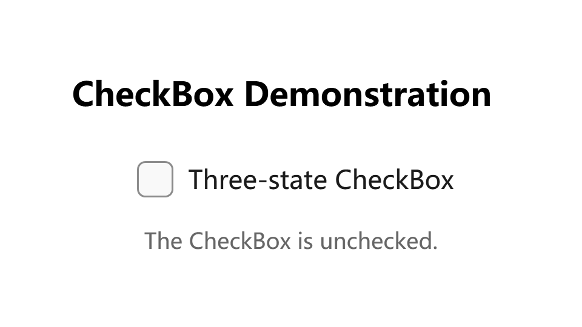
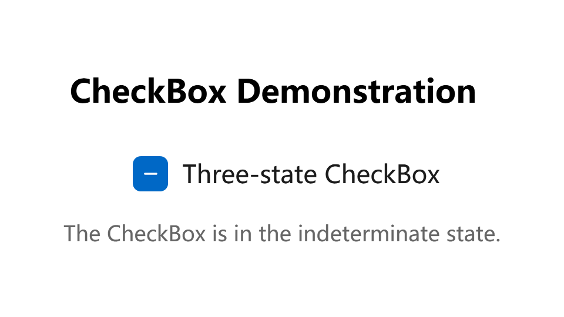
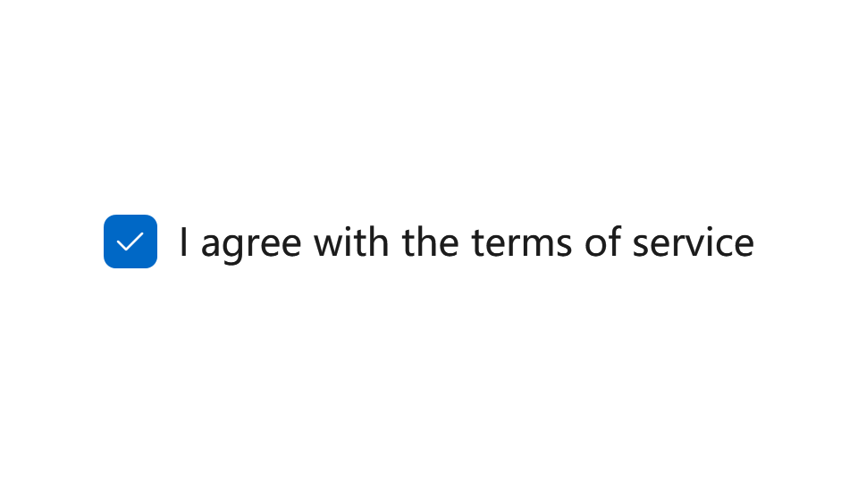
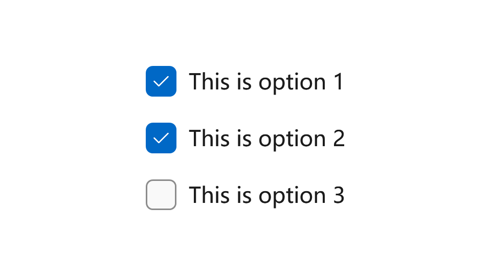
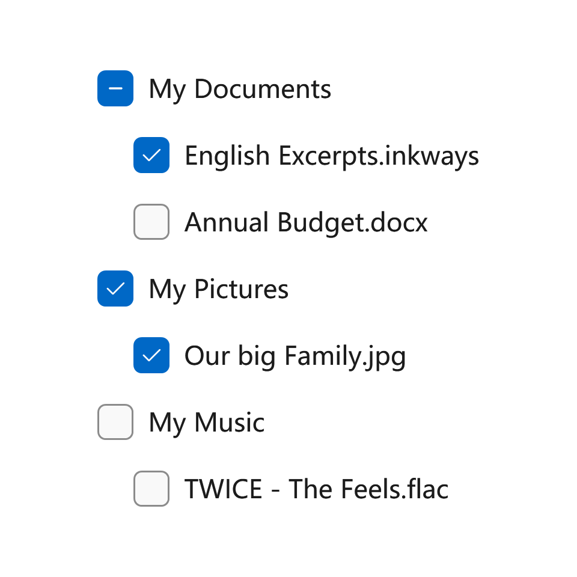
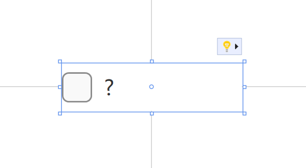
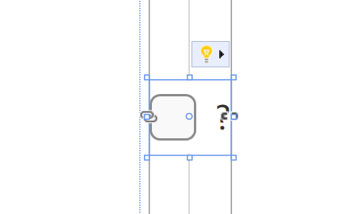

---

description: "用户可以选择或取消选择的控件。"

---

# 复选框

您可以在应用程序的用户界面 (UI) 中使用复选框来表示用户可以选择或取消选择的选项。您可以使用单个复选框，也可以将两个或多个复选框分组。

- **类**: [System.Windows.Controls](https://learn.microsoft.com/en-us/dotnet/api/system.windows.controls)[.CheckBox](https://learn.microsoft.com/en-us/dotnet/api/system.windows.controls.button)

- **继承**: [Object](https://learn.microsoft.com/en-us/dotnet/api/system.object) → (...) → [Control](https://learn.microsoft.com/en-us/dotnet/api/system.windows.controls.control) → [ContentControl](https://learn.microsoft.com/en-us/dotnet/api/system.windows.controls.contentcontrol) → [ButtonBase](https://learn.microsoft.com/en-us/dotnet/api/system.windows.controls.primitives.buttonbase) → [ToggleButton](https://learn.microsoft.com/en-us/dotnet/api/system.windows.controls.primitives.togglebutton) → [CheckBox](https://learn.microsoft.com/en-us/dotnet/api/system.windows.controls.checkbox)

## 示例

以下示例创建了一个复选框，并处理 Checked、Unchecked 和 Indeterminate 事件。

```xml
<Grid VerticalAlignment="Center">
    <Grid.RowDefinitions>
        <RowDefinition Height="Auto"/>
        <RowDefinition Height="Auto"/>
        <RowDefinition Height="Auto"/>
    </Grid.RowDefinitions>

    <TextBlock Text="复选框演示" Margin="0,0,10,20"
            FontSize="18" FontWeight="Bold"
            Grid.Row="0" HorizontalAlignment="Center"/>

    <CheckBox x:Name="cb1" Grid.Row="1" Margin="5,0,0,0" 
        Content="三态复选框" IsThreeState="True"
        Checked="HandleCheck" Unchecked="HandleUnchecked" 
        Indeterminate="HandleThirdState" HorizontalAlignment="Center" />
                            
    <TextBlock x:Name="text1" Grid.Row="2" Margin="0,10,0,0" TextAlignment="Center" Opacity="0.6" />
</Grid>
```

```csharp
private void HandleCheck(object sender, RoutedEventArgs e)
{
    text1.Text = "复选框已选中。";
}

private void HandleUnchecked(object sender, RoutedEventArgs e)
{
    text1.Text = "复选框未选中。";
}

private void HandleThirdState(object sender, RoutedEventArgs e)
{
    text1.Text = "复选框处于不确定状态。";
}
```

未选中：



已选中：


不确定：



## 备注

复选框控件继承自 [ToggleButton](./toggle-button)，可以有三种状态：选中、未选中和不确定。

复选框是一个 ContentControl，这意味着它可以包含任何类型的单个对象（例如字符串、图像或面板）。有关更多信息，请参阅 [ContentControl](https://learn.microsoft.com/en-us/dotnet/api/system.windows.controls.contentcontrol) 类。

### 这是正确的控件吗？

对于二元是/否选择，例如“记住我？”登录场景或服务条款协议，请使用单个复选框。



对于二元选择，复选框和 [**切换开关**](./toggle-switch) 之间的主要区别在于复选框用于状态，而切换开关用于操作。您可以延迟提交复选框交互（例如作为表单提交的一部分），而切换开关交互应立即提交。此外，只有复选框允许多选。

对于多选场景，用户可以从一组不互斥的选项中选择一个或多个项目，请使用 **多个复选框**。

当用户可以选择任意组合的选项时，请创建一组复选框。



当选项可以分组时，您可以使用不确定复选框来表示整个组。当用户选择组中的某些子项但不是全部时，请使用复选框的不确定状态。



复选框和单选按钮控件都允许用户从选项列表中进行选择。复选框允许用户选择多个选项的组合。相反，单选按钮允许用户从互斥选项中进行单一选择。当有多个选项但只能选择一个时，请使用 [单选按钮](./radio-button)。

:::tip

如果列表中有多个选项，可以使用复选框来节省空间，而不是使用开关。如果只有一个选项，请避免使用复选框，而使用开关。

:::

### 样式

按钮控件有一种内置样式：

- **DefaultCheckBoxStyle**: 复选框的默认样式，您可以通过 `ui:ThemeKeys.DefaultCheckBoxStyleKey` 访问。

### 紧凑尺寸

如果您在紧凑布局中使用复选框，您可能会发现即使复选框没有内容，它也会占用一定的空间。这是因为默认样式中设置了 **MinWidth** 属性。



要解决此问题，您可以将 **MinWidth** 属性设置为 `0`，如下所示：

```xml
<CheckBox Content="?" MinWidth="0"/>
```



## 另请参阅

### Microsoft Learn

- [CheckBox 类 (WPF)](https://learn.microsoft.com/en-us/dotnet/api/system.windows.controls.checkbox)

- [CheckBox 类 (WinRT)](https://learn.microsoft.com/en-us/windows/windows-app-sdk/api/winrt/microsoft.ui.xaml.controls.checkbox)

- [CheckBox - WPF](https://learn.microsoft.com/en-us/dotnet/desktop/wpf/controls/checkbox)

- [复选框 - Windows 应用](https://learn.microsoft.com/en-us/windows/apps/design/controls/checkbox)

### 相关控件

- [ToggleButton](./toggle-button)

- [ToggleSwitch](./toggle-switch)

- [RadioButton](./radio-button)