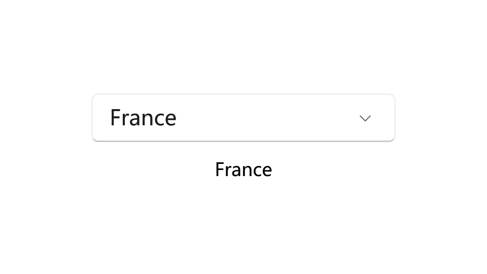

# ComboBox

Use a combo box (also known as a drop-down list) to present a list of items that a user can select from. A combo box starts in a compact state and expands to show a list of selectable items. A list box is similar to a combo box, but is not collapsible/does not have a compact state. You can learn more about list boxes at the end of this article.

- Class: [System.Windows.Controls](https://learn.microsoft.com/en-us/dotnet/api/system.windows.controls)[.ComboBox](https://learn.microsoft.com/en-us/dotnet/api/system.windows.controls.combobox)

- Inheritance: [Object](https://learn.microsoft.com/en-us/dotnet/api/system.object) → (...) → [Control](https://learn.microsoft.com/en-us/dotnet/api/system.windows.controls.control) → [ItemsControl](https://learn.microsoft.com/en-us/dotnet/api/system.windows.controls.itemscontrol) → [Selector](https://learn.microsoft.com/en-us/dotnet/api/system.windows.controls.primitives.selector) → [ComboBox](https://learn.microsoft.com/en-us/dotnet/api/system.windows.controls.combobox)


## Examples

The following example creates a ComboBox. The example populates the ComboBox by binding the ItemsSource property to a collection object of type VacationSpots. The example also creates a TextBlock that displays the selected item of the ComboBox.

```xaml
<StackPanel  Grid.Column="0"
        Grid.Row="6">
    <StackPanel.Resources>
        <local:VacationSpots x:Key="myVacations"/>
    </StackPanel.Resources>
    <ComboBox Name="comboBox1"
        ItemsSource="{StaticResource myVacations}"
        Text="My Cities"
        Width="200"
        IsEditable="true"
        IsReadOnly="true"/>

    <TextBlock Text="{Binding ElementName=comboBox1, Path=SelectedItem}" Margin="0,10,0,0" HorizontalAlignment="Center"/>
</StackPanel>
```

The following example defines the collection object that the ComboBox in the preceding example binds to.

```csharp
class VacationSpots : ObservableCollection<string>
{
    public VacationSpots ()
    {

        Add("Spain");
        Add("France");
        Add("Peru");
        Add("Mexico");
        Add("Italy");
    }
}
```

Then you can choose a city from the ComboBox.



## Remarks

### Is this the right control?

Use a drop-down list to let users select a single value from a set of items that can be adequately represented with single lines of text.

Use a list or grid view instead of a combo box to display items that contain multiple lines of text or images.

When there are fewer than five items, consider using radio buttons (if only one item can be selected) or check boxes (if multiple items can be selected).

Use a combo box when the selection items are of secondary importance in the flow of your app. If the default option is recommended for most users in most situations, showing all the items by using a list view might draw more attention to the options than necessary. You can save space and minimize distraction by using a combo box.

:::tip Recommendations

Limit the text content of combo box items to a single line.
Sort items in a combo box in the most logical order. Group together related options and place the most common options at the top. Sort names in alphabetical order, numbers in numerical order, and dates in chronological order.

:::

## ItemsControl

The ComboBox allows the user to select an item from a drop-down list or optionally to enter new text in the text box of the control. ComboBox is an ItemsControl, which means it can contain a collection of objects of any type (such as string, image, or panel). For more information, see the [ItemsControl](https://learn.microsoft.com/en-us/dotnet/api/system.windows.controls.itemscontrol) class.

### Extended Properties

You can use the attached properties from `ui:ComboBox` to customize your ComboBox.

- **TextBoxStyle**: Gets the style of the TextBox in the ComboBox when the ComboBox is editable.

### Elevation

The ComboBox control comes with an elevation border effect by default. You can use the `ui:ElevationBorder` to customize its elevation.

See more at: ____

### Styles

There is one built-in style for Button control:

- **DefaultComboBoxStyle**: The default style for ComboBox, you can access it with `ui:ThemeKeys.DefaultComboBoxStyleKey`.

## See also

### Microsoft Learn

- [ComboBox Class (WPF)](https://learn.microsoft.com/en-us/dotnet/api/system.windows.controls.combobox)

- [ComboBox Class (WinRT)](https://learn.microsoft.com/en-us/windows/windows-app-sdk/api/winrt/microsoft.ui.xaml.controls.combobox)

- [ComboBox - WPF](https://learn.microsoft.com/en-us/dotnet/desktop/wpf/controls/combobox)

- [Combo box and list box - Windows apps](https://learn.microsoft.com/en-us/windows/apps/design/controls/combo-box)

### Related controls

- [DropDownButton](./dropdown-button)

- [ToggleButton](./toggle-button)

- [SplitButton](./split-button)

- [HyperlinkButton](./hyperlink-button)

- [RepeatButton](./repeat-button)