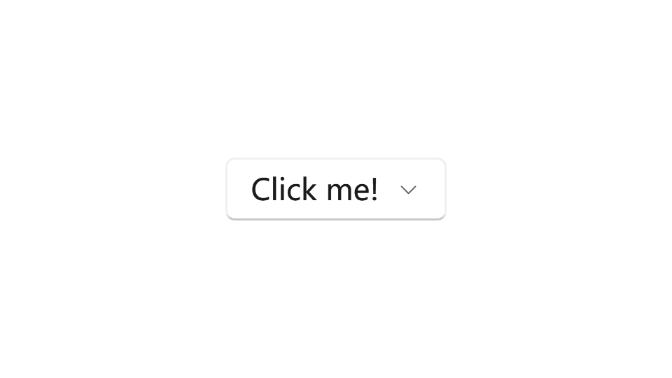
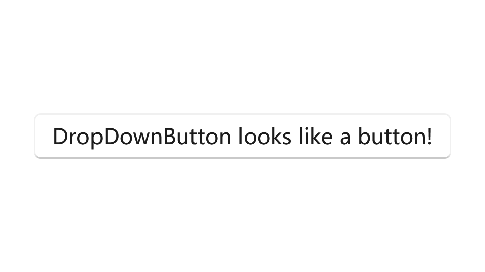

---

description: "用户点击时显示选项弹出菜单的按钮。"

---

# 下拉按钮

下拉按钮是一个按钮，显示一个倒三角形作为视觉指示，表明它有一个附加的弹出菜单，包含更多选项。它的行为与带有弹出菜单的标准按钮控件相同；只是外观不同。

- **类**: [iNKORE.UI.WPF.Modern.Controls](..)[.DropDownButton](.)

- **继承**: [Object](https://learn.microsoft.com/en-us/dotnet/api/system.object) → (...) → [Control](https://learn.microsoft.com/en-us/dotnet/api/system.windows.controls.control) → [ContentControl](https://learn.microsoft.com/en-us/dotnet/api/system.windows.controls.contentcontrol) → [ButtonBase](https://learn.microsoft.com/en-us/dotnet/api/system.windows.controls.primitives.buttonbase) → [Button](https://learn.microsoft.com/en-us/dotnet/api/system.windows.controls.button) → [DropDownButton](.)

下拉按钮继承了 Click 事件，但通常不使用它。相反，您使用 Flyout 属性附加一个弹出菜单，并通过使用弹出菜单中的菜单选项来调用操作。单击按钮时，弹出菜单会自动打开。请务必指定弹出菜单的 Placement 属性，以确保在按钮旁边的预期位置。默认的放置算法可能无法在所有情况下产生预期的放置效果。有关弹出菜单的更多信息，请参阅 **Flyout** 和 **MenuFlyout**。

## 示例

### 基本下拉按钮

此代码创建一个下拉按钮，单击按钮时会打开一个弹出菜单：

```xml
<ui:DropDownButton Content="点击我！">
    <ui:DropDownButton.Flyout>
        <ui:Flyout Placement="Bottom">
            <TextBlock Text="你好！" Width="200" Height="120"/>
        </ui:Flyout>
    </ui:DropDownButton.Flyout>
</ui:DropDownButton>
```



### 带有菜单弹出菜单

此示例展示了如何创建一个带有菜单弹出菜单的下拉按钮，该菜单包含用于在 TextBox 中段落对齐的命令。

```xml
<ui:DropDownButton x:Name="DropDownButton_Align">

    <ui:FontIcon x:Name="FontIcon_Align" Icon="{x:Static ui:SegoeFluentIcons.AlignLeft}"/>

    <ui:DropDownButton.Flyout>
        <ui:MenuFlyout>
            
            <MenuItem Header="左对齐" Tag="left" Click="MenuItem_Click">
                <MenuItem.Icon>
                    <ui:FontIcon Icon="{x:Static ui:SegoeFluentIcons.AlignLeft}"/>
                </MenuItem.Icon>
            </MenuItem>
            <MenuItem Header="居中对齐" Tag="center" Click="MenuItem_Click">
                <MenuItem.Icon>
                    <ui:FontIcon Icon="{x:Static ui:SegoeFluentIcons.AlignCenter}"/>
                </MenuItem.Icon>
            </MenuItem>
            <MenuItem Header="右对齐" Tag="right" Click="MenuItem_Click">
                <MenuItem.Icon>
                    <ui:FontIcon Icon="{x:Static ui:SegoeFluentIcons.AlignRight}"/>
                </MenuItem.Icon>
            </MenuItem>
            
        </ui:MenuFlyout>
    </ui:DropDownButton.Flyout>
</ui:DropDownButton>

<TextBox x:Name="TextBox_Text" Text="文本！" Width="200" Padding="10,6,6,6"/>
```
```csharp
private void Button_SaveScreenshot_Click(object sender, RoutedEventArgs e)
{
    RenderTargetBitmap targetBitmap = new RenderTargetBitmap(
        (int)Viewbox_Viewport.ActualWidth,
        (int)Viewbox_Viewport.ActualHeight,
        96d,
        96d,
        PixelFormats.Default);

    targetBitmap.Render(Viewbox_Viewport);


    if (saveFileDialog.ShowDialog() == true)
    {
        BmpBitmapEncoder encoder = new BmpBitmapEncoder();
        encoder.Frames.Add(BitmapFrame.Create(targetBitmap));
        // save file to disk
        using (FileStream fs = File.Open(saveFileDialog.FileName, FileMode.OpenOrCreate))
        {
            encoder.Save(fs);
        }
    }
}
```

## 备注

### 显示倒三角形箭头

下拉按钮默认在右侧显示一个倒三角形箭头。如果您想隐藏它，可以将 **ShowChevronArrow** 设置为 false。如果这样做，它看起来完全像一个按钮，但仍然可以打开弹出菜单。

```xml
<ui:DropDownButton Content="看起来像按钮的下拉按钮！" ShowChevronArrow="False"/>
```



### 弹出菜单打开模式

FlyoutOpeningMode 确定何时应该打开弹出菜单。

查看更多信息： ____

### 提升

按钮控件默认带有提升边框效果。您可以使用 `ui:ElevationBorder` 自定义其提升效果。

查看更多信息：____

### 样式

下拉按钮控件有一种内置样式。由于这是一个直接来自 `iNKORE.UI.WPF.Modern.Controls.dll` 的控件，默认样式键为 `null`，您可以使用 `{x:Null}` 应用默认样式。

## 另请参阅

### Microsoft Learn

- [DropDownButton 类 (WinRT)](https://learn.microsoft.com/en-us/windows/windows-app-sdk/api/winrt/microsoft.ui.xaml.controls.dropdownbutton)

- [按钮 # 下拉按钮 - Windows 应用](https://learn.microsoft.com/en-us/windows/apps/design/controls/buttons#example---drop-down-button)

### 相关控件

- [AppBarButton](../menu-and-toolbars/appbar-button)

- [Flyout](../dialogs/flyout)

- [MenuFlyout](../menu-and-toolbars/menu-flyout)

- [SplitButton](./split-button)