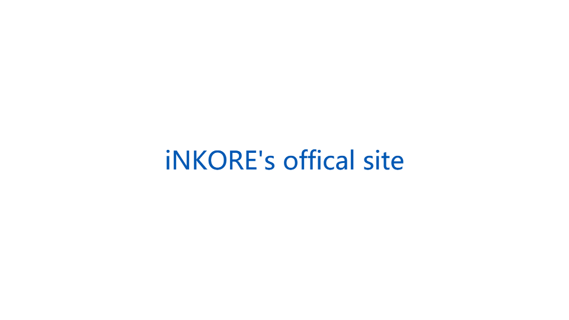

# HyperlinkButton

A HyperlinkButton appears as a text hyperlink. When a user clicks it, it opens the page you specify in the NavigateUri property in the default browser. Or you can handle its Click event, typically to navigate within your app.

- Class: [iNKORE.UI.WPF.Modern.Controls](..)[.HyperlinkButton](.)

- Inheritance: [Object](https://learn.microsoft.com/en-us/dotnet/api/system.object) → (...) → [Control](https://learn.microsoft.com/en-us/dotnet/api/system.windows.controls.control) → [ContentControl](https://learn.microsoft.com/en-us/dotnet/api/system.windows.controls.contentcontrol) → [ButtonBase](https://learn.microsoft.com/en-us/dotnet/api/system.windows.controls.primitives.buttonbase) → [HyperlinkButton](.)

## Examples

A **HyperlinkButton** looks like hyperlink text, but works like a button. You can use it in two ways:

### Use Click event

Handle the **Click** event **(Recommended)**. This works just like the **Click** event of a standard **Button**, and can be used to navigate within your app.

```xaml
<ui:HyperlinkButton Content="iNKORE's offical site" RaiseHyperlinkClicks="False" Click="HyperlinkButton_Click"/>
```
```csharp
private void HyperlinkButton_Click(object sender, RoutedEventArgs e)
{
    Process.Start(new ProcessStartInfo("https://inkore.net/")
    {
        UseShellExecute = true
    });
}
```



:::warn

Pay attention to **RaiseHyperlinkClicks** property! It will be introduced in the following sections.

:::

### Use NavigateUri property

Set the **NavigateUri** property. When a user clicks it, it will automatically open the URI in the default browser.

```xaml
<ui:HyperlinkButton Content="iNKORE's offical site" NavigateUri="https://inkore.net/"/>
```

## Remarks

### Is this the right control?

Use a hyperlink when you need text that responds when pressed and navigates the user to more information about the text that was pressed.

Choose the right type of hyperlink based on your needs:

- Use an inline [Hyperlink](https://learn.microsoft.com/en-us/dotnet/api/system.windows.documents.hyperlink) text element inside of a text control. A Hyperlink element flows with other text elements and you can use it in any InlineCollection. Use a text hyperlink if you want automatic text wrapping and don't necessarily need a large hit target. Hyperlink text can be small and difficult to target, especially for touch.

- Use a HyperlinkButton for stand-alone hyperlinks. A HyperlinkButton is a specialized Button control that you can use anywhere that you would use a Button.

- Use a HyperlinkButton with an Image as its content to make a clickable image.

### RaiseHyperlinkClicks property

Due to WPF's internal design, the Click event will be triggered twice when clicking the button once. To avoid this, you need to set **RaiseHyperlinkClicks** property to `false` if you are using **Click** event instead of **NavigateUri** property.

When **RaiseHyperlinkClicks** is set to `false`, NavigateUri will be ignored and not triggered.

:::tip Recommendations

- Only use hyperlinks for navigation; don't use them for other actions.
- Use the Body style from the type ramp for text-based hyperlinks. Read about fonts and the Windows type ramp.
- Keep discrete hyperlinks far enough apart so that the user can differentiate between them and has an easy time selecting each one.
Add tooltips to hyperlinks that indicate to where the user will be directed. If the user will be directed to an external site, include the top-level domain name inside the tooltip, and style the text with a secondary font color.

:::

### Styles

There is one built-in style for HyperlinkButton control. Since this is a control directly from `iNKORE.UI.WPF.Modern.Controls.dll`, the default style key is `null`, you can use `{x:Null}` to apply the default style.

## See also

### Microsoft Learn

- [HyperlinkButton class (WinRT)](https://learn.microsoft.com/en-us/windows/windows-app-sdk/api/winrt/microsoft.ui.xaml.controls.hyperlinkbutton)

- [Hyperlink class (WPF)](https://learn.microsoft.com/en-us/dotnet/api/system.windows.documents.hyperlink)

- [Hyperlinks - Windows apps](https://learn.microsoft.com/en-us/windows/apps/design/controls/hyperlinks#create-a-hyperlinkbutton)

### Related controls

- [Button](./button)