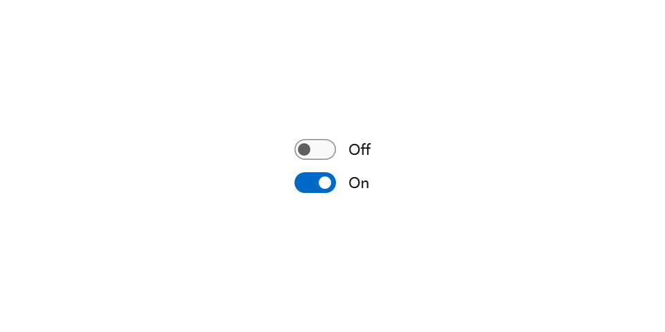
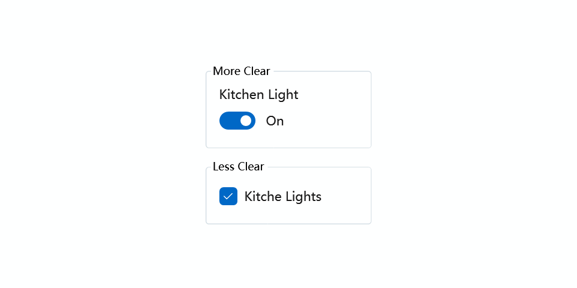

---

description: "可以在两种状态之间切换的开关。"

---

# 切换开关

使用切换开关控件向用户展示两个互斥的选项（如开/关），选择一个选项会立即生效。切换开关应有一个标签。

- **类**: [iNKORE.UI.WPF.Modern.Controls](..)[.ToggleSwitch](.)

- **继承**: [Object](https://learn.microsoft.com/en-us/dotnet/api/system.object) → (...) → [Control](https://learn.microsoft.com/en-us/dotnet/api/system.windows.controls.control) → [ToggleSwitch](.)

## 示例

以下是创建一个简单切换开关的方法。此 XAML 创建了一个切换开关。

```xml
<ui:ToggleSwitch/>
<ui:ToggleSwitch IsOn="True"/>
```



然后，您可以添加一个标题来告诉用户此开关的作用，该标题将位于控件上方区域。

开关可以是开或关。使用 IsOn 属性确定开关的状态。当开关用于控制另一个二元属性的状态时，您可以使用绑定，如下所示。

在其他情况下，您可以处理 Toggled 事件以响应状态的变化。

```xml
<ui:SimpleStackPanel Spacing="10">
    <ui:ToggleSwitch x:Name="ToggleSwitch_MainLight" Header="主灯" Toggled="ToggleSwitch_MainLight_Toggled"/>
    <TextBlock x:Name="TextBlock_MainLightStatus" Text="尝试点击切换开关" Opacity="0.5"/>
</ui:SimpleStackPanel>
```

```csharp
private void ToggleSwitch_MainLight_Toggled(object sender, RoutedEventArgs e)
{
    TextBlock_MainLightStatus.Text = ToggleSwitch_MainLight.IsOn
        ? "主灯已打开"
        : "主灯已关闭";
}
```


## 备注

复选框控件继承自 [ToggleButton](./toggle-button)，可以有三种状态：选中、未选中和不确定。

### 这是正确的控件吗？

对于用户翻转切换开关后立即生效的二元操作，请使用切换开关。


### 样式

按钮控件有一种内置样式：

- **DefaultCheckBoxStyle**: 复选框的默认样式，您可以通过 `ui:ThemeKeys.DefaultCheckBoxStyleKey` 访问。

将切换开关视为设备的物理电源开关：当您希望启用或禁用设备执行的操作时，翻转开关。

为了使切换开关易于理解，请使用一个或两个词（最好是名词）来标记它，描述它控制的功能。例如，“WiFi”或“厨房灯”。

### 选择切换开关和复选框

对于某些操作，切换开关或复选框都可能适用。要决定哪个控件更适合，请遵循以下提示：

- 对于用户更改后立即生效的二元设置，请使用切换开关。

   

   在此示例中，使用切换开关可以清楚地看到厨房灯设置为“开”。但使用复选框，用户需要考虑灯现在是否亮着，或者是否需要选中复选框以打开灯。

- 对于可选的（“可有可无”）项目，请使用复选框。

- 当用户需要执行额外步骤以使更改生效时，请使用复选框。例如，如果用户必须点击“提交”或“下一步”按钮以应用更改，请使用复选框。

- 当用户可以选择与单个设置或功能相关的多个项目时，请使用复选框。

:::tip 建议

- 尽可能使用默认的开和关标签；仅在必要时替换它们以使切换开关有意义。如果替换它们，请使用一个更准确描述切换的单词。通常，如果“开”和“关”这两个词不能描述与切换开关相关的操作，您可能需要一个不同的控件。

- 除非必须，否则避免替换开和关标签；除非情况需要自定义标签，否则请坚持使用默认标签。

:::

### 开/关标签

默认情况下，切换开关包含字面上的开和关标签，这些标签会自动本地化。您可以通过设置 OnContent 和 OffContent 属性来替换这些标签。

此示例将开/关标签替换为显示/隐藏标签。

```xml
<ToggleSwitch x:Name="imageToggle" Header="显示图像"
    OffContent="显示" OnContent="隐藏"
    Toggled="ToggleSwitch_Toggled"/>
```

此示例删除了标签。

```xml
<ToggleSwitch OffContent="" OnContent=""
    Toggled="ToggleSwitch_Toggled"/>
```

您还可以通过设置 OnContentTemplate 和 OffContentTemplate 属性来使用更复杂的内容。

### 紧凑尺寸

如果您在紧凑布局中使用 ToggleSwitch，您可能会发现即使复选框没有内容，它也会占用一定的空间。这是因为默认样式中设置了 **MinWidth** 属性。


要解决此问题，您可以将 **MinWidth** 属性设置为 `0`，如下所示：

```xml
<ToggleSwitch MinWidth="0"/>
```


## 另请参阅

### Microsoft Learn

- [切换开关指南](https://learn.microsoft.com/en-us/windows/apps/design/controls/toggles)

- [ToggleSwitch 类 (WinRT)](https://learn.microsoft.com/en-us/windows/windows-app-sdk/api/winrt/microsoft.ui.xaml.controls.toggleswitch)

### 相关控件

- [复选框](./check-box)

- [ToggleButton](./toggle-button)

- [单选按钮](./radio-button)