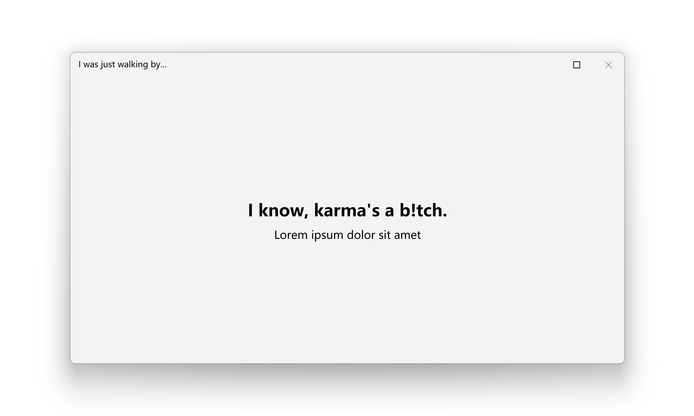

# Window

The Window class in represents a window in a Windows application. It provides a rich set of features to manage and interact with the window, such as handling its content, appearance, and behavior. This document covers the essential aspects of the Window class, including its properties, methods, and events.

- **Class**: [System.Windows](https://learn.microsoft.com/en-us/dotnet/api/system.windows)[.Window](https://learn.microsoft.com/en-us/dotnet/api/system.windows.controls.button)

- **Inheritance**: [Object](https://learn.microsoft.com/en-us/dotnet/api/system.object) → (...) → [Control](https://learn.microsoft.com/en-us/dotnet/api/system.windows.controls.control) → [ContentControl](https://learn.microsoft.com/en-us/dotnet/api/system.windows.controls.contentcontrol) → [Window](https://learn.microsoft.com/en-us/dotnet/api/system.windows.controls.window)

## Examples

### Create a basic window

You can create a basic window by using the Window class. By default, there's a main window called `MainWindow.xaml` when you create a WPF project with Visual Studio. Mostly we use this window as the main window of the application. You can also add more windows to the project with the following steps.

First, create a new window by right-clicking the project in Solution Explorer, selecting **Add** > **New Item**, and then selecting Window (WPF) from the list. Name the new window `MyWindow.xaml`.


Then, you can open the new window by creating an instance of it and calling the `Show` method. Here's an example of how to open the new window:

```csharp
var myWindow = new MyWindow();
myWindow.Show();
```

### Apply modern styles

The window is always using the default style and native frames unless you apply the modern styles manually. With **ui:WindowHelper.UseModernWindowStyle** property, you can easily apply modern style to a window like this:

```xml title="MainWindow.xaml"
<Window x:Class="WpfApp1.MainWindow"
        xmlns="http://schemas.microsoft.com/winfx/2006/xaml/presentation"
        xmlns:x="http://schemas.microsoft.com/winfx/2006/xaml"
        xmlns:d="http://schemas.microsoft.com/expression/blend/2008"
        xmlns:mc="http://schemas.openxmlformats.org/markup-compatibility/2006"
        xmlns:ui="http://schemas.inkore.net/lib/ui/wpf/modern"
        xmlns:local="clr-namespace:WpfApp1"
        mc:Ignorable="d"
# highlight-next-line
        ui:WindowHelper.UseModernWindowStyle="True"
        ui:WindowHelper.CornerStyle="Round"
        Title="I was just walking by..." Height="450" Width="800" WindowStartupLocation="CenterScreen">
    <ui:SimpleStackPanel HorizontalAlignment="Center" VerticalAlignment="Center" Spacing="10">
        <TextBlock Text="I know, karma's a b!tch." HorizontalAlignment="Center" FontSize="24" FontWeight="Bold"/>
        <TextBlock Text="Lorem ipsum dolor sit amet" FontSize="16" HorizontalAlignment="Center"/>
    </ui:SimpleStackPanel>
</Window>
```


### System backdrops

Since Windows 10, there are a few system-level backdrops that can be applied to the window. You can use **ui:WindowHelper.SystemBackdrop** property to apply the backdrop. For example, you can apply the mica effect with the following code:

```ini
ui:WindowHelper.SystemBackdropType="Mica"
```


### Back button in title bar

You can use the **ui:TitleBar.IsBackButtonVisible** and **ui:TitleBar.IsBackEnabled** properties to show and enable the back button in the title bar. The back button is useful when you want to navigate back to the previous window or page.

First, make sure the back button feature is enabled in the window:

```ini
ui:TitleBar.IsBackButtonVisible="True"
ui:TitleBar.IsBackEnabled="True"
```

Then when you run, you may see there's a back button in the title bar. Next, you can handle the click event of the back button with **ui:TitleBar.BackButtonCommand**. For more infomation about the commands, please [click here](https://learn.microsoft.com/en-us/dotnet/desktop/wpf/advanced/commanding-overview).

The complete code should look like this:

```xml title="MainWindow.xaml"
<Window x:Class="WpfApp1.MainWindow"
        xmlns="http://schemas.microsoft.com/winfx/2006/xaml/presentation"
        xmlns:x="http://schemas.microsoft.com/winfx/2006/xaml"
        xmlns:d="http://schemas.microsoft.com/expression/blend/2008"
        xmlns:mc="http://schemas.openxmlformats.org/markup-compatibility/2006"
        xmlns:ui="http://schemas.inkore.net/lib/ui/wpf/modern"
        xmlns:local="clr-namespace:WpfApp1"
        mc:Ignorable="d"
        ui:WindowHelper.UseModernWindowStyle="True"
# highlight-start
        ui:TitleBar.IsBackButtonVisible="True"
        ui:TitleBar.IsBackEnabled="True"
        ui:TitleBar.BackButtonCommand="{x:Static local:MainWindow.BackCommand}"
# highlight-end
        Title="I was just walking by..." Height="450" Width="800" WindowStartupLocation="CenterScreen">
    <ui:SimpleStackPanel HorizontalAlignment="Center" VerticalAlignment="Center" Spacing="10">
        <TextBlock Text="I know, karma's a b!tch." HorizontalAlignment="Center" FontSize="24" FontWeight="Bold"/>
        <TextBlock Text="Lorem ipsum dolor sit amet" FontSize="16" HorizontalAlignment="Center"/>
    </ui:SimpleStackPanel>
</Window>
```

```csharp title="MainWindow.xaml.cs"
public partial class MainWindow : Window
{
    public MainWindow()
    {
        InitializeComponent();
# highlight-next-line
        this.CommandBindings.Add(new CommandBinding(BackCommand, BackCommand_Executed));
    }

# highlight-next-line
    public static readonly RoutedUICommand BackCommand = new RoutedUICommand("Back button clicked", "Back", typeof(MainWindow));

    private void BackCommand_Executed(object sender, ExecutedRoutedEventArgs e)
    {
        // Do someting when the back button is clicked
        MessageBox.Show("Back button is clicked!");
    }
}
```

When clicking the back button, you may see the expected message box coming up. You can replace the message box with your own logic to navigate back to the previous window or page.


You can also use the other properties with the keyword `Back` or `BackButton` in the **ui:TitleBar** class to do more customizations to the back button.

## Members

### WindowHelper.UseModernWindowStyle

Gets or sets whether the modern window style will be applied to the window. The modern window style is a custom window style that provides a modern look and feel to the window.

Only do you set this to true, all the properties below can work.

### WindowHelper.SystemBackdropType

Gets or sets the system backdrop type of the window. You can choose one option from [BackdropType Enum](../../definitions/helpers/styles/backdrop-type).

:::warning System Compatibility

The availability of Acrylic backdrops are listed above. Mica and Tabbed are only available on Windows 11. If you're running the application on an older version of Windows, the system backdrops will not be applied.

The option **Acrylic** will automatically choose the best API based on the system version. If you're running the application on Windows 11, it will use Acrylic11. If you're running the application on Windows 10, it will use Acrylic10. However, this may cause some unintended behaviors.

:::

### WindowHelper.Acrylic10Color

Gets or sets the color of the Acrylic10 backdrop. This property is only works when **SystemBackdropType** is `Acrylic10` or is `Acrylic` and running on Windows 10. You can set this property to a **Color** value to customize the color of the Acrylic10 backdrop.

:::warning Use Color values, not Brush

This property only accepts **Color** values, not **Brush** values. If you pass a **Brush** value, an exception will be thrown. You can use **ColorConverter** to convert a **Brush** to a **Color**.

:::

### WindowHelper.ApplyBackground

This property decides whether the **Background** property will be applied to the window. If you set this property to **False**, the **Background** property will be ignored and the window will not render its background. Usually we will automatically set this property depending on the backdrop you're using. You can also set this property manually to control the background rendering, though it's not commonly used. 

The default value is **True** when **SystemBackdropType** is **None**. Otherwise, it's **False**.

### WindowHelper.ApplyNoise

This property decides whether the noise effect will be applied to the window. If you set this property to **False**, the noise effect will not be rendered. The noise effect is a subtle noise texture that makes the window look more natural and less flat. The default value is always **False** since we figured out that when you use the acrylic backdrop, the noise effect will be covered by system and it's not necessary to render the noise effect again.

You can set this property to **True** to enable an additional noise effect manually.

### WindowHelper.FixMaximizedWindow

As we have fully customized the window for modern styles, the default maximize behavior of the window may not work as expected. But no worries, we have got a way to fix this issue and make the window maximize as expected. However, this fix may cause an exception as follow:

> **Managed Debugging Assistant**: A call to PInvoke function 'iNKORE.UI.WPF.Modern!iNKORE.UI.WPF.Modern.Controls.Primitives.MaximizedWindowFixer::GetWindowPlacement' has unbalanced the stack. This is likely because the managed PInvoke signature does not match the unmanaged target signature. Check that the calling convention and parameters of the PInvoke signature match the target unmanaged signature.

This exception is **harmless and can be ignored**. If you want to get rid of this exception, you can set this property to **False** (not recommended, since it will break the maximize function).

```ini
ui:WindowHelper.FixMaximizedWindow="False"
```

For a better solution, you can turn off the exception breaking in the **Exception Settings** window in Visual Studio:


Or you can simply UNcheck **Break when this exception type is thrown** or CHECK **(Except when throw from) iNKORE.UI.WPF.Modern.dll** when this exception appears, this will also ignore the exception.


### WindowHelper.CornerStyle

You can set the corner style of the window with this property. You can choose one option from [WindowCornerStyle Enum](../../definitions/helpers/styles/window-corner-style).

:::warning System compatibility

The corner style is only available on Windows 11. If you're running the application on an older version of Windows, the corner style will not be applied.

:::

### WindowHelper.*ButtonAvailability

There are three buttons located in the title bar by default: minimize, maximize/restore, and close. You can customize these buttons by using the three properties in **ui:TitleBar** class as well:

- **ui:TitleBar.ButtonCloseAvailability**: The availability of the close button.

- **ui:TitleBar.ButtonMaximizeAvailability**: The availability of the maximize/restore button.

- **ui:TitleBar.ButtonMinimizeAvailability**: The availability of the minimize button.

As the word 'availability' means, you can control the visibility and enabled status of the buttons with these properties. There are a few values that you can choose from:

- **Auto**: Let the system decide the availability of the button, which is the default value. The system will decide whether to show the button based on **WindowStyle** and **ResizeMode** property.

- **Collapsed**: The button is hidden and disabled, there will be no space reserved for the button.

- **Disabled**: The button is disabled but visible. You can still see the button but cannot interact with it.

- **Enabled**: The button is enabled and visible. You can see and interact with the button.

:::warning Be careful when you hide the close button.

You can surely disable or hide the close button. But users can still close your window by pressing Alt+F4, using the task manager, clicking the close button on the taskbar or other methods.

If you really wish your window to be unclosable, you should consider handling the **Window.Closing** event after disabling the close button, and cancel the closing operation by setting **Cancel** property of **CancelEventArgs** to **true**.

:::

For example, the following code will hide the minimize button and disable the close button:

```ini
ui:TitleBar.ButtonMinimizeAvailability="Collapsed"
ui:TitleBar.ButtonCloseAvailability="Disabled"
```



:::warning Never hide only one of minimize button and maximize/restore button.

According to the Fluent Design guidelines, you should always show both minimize and maximize/restore buttons together. If you hide one of them, the other one should be hidden as well.

Though we give you the full rights to customize your applications, it's not recommended since it might confuse users and break the consistency of the UI.

:::

## Remarks

### Managed Properties

To provide the best look and feel, we need to take over the WindowChrome of the window to change it with your needs. So after applying the modern styles, You may NOT modify the WindowChrome of the window directly, for the same reason, you may NOT modify the following properties as well:

- WindowChrome.WindowChrome

- FrameworkElement.Style

:::danger Never modify them directly

If you modify the properties listed above, the modern styles and backdrop might be broken, and the window may not look as expected or even crash.

:::

## See also

### Microsoft Learn

- [Window Class (WPF)](https://learn.microsoft.com/en-us/dotnet/api/system.windows.window)

### Related controls

- [Flyout](./flyout)

- [ContentDialog](./content-dialog)

- [MessageBox](./message-box)

### Related articles

- [Definitions / WindowHelper](../../definitions/controls/helpers/window-helper)

- [Definitions / TitleBar](coming_soon)

- [Definitions / WindowCornerStyle](../../definitions/helpers/styles/window-corner-style)

- [Definitions / BackdropType](../../definitions/helpers/styles/backdrop-type)
