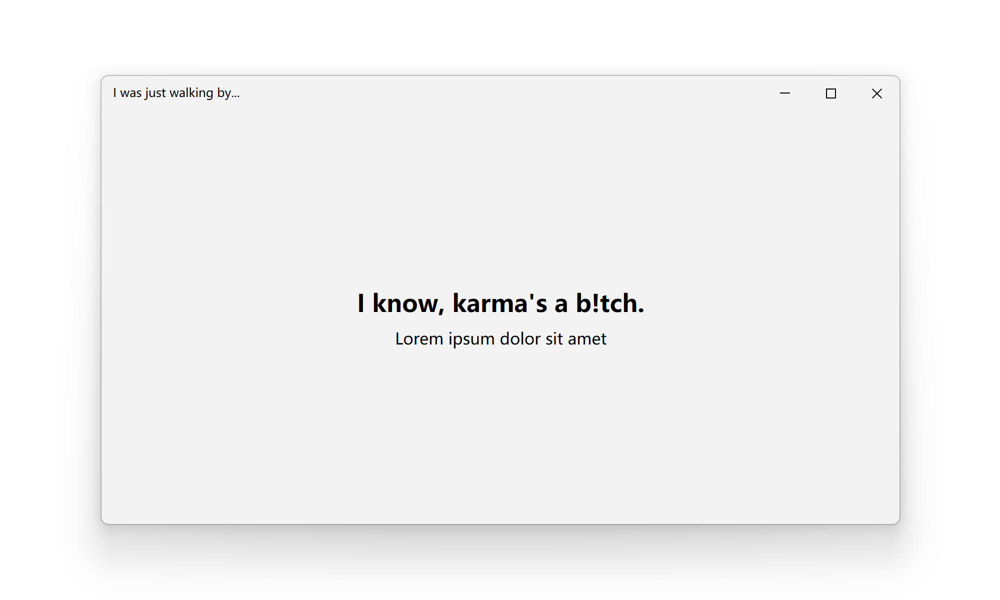
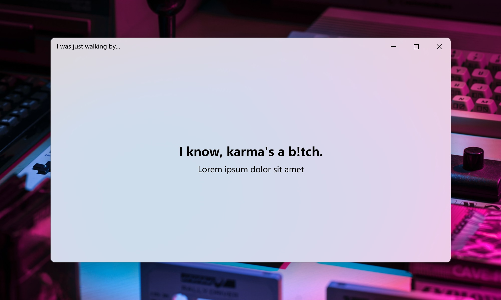
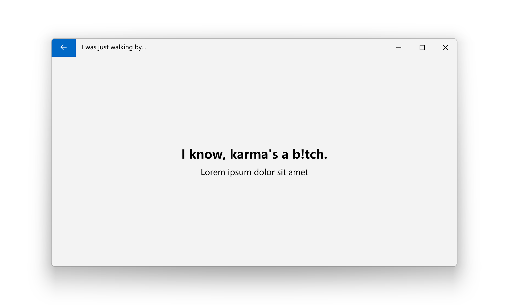

# Window

The Window class in represents a window in a Windows application. It provides a rich set of features to manage and interact with the window, such as handling its content, appearance, and behavior. This document covers the essential aspects of the Window class, including its properties, methods, and events.

- **Class**: [System.Windows](https://learn.microsoft.com/en-us/dotnet/api/system.windows)[.Window](https://learn.microsoft.com/en-us/dotnet/api/system.windows.controls.button)

- **Inheritance**: [Object](https://learn.microsoft.com/en-us/dotnet/api/system.object) → (...) → [Control](https://learn.microsoft.com/en-us/dotnet/api/system.windows.controls.control) → [ContentControl](https://learn.microsoft.com/en-us/dotnet/api/system.windows.controls.contentcontrol) → [Window](https://learn.microsoft.com/en-us/dotnet/api/system.windows.controls.window)


## Examples

### Create a basic window

You can create a basic window by using the Window class. By default, there's a main window called `MainWindow.xaml` when you create a WPF project with Visual Studio. Mostly we use this window as the main window of the application. You can also add more windows to the project with the following steps.

First, create a new window by right-clicking the project in Solution Explorer, selecting **Add** > **New Item**, and then selecting Window (WPF) from the list. Name the new window `MyWindow.xaml`.


Then, you can open the new window by creating an instance of it and calling the `Show` method. Here's an example of how to open the new window:

```csharp
var myWindow = new MyWindow();
myWindow.Show();
```

### Apply modern styles

The window is always using the default style and native frames unless you apply the modern styles manually. With **ui:WindowHelper.UseModernWindowStyle** property, you can easily apply modern style to a window like this:

```xml title="MainWindow.xaml"
<Window x:Class="WpfApp1.MainWindow"
        xmlns="http://schemas.microsoft.com/winfx/2006/xaml/presentation"
        xmlns:x="http://schemas.microsoft.com/winfx/2006/xaml"
        xmlns:d="http://schemas.microsoft.com/expression/blend/2008"
        xmlns:mc="http://schemas.openxmlformats.org/markup-compatibility/2006"
        xmlns:ui="http://schemas.inkore.net/lib/ui/wpf/modern"
        xmlns:local="clr-namespace:WpfApp1"
        mc:Ignorable="d"
# highlight-next-line
        ui:WindowHelper.UseModernWindowStyle="True"
        ui:WindowHelper.CornerStyle="Round"
        Title="I was just walking by..." Height="450" Width="800" WindowStartupLocation="CenterScreen">
    <ui:SimpleStackPanel HorizontalAlignment="Center" VerticalAlignment="Center" Spacing="10">
        <TextBlock Text="I know, karma's a b!tch." HorizontalAlignment="Center" FontSize="24" FontWeight="Bold"/>
        <TextBlock Text="Lorem ipsum dolor sit amet" FontSize="16" HorizontalAlignment="Center"/>
    </ui:SimpleStackPanel>
</Window>
```



### System backdrops

Since Windows 10, there are a few system-level backdrops that can be applied to the window. You can use **ui:WindowHelper.SystemBackdrop** property to apply the backdrop. For example, you can apply the mica effect with the following code:

```ini
ui:WindowHelper.SystemBackdropType="Mica"
```



### Back button in title bar

You can use the **ui:TitleBar.IsBackButtonVisible** and **ui:TitleBar.IsBackEnabled** properties to show and enable the back button in the title bar. The back button is useful when you want to navigate back to the previous window or page.

First, make sure the back button feature is enabled in the window:

```ini
ui:TitleBar.IsBackButtonVisible="True"
ui:TitleBar.IsBackEnabled="True"
```

Then when you run, you may see there's a back button in the title bar. Next, you can handle the click event of the back button with **ui:TitleBar.BackButtonCommand**. For more infomation about the commands, please [click here](https://learn.microsoft.com/en-us/dotnet/desktop/wpf/advanced/commanding-overview).

The complete code should look like this:

```xml title="MainWindow.xaml"
<Window x:Class="WpfApp1.MainWindow"
        xmlns="http://schemas.microsoft.com/winfx/2006/xaml/presentation"
        xmlns:x="http://schemas.microsoft.com/winfx/2006/xaml"
        xmlns:d="http://schemas.microsoft.com/expression/blend/2008"
        xmlns:mc="http://schemas.openxmlformats.org/markup-compatibility/2006"
        xmlns:ui="http://schemas.inkore.net/lib/ui/wpf/modern"
        xmlns:local="clr-namespace:WpfApp1"
        mc:Ignorable="d"
        ui:WindowHelper.UseModernWindowStyle="True"
# highlight-start
        ui:TitleBar.IsBackButtonVisible="True"
        ui:TitleBar.IsBackEnabled="True"
        ui:TitleBar.BackButtonCommand="{x:Static local:MainWindow.BackCommand}"
# highlight-end
        Title="I was just walking by..." Height="450" Width="800" WindowStartupLocation="CenterScreen">
    <ui:SimpleStackPanel HorizontalAlignment="Center" VerticalAlignment="Center" Spacing="10">
        <TextBlock Text="I know, karma's a b!tch." HorizontalAlignment="Center" FontSize="24" FontWeight="Bold"/>
        <TextBlock Text="Lorem ipsum dolor sit amet" FontSize="16" HorizontalAlignment="Center"/>
    </ui:SimpleStackPanel>
</Window>
```

```csharp title="MainWindow.xaml.cs"
public partial class MainWindow : Window
{
    public MainWindow()
    {
        InitializeComponent();
# highlight-next-line
        this.CommandBindings.Add(new CommandBinding(BackCommand, BackCommand_Executed));
    }

# highlight-next-line
    public static readonly RoutedUICommand BackCommand = new RoutedUICommand("Back button clicked", "Back", typeof(MainWindow));

    private void BackCommand_Executed(object sender, ExecutedRoutedEventArgs e)
    {
        // Do someting when the back button is clicked
        MessageBox.Show("Back button is clicked!");
    }
}
```

When clicking the back button, you may see the expected message box coming up. You can replace the message box with your own logic to navigate back to the previous window or page.



You can also use the other properties with the keyword `Back` or `BackButton` in the **ui:TitleBar** class to do more customizations to the back button.

## Remarks

### Attached Properties

You can use [**ui:WindowHelper**](../../definitions/controls/helpers/window-helper) and [**ui:TitleBar**](../../definitions/controls/primitives/title-bar) to customize the window. The helper provides a set of attached properties to control the appearance and behavior of the window. You can use these properties to apply modern styles, system backdrops, and other features to the window.

### Exception: PInvoke stack imbalance

You might see this exception when targeting .NET Framework. It's harmless and can be ignored. For how to get rid of it and more information, please check  [**ui:WindowHelper.FixMaximizedWindow**](../../definitions/controls/helpers/window-helper#fixmaximizedwindow) property.

### Managed Properties

To provide the best look and feel, we need to take over the WindowChrome of the window to change it with your needs. So after applying the modern styles, You may NOT modify the WindowChrome of the window directly, for the same reason, you may NOT modify the following properties as well:

- WindowChrome.WindowChrome

- FrameworkElement.Style

:::danger Never modify them directly

If you modify the properties listed above, the modern styles and backdrop might be broken, and the window may not look as expected or even crash.

:::

## See also

### Microsoft Learn

- [Window Class (WPF)](https://learn.microsoft.com/en-us/dotnet/api/system.windows.window)

### Related controls

- [Flyout](./flyout)

- [ContentDialog](./content-dialog)

- [MessageBox](./message-box)

### Related articles

- [Definitions / WindowHelper](coming_soon)

- [Definitions / TitleBar](coming_soon)

- [Definitions / WindowCornerStyle](../../definitions/helpers/styles/window-corner-style)

- [Definitions / BackdropType](../../definitions/helpers/styles/backdrop-type)
