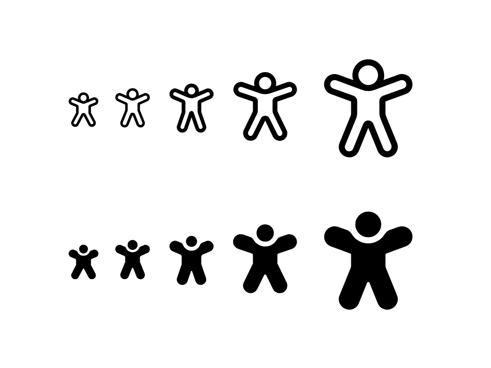

# FontIcon

FontIcon is a control that displays an icon from a specified font. It is a lightweight alternative to ImageIcon and can be used to display icons in a variety of contexts. The FontIcon is the best choice to use when you have a huge amount of icons that you want to display in your application.

- **Class**: [iNKORE.UI.WPF.Modern.Controls](..)[.FontIcon](.)

- **Inheritance**: [Object](https://learn.microsoft.com/en-us/dotnet/api/system.object) → (...) → [FrameworkElement](https://learn.microsoft.com/en-us/dotnet/api/system.windows.frameworkelement) → [IconElement](.) → [FontIcon](.)

## Examples

### Icon from the icon sets

If an icon set is present, you can use the Icon property to pass the icon data to the component like this:

```xml
<ui:FontIcon Icon="{x:Static ui:SegoeFluentIcons.Home}"/>
```


Under the `iNKORE.UI.WPF.Modern.Common.IconKeys` namespace, there are a few sets that you can use made by Microsoft (and they meet the Fluent Design specifications):

- `SegoeFluentIcons`: [Segoe Fluent Icons Family](https://learn.microsoft.com/en-us/windows/apps/design/style/segoe-fluent-icons-font) from Microsoft;

- `FluentSystemIcons`: [Fluent System Icons Family](https://github.com/microsoft/fluentui-system-icons) from Microsoft.

You can also create your own icon set by creating static `iNKORE.UI.WPF.Modern.Common.IconKeys.FontIconData` instances and pass them to the XAML with **x:Static**. For more details, [click here](COMING_SOON).

:::danger IMPORTANT

**Segoe Fluent Icons** are part of Microsoft's Segoe UI font family.These icons are primarily intended for use in Microsoft products and services. While they can be used in personal projects, commercial use may require adherence to Microsoft's licensing terms, as they are proprietary assets owned by Microsoft.”


**Fluent System Icons** are open-source icons developed by Microsoft as part of the Fluent Design System. These icons are available under the MIT License, allowing for both personal and commercial use without restriction. Users are free to include these icons in their projects, modify them, and distribute them as needed, provided they include the original license and copyright notice.

We strongly recommend you take **Fluent System Icons** as your primary choice.

:::

Here's a few examples of using Fluent System Icons:

```xml
<ui:SimpleStackPanel Spacing="2" Orientation="Horizontal">
    <ui:FontIcon Icon="{x:Static ui:FluentSystemIcons.Accessibility_16_Regular}"/>
    <ui:FontIcon Icon="{x:Static ui:FluentSystemIcons.Accessibility_20_Regular}" FontSize="20"/>
    <ui:FontIcon Icon="{x:Static ui:FluentSystemIcons.Accessibility_24_Regular}" FontSize="24"/>
    <ui:FontIcon Icon="{x:Static ui:FluentSystemIcons.Accessibility_32_Regular}" FontSize="32"/>
    <ui:FontIcon Icon="{x:Static ui:FluentSystemIcons.Accessibility_48_Regular}" FontSize="48"/>
</ui:SimpleStackPanel>
<ui:SimpleStackPanel Spacing="2" Orientation="Horizontal">
    <ui:FontIcon Icon="{x:Static ui:FluentSystemIcons.Accessibility_16_Filled}"/>
    <ui:FontIcon Icon="{x:Static ui:FluentSystemIcons.Accessibility_20_Filled}" FontSize="20"/>
    <ui:FontIcon Icon="{x:Static ui:FluentSystemIcons.Accessibility_24_Filled}" FontSize="24"/>
    <ui:FontIcon Icon="{x:Static ui:FluentSystemIcons.Accessibility_32_Filled}" FontSize="32"/>
    <ui:FontIcon Icon="{x:Static ui:FluentSystemIcons.Accessibility_48_Filled}" FontSize="48"/>
</ui:SimpleStackPanel>
```



For icon sets with a specified size, such as Fluent System Icons, you need to specify the size in the component as well using **FontSize** property. 

:::info

The **FontSize** property is `16` by default. If the icon set is designed for 16px size (like Segoe Fluent Icons), you don't need to specify the **FontSize** property. 

Some icon sets have different sizes of icon that are packed together (like Fluent System Icons), it's important to specify the FontSize property.

If the element's FontSize doesn't match the designed size of the icon, the pixel-perfect might be gone and the element might look weird.

:::

### Icon without an icon set

You can pass a `string` to the **Glyph** property to set the icon when icon set is not suitable. However you may have to specify the **FontFamily** property as well, the default value is `Segoe Fluent Icons`.

For example, the following code:

```xml
<ui:FontIcon Icon="{x:Static ui:FluentSystemIcons.Accessibility_16_Regular}"/>
```

equals to:

```xml
<ui:FontIcon Glyph="&#xF102;" FontFamily="Fluent System Icons"/>
```

:::warning

We strongly discourage this as it increases the coupling and complexity of the code, and is difficult to maintain at a later stage.

We recommend that you use an existing Fluent Design-compliant icon library (above) or wrap your own icon library with FontIconData ([tutorial here](COMING_SOON)). Don't use Glyph attributes as a last resort.

:::

### Layering and mirroring

Some icons (like Segoe Fluent Icons) may have the same fixed width with a consistent height and left origin point, so layering and colorization effects can be achieved by drawing glyphs directly on top of each other. This example show a black outline drawn on top of the zero-width red heart.

```xml
<Grid>
    <ui:FontIcon Icon="{x:Static ui:SegoeFluentIcons.HeartFill}" Foreground="#C72335" />
    <ui:FontIcon Icon="{x:Static ui:SegoeFluentIcons.Heart}" />
</Grid>
```


### Going with a text element

When you're using a FontIcon with a TextBlock, you may do the following code:

```xml
<ui:SimpleStackPanel Spacing="4" Orientation="Horizontal">
    <ui:FontIcon Icon="{x:Static ui:FluentSystemIcons.Home_16_Regular}" VerticalAlignment="Center"/>
    <TextBlock Text="Back to home" VerticalAlignment="Center"/>
</ui:SimpleStackPanel>
```

However there's a better way to do this. Using the **IconAndText** component will simplify your code and make it more readable:

```xml
<ui:IconAndText Icon="{x:Static ui:FluentSystemIcons.Home_16_Regular}" Content="Back to home"/>
```


For more info about IconAndText component, please [click here](./icon-and-text).

## Remarks

### Icon availability

#### Third-party icon sets

If you're using your own created icon set, make sure that all the icons are available in the specified font family. If the license allowed, the best way is to put the font file directly into the project as an resource and set the FontFamily to the font file path.

If you're using a third-party icon set, make sure that the license allows you to use it in your project.

#### Pre-bundled icon sets

If you're using the pre-bundled icon sets from Microsoft mentioned above, please pay attention to the icon availability. 

- For **Segoe Fluent Icons**, the FontIcon will use the font from your computer. In other words, they may be rendered correctly only in Windows 11 or higher versions. In Windows 10, there's a fallback to **Segoe MDL Assets 2**, which adapts the old design, and in Windows 7, none of the icons will be rendered. However, some icons might be missing on Segoe MDL Assets 2 and are only available when Segoe Fluent Icons font is installed on the user's computer.

    :::info Why we don't embed Segoe Icons?

    According to Microsoft, it's forbidden to ship this font anywhere than Windows 10 and Windows 11, and we don't think we should risk.

    Using the open and free icon set **Fluent System Icons** is strongly recommended. Not only does it supports multi-sizes, regular and filled variant are both available as well.

    If you intend to use Segoe Fluent Icons and want you app to work in Windows 7, the best way to fix this is check if Segoe Fluent Icons is installed on the computer. If not, then download the Font from Microsft (https://aka.ms/SegoeFluentIcons) and then install it.
    After installation you app needs to be restarted in order that WPF loads the new font correctly.

    :::

- For **Fluent System Icons**, the font files are embedded in the library, so no worries, they are always available.

### Licensces and copyright

As mentioned above, using the protected icon sets may lead to copyright disputes. If you're using your own icon set, make sure that the license allows you to use it in your project.

If you're using the pre-bundled icon sets from Microsoft, please pay attention to the license and copyright.

## See also

### Microsoft Learn

- [Segoe Fluent Icons - Windows apps](https://learn.microsoft.com/en-us/windows/apps/design/style/segoe-fluent-icons-font)

- [Segoe MDL2 Assets icons - Windows apps](https://learn.microsoft.com/en-us/windows/apps/design/style/segoe-ui-symbol-font)

- [Design toolkits and samples for Windows apps](https://learn.microsoft.com/en-us/windows/apps/design/downloads/#fonts)

- [Iconography in Windows 11](https://learn.microsoft.com/en-us/windows/apps/design/signature-experiences/iconography)

- [FontIcon Class (WinRT)](https://learn.microsoft.com/en-us/windows/windows-app-sdk/api/winrt/microsoft.ui.xaml.controls.fonticon)

### Related controls

- [ImageIcon](./image-icon)

- [SymbolIcon](./symbol-icon)

- [PathIcon](./path-icon)

- [IconAndText](./icon-and-text)

- [Button](../basic-input/button)

- [AppBarButton](../menu-and-toolbars/appbar-button)