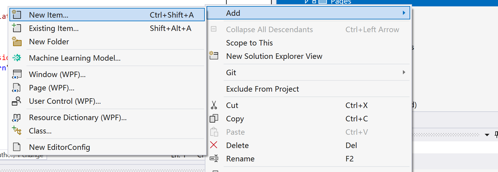

# Frame

The Frame control from WPF supports content navigation within content. Frame can be hosted by a root element like Window, NavigationWindow, Page, UserControl, FlowDocument, or as an island within a content tree that belongs to a root element.

Using our extended Frame control, you can navigate with Fluent animations, better performance and more.

- **Class**: [iNKORE.UI.WPF.Modern.Controls](..)[.Frame](.)

- **Inheritance**: [Object](https://learn.microsoft.com/en-us/dotnet/api/system.object) → (...) → [Control](https://learn.microsoft.com/en-us/dotnet/api/system.windows.controls.control) → [ContentControl](https://learn.microsoft.com/en-us/dotnet/api/system.windows.controls.contentcontrol) → [Frame](https://learn.microsoft.com/en-us/dotnet/api/system.windows.controls.frame) → [Frame](.)

## Examples

The following example shows how to create a simple Frame control to navigate through a set of pages.

First, create two pages called `Page1.xaml` and `Page2.xaml`. Create a folder named `Pages`, right click the folder, and select **Add** → **New Item**. Select **WPF / Page** and name it `Page1.xaml`. Repeat the process to create `Page2.xaml`.




Add the namespace declaration to the root:

```ini
xmlns:ui="http://schemas.inkore.net/lib/ui/wpf/modern"
```

Change the root class from Page to `ui:Page`. Go to the code-behind *(e.g. Page1.xaml.cs)*, and change the base class from Page to `iNKORE.UI.WPF.Modern.Controls.Page`.


```xml

Then add some content to the pages. For example, add a `TextBlock` to each page to display the page name


### Basic usage


