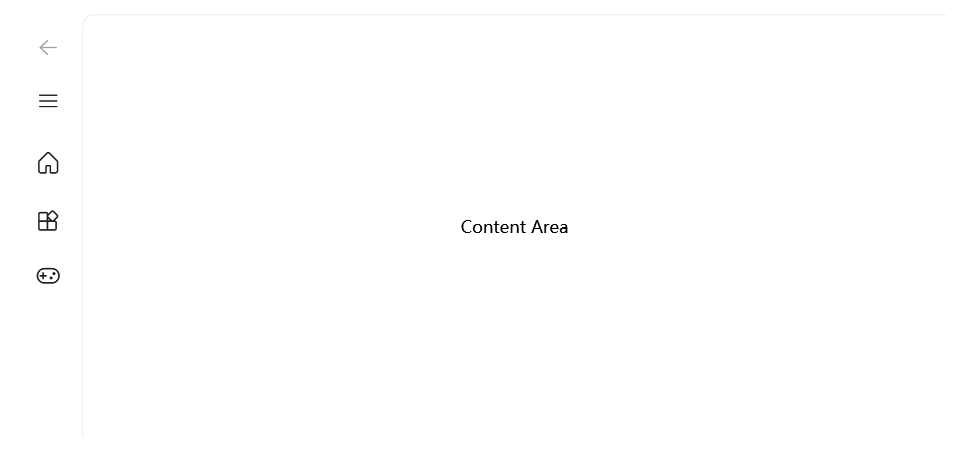
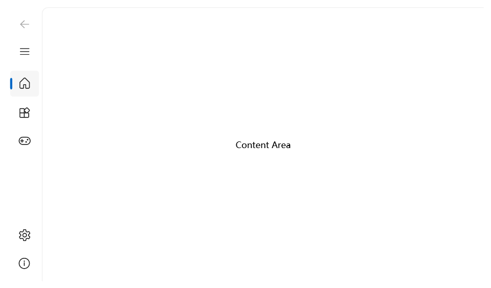
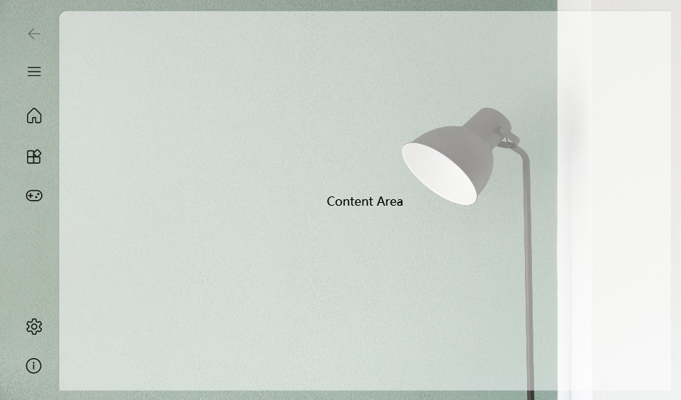
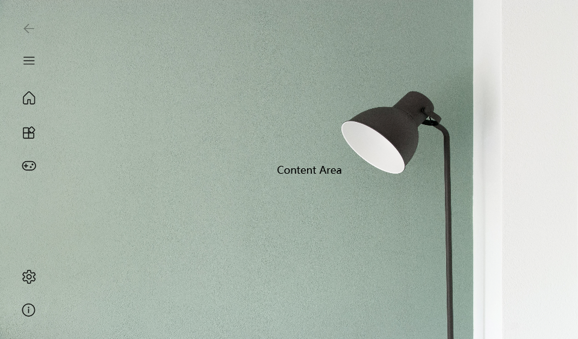

# NavigationView

The navigation view control provides a common vertical layout for top-level areas of your app via a collapsible navigation menu. It adapts to a variety of screen sizes and supports both top and left navigation styles.

- **Class**: [iNKORE.UI.WPF.Modern.Controls](..)[.NavigationView](.)

- **Inheritance**: [Object](https://learn.microsoft.com/en-us/dotnet/api/system.object) → (...) → [Control](https://learn.microsoft.com/en-us/dotnet/api/system.windows.controls.control) → [ContentControl](https://learn.microsoft.com/en-us/dotnet/api/system.windows.controls.contentcontrol) → [NavigationView](.)

## Examples

This example shows how to create a simple navigation view.

```xml
<ui:NavigationView IsPaneOpen="False">
    <ui:NavigationView.MenuItems>
        <ui:NavigationViewItem Content="Home">
            <ui:NavigationViewItem.Icon>
                <ui:FontIcon Icon="{x:Static ui:SegoeFluentIcons.Home}"/>
            </ui:NavigationViewItem.Icon>
        </ui:NavigationViewItem>
        
        <ui:NavigationViewItem Content="Apps">
            <ui:NavigationViewItem.Icon>
                <ui:FontIcon Icon="{x:Static ui:SegoeFluentIcons.OEM}"/>
            </ui:NavigationViewItem.Icon>
        </ui:NavigationViewItem>

        <ui:NavigationViewItem Content="Games">
            <ui:NavigationViewItem.Icon>
                <ui:FontIcon Icon="{x:Static ui:SegoeFluentIcons.Game}"/>
            </ui:NavigationViewItem.Icon>
        </ui:NavigationViewItem>


    </ui:NavigationView.MenuItems>

    <Border>
        <TextBlock Text="Content Area" HorizontalAlignment="Center" VerticalAlignment="Center"/>
    </Border>

</ui:NavigationView>
```



:::warning

If you're using left compact layout, we recommend you set the property **IsPaneOpen** to `false` in the XAML code. This prevents from the NavigationViewItem shows unexpected title when startup.


:::

### Add Footer Items

You can use **ui:NavigationView.FooterMenuItems** property to add items to the footer (bottom part) of the NavigationView.

```xml
<ui:NavigationView IsPaneOpen="False">
    <ui:NavigationView.MenuItems>
        <ui:NavigationViewItem Content="Home">
            <ui:NavigationViewItem.Icon>
                <ui:FontIcon Icon="{x:Static ui:SegoeFluentIcons.Home}"/>
            </ui:NavigationViewItem.Icon>
        </ui:NavigationViewItem>
        
        <ui:NavigationViewItem Content="Apps">
            <ui:NavigationViewItem.Icon>
                <ui:FontIcon Icon="{x:Static ui:SegoeFluentIcons.OEM}"/>
            </ui:NavigationViewItem.Icon>
        </ui:NavigationViewItem>

        <ui:NavigationViewItem Content="Games">
            <ui:NavigationViewItem.Icon>
                <ui:FontIcon Icon="{x:Static ui:SegoeFluentIcons.Game}"/>
            </ui:NavigationViewItem.Icon>
        </ui:NavigationViewItem>
    </ui:NavigationView.MenuItems>

    <ui:NavigationView.FooterMenuItems>
        
        <ui:NavigationViewItem Content="Settings">
            <ui:NavigationViewItem.Icon>
                <ui:FontIcon Icon="{x:Static ui:SegoeFluentIcons.Settings}"/>
            </ui:NavigationViewItem.Icon>
        </ui:NavigationViewItem>
        <ui:NavigationViewItem Content="About">
            <ui:NavigationViewItem.Icon>
                <ui:FontIcon Icon="{x:Static ui:SegoeFluentIcons.Info}"/>
            </ui:NavigationViewItem.Icon>
        </ui:NavigationViewItem>

    </ui:NavigationView.FooterMenuItems>

    <Border>
        <TextBlock Text="Content Area" HorizontalAlignment="Center" VerticalAlignment="Center"/>
    </Border>

</ui:NavigationView>
```



### Clear background

According to the Fluent Design guidelines, the NavigationView control comes with a background layer in the content area as following:



In some cases, you may want the background to be clear, without any colors anf filles. You can add a few resources to **FrameworkElement.Resource**:

```xml
<SolidColorBrush x:Key="{x:Static ui:ThemeKeys.NavigationViewContentBackgroundKey}" Color="Transparent"/>
<SolidColorBrush x:Key="{x:Static ui:ThemeKeys.ExpanderHeaderBorderBrushKey}" Color="Transparent"/>
<Thickness x:Key="NavigationViewContentGridBorderThickness">0,0,0,0</Thickness>

```

The full code should look like this:

```xml
<ui:NavigationView IsPaneOpen="False">
<FrameworkElement.Resources>
    <SolidColorBrush x:Key="{x:Static ui:ThemeKeys.NavigationViewContentBackgroundKey}" Color="Transparent"/>
    <SolidColorBrush x:Key="{x:Static ui:ThemeKeys.ExpanderHeaderBorderBrushKey}" Color="Transparent"/>
    <Thickness x:Key="NavigationViewContentGridBorderThickness">0,0,0,0</Thickness>

</FrameworkElement.Resources>

<ui:NavigationView.MenuItems>
    <ui:NavigationViewItem Content="Home">
        <ui:NavigationViewItem.Icon>
            <ui:FontIcon Icon="{x:Static ui:SegoeFluentIcons.Home}"/>
        </ui:NavigationViewItem.Icon>
    </ui:NavigationViewItem>

    <ui:NavigationViewItem Content="Apps">
        <ui:NavigationViewItem.Icon>
            <ui:FontIcon Icon="{x:Static ui:SegoeFluentIcons.OEM}"/>
        </ui:NavigationViewItem.Icon>
    </ui:NavigationViewItem>

    <ui:NavigationViewItem Content="Games">
        <ui:NavigationViewItem.Icon>
            <ui:FontIcon Icon="{x:Static ui:SegoeFluentIcons.Game}"/>
        </ui:NavigationViewItem.Icon>
    </ui:NavigationViewItem>

</ui:NavigationView.MenuItems>

<ui:NavigationView.FooterMenuItems>

    <ui:NavigationViewItem Content="Settings">
        <ui:NavigationViewItem.Icon>
            <ui:FontIcon Icon="{x:Static ui:SegoeFluentIcons.Settings}"/>
        </ui:NavigationViewItem.Icon>
    </ui:NavigationViewItem>
    <ui:NavigationViewItem Content="About">
        <ui:NavigationViewItem.Icon>
            <ui:FontIcon Icon="{x:Static ui:SegoeFluentIcons.Info}"/>
        </ui:NavigationViewItem.Icon>
    </ui:NavigationViewItem>

</ui:NavigationView.FooterMenuItems>

<Border>
    <TextBlock Text="Content Area" HorizontalAlignment="Center" VerticalAlignment="Center"/>
</Border>

</ui:NavigationView>
```

Then you should see there's no more fill in the content area:



### Navigate through pages

The NavigationView usually helps the user go through different pages. To make this, some behinded code and a Frame will be used.

For more information, you can try the [example project](https://github.com/iNKORE-NET/UI.WPF.Modern/tree/main/samples/NavigationViewExample).

## Remarks

### Is this the right control?

NavigationView is an adaptive navigation control that works well for:

- Providing a consistent navigational experience throughout your app.
- Preserving screen real estate on smaller windows.
- Organizing access to many navigation categories.

### IsFooterSeparatorVisible

Owning both MenuItems and FooterMenus, when the height is not enough for all the items, there will be a scroll bar to display them, and you might also see a separator between MenuItems and FooterMenuItems.

You can use the property **IsFooterSeparatorVisible** to control whether this separator is visible. There are three values you can choose from:

- `true`: The separator will be ALWAYS visible, no matter what the height is.

- `false`: The separator will be NEVER be visible, no matter what the height is.

- `null`: The separator will be visible only there's not enough space for all items.

The default value is `null`.

### Display modes

You can use the PaneDisplayMode property to configure different navigation styles, or display modes, for the NavigationView.

#### Top

The pane is positioned above the content.
`PaneDisplayMode="Top"`


We recommend top navigation when:

- You have 5 or fewer top-level navigation categories that are equally important, and any additional top-level navigation categories that end up in the dropdown overflow menu are considered less important.

- You need to show all navigation options on screen.
- You want more space for your app content.
- Icons cannot clearly describe your app's navigation categories.

#### Left

The pane is expanded and positioned to the left of the content.
`PaneDisplayMode="Left"`


We recommend left navigation when:

- You have 5-10 equally important top-level navigation categories.
- You want navigation categories to be very prominent, with less space for other app content.

#### LeftCompact

The pane shows only icons until opened and is positioned to the left of the content. When opened, the pane overlays the content.
PaneDisplayMode="LeftCompact"


#### LeftMinimal

Only the menu button is shown until the pane is opened. When opened, the pane overlays the left side of the content.
PaneDisplayMode="LeftMinimal"


#### Auto

By default, PaneDisplayMode is set to Auto. In Auto mode, the NavigationView adapts between LeftMinimal when the window is narrow, to LeftCompact, and then Left as the window gets wider. For more info, see the adaptive behavior section.


### Details & guidelines

There are more detailed and useful information on [this page](https://learn.microsoft.com/en-us/windows/apps/design/controls/navigationview). If you want to put NavigationView into good use, you should really read this.

## See also

### Microsoft Learn

- [NavigationView - Windows apps](https://learn.microsoft.com/en-us/windows/apps/design/controls/navigationview)

- [NavigationView Class (WinRT)](https://learn.microsoft.com/en-us/windows/windows-app-sdk/api/winrt/microsoft.ui.xaml.controls.navigationview)

- [Navigation basics - Windows apps](https://learn.microsoft.com/en-us/windows/apps/design/basics/navigation-basics)

### Related controls

- [Frame](./frame)

- [FontIcon](../media/font-icon)

- [TabControl](./tab-control)