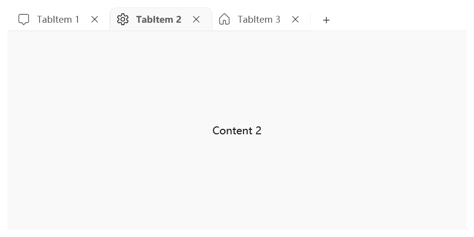
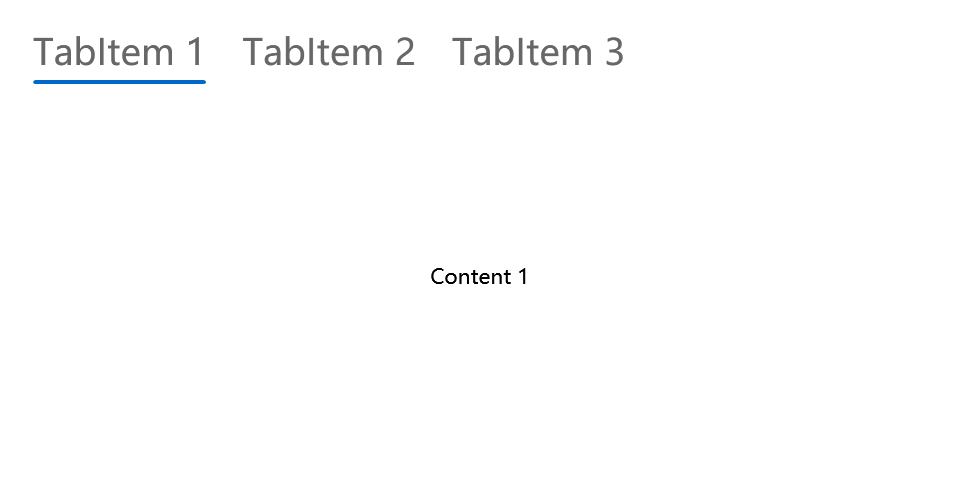

# TabControl

Tabs organize and allow navigation between groups of content that are related and at the same level of hierarchy.

- **Class**: [System.Windows.Controls](https://learn.microsoft.com/en-us/dotnet/api/system.windows.controls)[.TabControl](https://learn.microsoft.com/en-us/dotnet/api/system.windows.controls.tabcontrol)

- Inheritance: [Object](https://learn.microsoft.com/en-us/dotnet/api/system.object) → (...) → [Control](https://learn.microsoft.com/en-us/dotnet/api/system.windows.controls.control) → [ItemsControl](https://learn.microsoft.com/en-us/dotnet/api/system.windows.controls.itemscontrol) → [Selector](https://learn.microsoft.com/en-us/dotnet/api/system.windows.controls.primitives.selector) → [TabControl](https://learn.microsoft.com/en-us/dotnet/api/system.windows.controls.tabcontrol)

## Examples

### Basic TabControl

The following example creates a simple TabControl that has 3 tabs.

```xml
<TabControl>

    <TabItem Header="TabItem 1">
        <TextBlock Text="Content 1" HorizontalAlignment="Center" VerticalAlignment="Center"/>
    </TabItem>

    <TabItem Header="TabItem 2">
        <TextBlock Text="Content 2" HorizontalAlignment="Center" VerticalAlignment="Center"/>
    </TabItem>

    <TabItem Header="TabItem 3">
        <TextBlock Text="Content 3" HorizontalAlignment="Center" VerticalAlignment="Center"/>
    </TabItem>

</TabControl>

```


### TabItem with icon

You can add icons to every TabItem using the **ui:TabItemHelper.Icon** property.

```xml
<TabControl>

    <TabItem Header="TabItem 1">
        <ui:TabItemHelper.Icon>
            <ui:FontIcon Icon="{x:Static ui:SegoeFluentIcons.ActionCenter}"/>
        </ui:TabItemHelper.Icon>
        
        <TextBlock Text="Content 1" HorizontalAlignment="Center" VerticalAlignment="Center"/>
    </TabItem>

    <TabItem Header="TabItem 2">
        <ui:TabItemHelper.Icon>
            <ui:FontIcon Icon="{x:Static ui:SegoeFluentIcons.Settings}"/>
        </ui:TabItemHelper.Icon>
        
        <TextBlock Text="Content 2" HorizontalAlignment="Center" VerticalAlignment="Center"/>
    </TabItem>

    <TabItem Header="TabItem 3">
        <ui:TabItemHelper.Icon>
            <ui:FontIcon Icon="{x:Static ui:SegoeFluentIcons.Home}"/>
        </ui:TabItemHelper.Icon>

        <TextBlock Text="Content 3" HorizontalAlignment="Center" VerticalAlignment="Center"/>
    </TabItem>

</TabControl>

```



### Handling command buttons

The default style of TabControl comes with a close button that you can use for removing or closing the tab. You can use **ui:TabItemHelper.CloseTabButtonCommand** to handle the click of the close button.

There's also a add tab button that you can use for creating new tabs. You can use **ui:TabControlHelper.AddTabButtonCommand** to handle the click of the add button.

If you want to remove the close button for the whole TabControl, you can apply **ui:TabControlHelper.IsAddTabButtonVisible** on your TabControl. This will remove both the close buttons and add tab button.

```xml
<TabControl ui:TabControlHelper.IsAddTabButtonVisible="False">

    <TabItem Header="TabItem 1">
        <TextBlock Text="Content 1" HorizontalAlignment="Center" VerticalAlignment="Center"/>
    </TabItem>

    <TabItem Header="TabItem 2">
        <TextBlock Text="Content 2" HorizontalAlignment="Center" VerticalAlignment="Center"/>
    </TabItem>

    <TabItem Header="TabItem 3">
        <TextBlock Text="Content 3" HorizontalAlignment="Center" VerticalAlignment="Center"/>
    </TabItem>

</TabControl>
```


### Add header and footer

You can also use the **ui:TabControlHelper.TabStripHeader** and **ui:TabControlHelper.TabStripFooter** property to add the strip header and footer.

Since this two properties accept `object` values, you can add literally anything to the header and footer, like text, controls, icons and more.

```xml
<TabControl>
    <ui:TabControlHelper.TabStripHeader>
        <Border MinWidth="48" Background="Red">
            <TextBlock Text="Header" HorizontalAlignment="Center" VerticalAlignment="Center" Margin="5"/>
        </Border>
    </ui:TabControlHelper.TabStripHeader>
    <ui:TabControlHelper.TabStripFooter>
        <Border MinWidth="48" Background="CornflowerBlue">
            <TextBlock Text="Footer" HorizontalAlignment="Center" VerticalAlignment="Center" Margin="5"/>
        </Border>
    </ui:TabControlHelper.TabStripFooter>


    <TabItem Header="TabItem 1">
        <TextBlock Text="Content 1" HorizontalAlignment="Center" VerticalAlignment="Center"/>
    </TabItem>

    <TabItem Header="TabItem 2">
        <TextBlock Text="Content 2" HorizontalAlignment="Center" VerticalAlignment="Center"/>
    </TabItem>

    <TabItem Header="TabItem 3">
        <TextBlock Text="Content 3" HorizontalAlignment="Center" VerticalAlignment="Center"/>
    </TabItem>

</TabControl>
```


### Pivot style

The Pivot enables touch-swiping between a small set of content sections. To create a Pivot control, simply apply the pivot style to a TabControl.

```xml
<TabControl Style="{StaticResource {x:Static ui:ThemeKeys.TabControlPivotStyleKey}}">

    <TabItem Header="TabItem 1">
        <TextBlock Text="Content 1" HorizontalAlignment="Center" VerticalAlignment="Center"/>
    </TabItem>

    <TabItem Header="TabItem 2">
        <TextBlock Text="Content 2" HorizontalAlignment="Center" VerticalAlignment="Center"/>
    </TabItem>

    <TabItem Header="TabItem 3">
        <TextBlock Text="Content 3" HorizontalAlignment="Center" VerticalAlignment="Center"/>
    </TabItem>

</TabControl>
```



:::warning

Once a TabControl is applied Pivot style, the **TabStripPlacement** property will be unusable. A Pivot can only have its Tabs on the top.

Actually this is because we didn't work out the code other placement scenarios, If you are interested, feel free to add this feature in [Pivot.xaml](https://github.com/iNKORE-NET/UI.WPF.Modern/blob/main/source/iNKORE.UI.WPF.Modern/Themes/Styles/Pivot.xaml), and PRs are welcomed!

Also, if you want to add headers to Pivot styled TabControl, please don't use `ui:TabControlHelper`, instead use `ui:PivotHelper` like this:

- `ui:TabControlHelper.TabStripHeader` → `ui:PivotHelper.LeftHeader`

- `ui:TabControlHelper.TabStripFooter` → `ui:PivotHelper.RightHeader`

:::

### Pivot with icons

You can add icons for a Pivot tab item using *** as well. However, we recommend you adjust the icon's size since the Pivot header is larger, the recommended value is `20` or `24`.

```xml
<TabControl Style="{StaticResource {x:Static ui:ThemeKeys.TabControlPivotStyleKey}}" >

    <TabItem Header="TabItem 1">
        <ui:TabItemHelper.Icon>
            <ui:FontIcon Icon="{x:Static ui:SegoeFluentIcons.Shop}" FontSize="20"/>
        </ui:TabItemHelper.Icon>
        <TextBlock Text="Content 1" HorizontalAlignment="Center" VerticalAlignment="Center"/>
    </TabItem>

    <TabItem Header="TabItem 2">
        <ui:TabItemHelper.Icon>
            <ui:FontIcon Icon="{x:Static ui:SegoeFluentIcons.Settings}" FontSize="20"/>
        </ui:TabItemHelper.Icon>
        <TextBlock Text="Content 2" HorizontalAlignment="Center" VerticalAlignment="Center"/>
    </TabItem>

    <TabItem Header="TabItem 3">
        <TextBlock Text="Content 3" HorizontalAlignment="Center" VerticalAlignment="Center"/>
    </TabItem>

</TabControl>
```


:::warning

This feature is only available for version **0.9.28** or higher. If you have set the **ui:TabItemHelper.Icon** property and find out the icon not appearing, please consider upgrading the library version.

If you can't see the version 0.9.28 in the Nuget Package Manager, this means this version has't released yet. Please wait for the release or compile the library yourself.

:::

## Remarks

### Is this the right control?

To create a control that displays a collection of tabs that can be used to display several documents, which can be added, closed or moved, use a TabControl with the default style.

To achieve common top navigation patterns, we recommend using NavigationView or a TabControl with Pivot style.

Some key differences between the NavigationView and Pivot are listed here:

- Pivot supports touch-swiping to switch between items.
- Overflow items in a Pivot carousel, while NavigationView uses a menu dropdown overflow so that users can see all items.
- Pivot handles navigation between content sections, while NavigationView allows for more control over navigation behavior.

### Styles

There are two built-in styles for Button control:

- DefaultTabControlStyle: The default style for TabControl, you can access it with `ui:ThemeKeys.DefaultTabControlStyleKey`.

- TabControlPivotStyle: The Pivot style for TabControl, you can access it with `ui:ThemeKeys.TabControlPivotStyleKey`.


## See also

### Microsoft Learn

- [TabControl Class (WPF)](https://learn.microsoft.com/en-us/dotnet/api/system.windows.controls.tabcontrol)

- [TabControl - WPF](https://learn.microsoft.com/en-us/dotnet/desktop/wpf/controls/tabcontrol)

- [Tab View - Windows apps](https://learn.microsoft.com/en-us/windows/apps/design/controls/tab-view)

- [Pivot - Windows apps](https://learn.microsoft.com/en-us/windows/apps/design/controls/pivot)

- [Selector bar - Windows apps](https://learn.microsoft.com/en-us/windows/apps/design/controls/selector-bar)

### Related controls

- [NavigationView](./navigation-view)