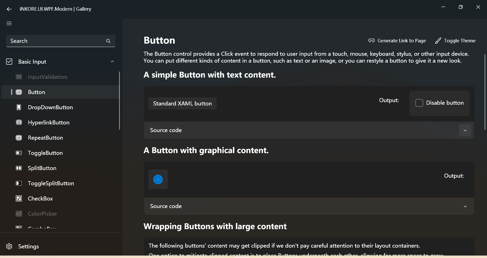
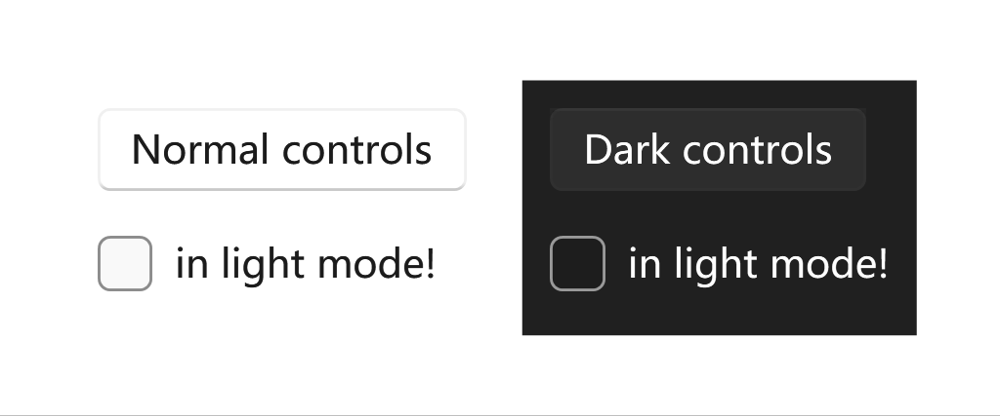

# Theme Schemes (theme mode)

Windows apps can use a light or dark application theme. The theme affects the colors of the app's background, text, icons, and common controls.

:::info

This article is about theme modes (light/dark). If you want to know about accent colors (aka primary color), please see [Accent Color](./accent-color).

:::

## Available Schemes

All controls comes with two palette modes: light (the default) and dark.

### Light

The light theme is the default theme mode. It is the most commonly used theme mode and designed to be easy on the eyes and provide a good contrast between the background and foreground colors. The light theme is suitable for most applications and is recommended for applications that are used in well-lit environments, also recommended for applications that are used by people with visual impairments.


### Dark

The dark theme is designed to be easy on the eyes in low-light environments. It provides a high contrast between the background and foreground colors, making it easier to read text and see icons. The dark theme is recommended for applications that are used in low-light environments, such as at night or in dark rooms.



## Change default value

By default, your Windows app's theme is the user’s theme preference from Windows Settings or the device's default theme. However, you can set the theme specifically for your Windows app.

### With ThemeResources (static and globally)

When you use a global **ThemeResources**, you may find out that there's a property called **RequestedTheme**. You can use this property to set the default theme mode for your app in XAML. The example `App.xaml` should look like this:

```ini
RequestedTheme="Dark"
```

```xml
<Application x:Class="WpfApp1.App"
             xmlns="http://schemas.microsoft.com/winfx/2006/xaml/presentation"
             xmlns:x="http://schemas.microsoft.com/winfx/2006/xaml"
             xmlns:local="clr-namespace:WpfApp1" 
             xmlns:ui="http://schemas.inkore.net/lib/ui/wpf/modern"
             StartupUri="MainWindow.xaml">
    <Application.Resources>
        <ResourceDictionary>
            <ResourceDictionary.MergedDictionaries>
                <ui:ThemeResources RequestedTheme="Dark"/>
                <ui:XamlControlsResources/>
            </ResourceDictionary.MergedDictionaries>
        </ResourceDictionary>
    </Application.Resources>
</Application>
```

If you want to follow the system settings, you can do this, or simply do nothing:

```ini
RequestedTheme="{x:Null}"
```

### With ThemeManager.Current (dynamically and globally)

When you want to dynamically change the theme scheme, you can use the **ThemeManager.Current.ApplicationTheme** property like this:

```csharp
ThemeManager.Current.ApplicationTheme = ApplicationTheme.Dark;
```

For example, here's how a theme toggle button is implemented:

```xml
<Button x:Name="Button_ToggleTheme" Content="Toggle Theme" Click="Button_ToggleTheme_Click"/>
```

```csharp
private void Button_ToggleTheme_Click(object sender, RoutedEventArgs e)
{
    if (ThemeManager.Current.ApplicationTheme == ApplicationTheme.Dark)
    {
        ThemeManager.Current.ApplicationTheme = ApplicationTheme.Light;
    }
    else
    {
        ThemeManager.Current.ApplicationTheme = ApplicationTheme.Dark;
    }
}
```

If you want to follow the system settings, you can do this, or simply do nothing:

```csharp
ThemeManager.Current.ApplicationTheme = null;
```

### With ThemeManager attached property (locally)

When you want to dynamically change the theme scheme for a specific control, you can use the **ThemeManager.Theme** attached property like this:

```ini
ui:ThemeManager.RequestedTheme="Dark"
```

Try this example in your project:

```xml
<ui:SimpleStackPanel Orientation="Horizontal" Spacing="10">
    <Border ui:ThemeManager.RequestedTheme="Light">
        <ui:SimpleStackPanel Margin="10" Spacing="10">
            <Button Content="Normal controls"/>
            <CheckBox Content="in light mode!"/>
        </ui:SimpleStackPanel>
    </Border>
    <Border ui:ThemeManager.RequestedTheme="Dark" Grid.Column="1"
        Background="{DynamicResource {x:Static ui:ThemeKeys.ApplicationPageBackgroundThemeBrushKey}}">
        <ui:SimpleStackPanel Margin="10" Spacing="10">
            <Button Content="Dark controls"/>
            <CheckBox Content="in light mode!"/>
        </ui:SimpleStackPanel>
    </Border>
</ui:SimpleStackPanel>
```



If you want to follow the system settings, you can do this, or simply do nothing:

```ini
ui:ThemeManager.RequestedTheme="Default"
```

## Remarks

### Default value

If you don't specify the theme scheme or you set the default values, the application will follow the system settings.

:::warn Sometimes NOT

There are a few scenarios that the app cannot follow the system settings, mostly because the WinRT settings reader doesn't work for some reasons:

- The app is running on Windows 7/8/8.1, or older versions of Windows 10;

- In the project settings, the target OS version is lower than `windows10.0.18362.0`.

:::

## See also

- [Color in Windows apps](https://learn.microsoft.com/en-us/windows/apps/design/style/color)

- [Color in Windows 11](https://learn.microsoft.com/en-us/windows/apps/design/signature-experiences/color)

- [Layering and elevation in Windows 11](https://learn.microsoft.com/en-us/windows/apps/design/signature-experiences/layering)

