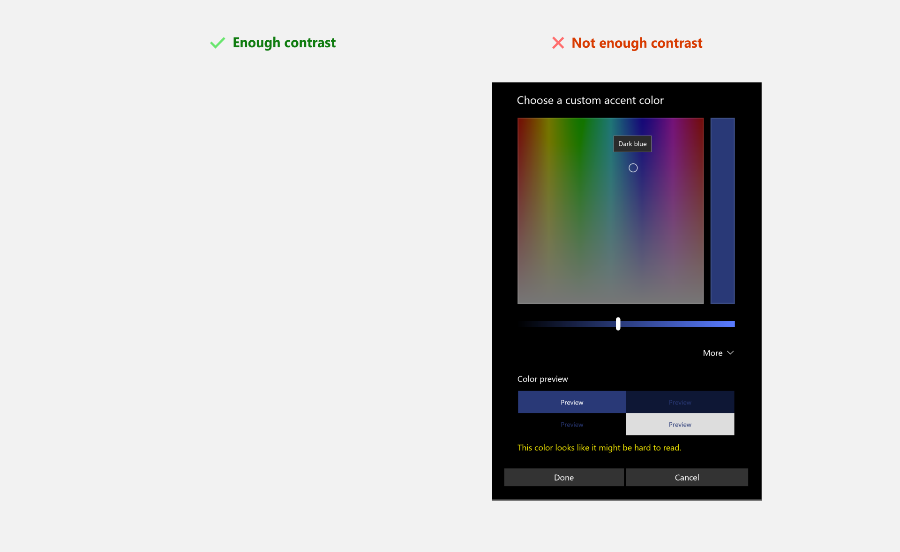
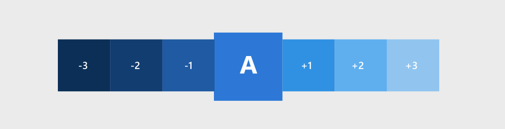
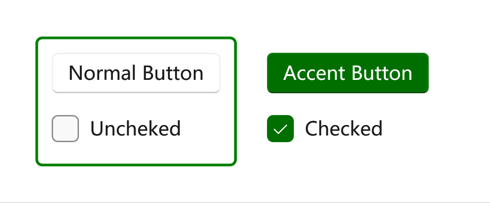

# Accent color

:::note

This article is about accent colors (aka primary color). If you want to know about theme modes (light/dark), please see [Theming / Theme modes](./theme-modes).

:::

Accent color is used to emphasize important elements in the user interface and to indicate the state of an interactive object or control. Accent color values are generated automatically and optimized for contrast in both light and dark modes. Accent colors are used sparingly to highlight important elements and convey information about an interactive element's state.

## Choosing an accent color

If you select a custom accent color for your app, please make sure that text and backgrounds that use the accent color have sufficient contrast for optimal readability. To test contrast, you can use the color picker tool in Windows Settings, or you can use these [online contrast tools](https://www.w3.org/TR/WCAG20-TECHS/G18.html#G18-resources).



## Accent color palette

An accent color algorithm in the Windows shell generates light and dark shades of the accent color.



These shades can be accessed as theme resources:

- `SystemAccentColorLight3`

- `SystemAccentColorLight2`

- `SystemAccentColorLight1`

- `SystemAccentColorDark1`

- `SystemAccentColorDark2`

- `SystemAccentColorDark3`

You can also access the accent color palette programmatically with the `FrameworkElement.FindResource` and **ThemeKeys**.

When using colored text on a colored background, make sure there is enough contrast between text and background. By default, hyperlink or hypertext will use the accent color. If you apply variations of the accent color to the background, you should use a variation of the original accent color to optimize the contrast of colored text on a colored background.

The chart below illustrates an example of the various light/dark shades of accent color, and how colored type can be applied on a colored surface.


## Overriding the accent color

Common controls use an accent color to convey state information. By default, the accent color is the SystemAccentColor that users select in their Settings. However, you can also customize your app's accent color to reflect your brand.

When you use a global **ThemeResources**, you may find out that there's a property called **AccentColor**. You can use this property to set the accent color for your app in XAML.

```xml
<ui:ThemeResources AccentColor="Green"/>
```

The example `App.xaml` should look like this:

```xml title="App.xaml"
<Application x:Class="WpfApp1.App"
             xmlns="http://schemas.microsoft.com/winfx/2006/xaml/presentation"
             xmlns:x="http://schemas.microsoft.com/winfx/2006/xaml"
             xmlns:local="clr-namespace:WpfApp1"
             xmlns:ui="http://schemas.inkore.net/lib/ui/wpf/modern"
             StartupUri="MainWindow.xaml">
    <Application.Resources>
        <ResourceDictionary>
            <ResourceDictionary.MergedDictionaries>
                <ui:ThemeResources AccentColor="Green"/>
                <ui:XamlControlsResources/>
            </ResourceDictionary.MergedDictionaries>
        </ResourceDictionary>
    </Application.Resources>
</Application>
```

Then add some controls to test it:

```xml
<ui:SimpleStackPanel Orientation="Horizontal" Spacing="10" Margin="0,0,5,0">
    <Border BorderBrush="{DynamicResource {x:Static ui:ThemeKeys.SystemControlBackgroundAccentBrushKey}}"
            BorderThickness="2" CornerRadius="4">
        <ui:SimpleStackPanel Margin="10" Spacing="10">
            <Button Content="Normal Button"/>
            <CheckBox Content="Uncheked"/>
        </ui:SimpleStackPanel>
    </Border>
    <Border  Grid.Column="1">
        <ui:SimpleStackPanel Margin="12" Spacing="10">
            <Button Content="Accent Button" Style="{StaticResource {x:Static ui:ThemeKeys.AccentButtonStyleKey}}"/>
            <CheckBox Content="Checked" IsChecked="True"/>
        </ui:SimpleStackPanel>
    </Border>
</ui:SimpleStackPanel>
```



## See also

### Related articles

- [Theming / Theme scheme](./theme-scheme)

### Microsoft Learn

- [Color in Windows apps](https://learn.microsoft.com/en-us/windows/apps/design/style/color)

- [Color in Windows 11](https://learn.microsoft.com/en-us/windows/apps/design/signature-experiences/color)

- [Layering and elevation in Windows 11](https://learn.microsoft.com/en-us/windows/apps/design/signature-experiences/layering)

